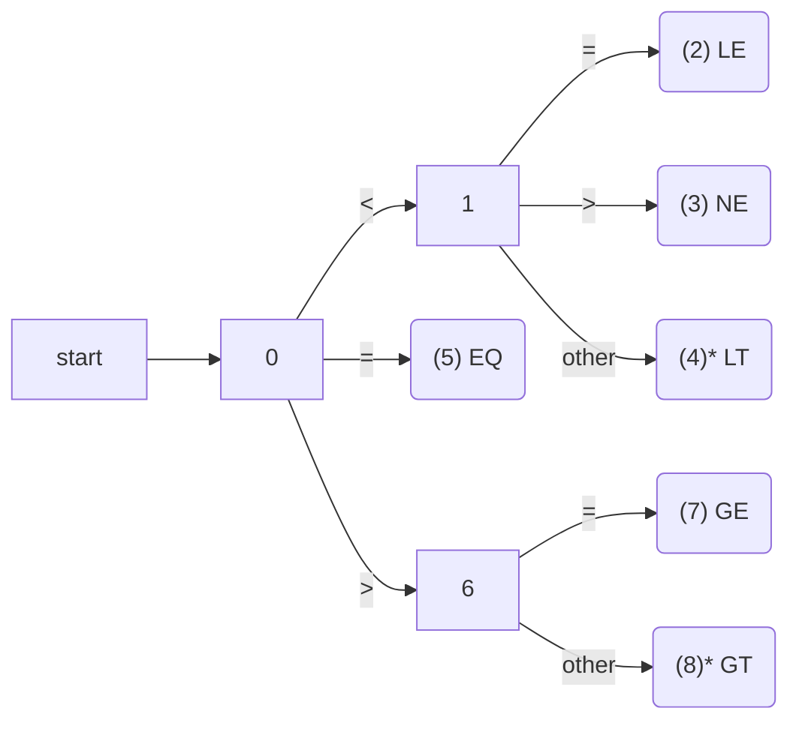
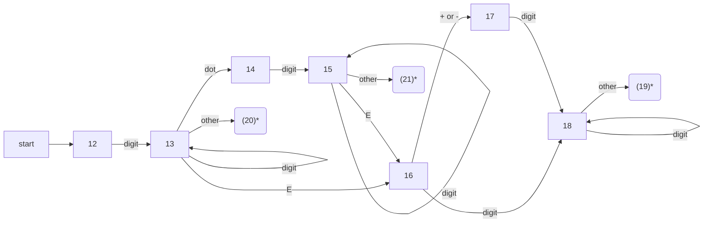
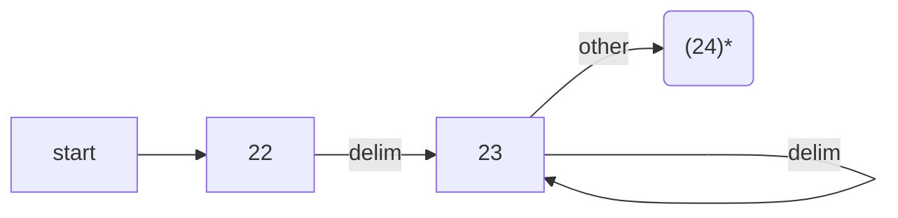

# Chapter 3 Lexical Analysis

In this chapter we show how to construct a lexical analyzer. To implement a lexical analyzer by hand, it helps to start with a diagram or other description for the lexemes of each token. We can then write code to identify each occurrence of each lexeme on the input and to return information about the token identified.

We can also produce a lexical analyzer automatically by specifying the lexeme patterns to a lexical-analyzer generator and compiling those patterns into code that functions as a lexical analyzer. This approach makes it easier to modify a lexical analyzer, since we have only to rewrite the affected patterns, not the entire program. It also speeds up the process of implementing the lexical analyzer, since the programmer specifies the software at the very high level of patterns and relies on the generator to produce the detailed code. We shall introduce in Section 3.5 a lexical-analyzer generator called Lex (or Flex in a more recent embodiment).

We begin the study of lexical-analyzer generators by introducing regular expressions, a convenient notation for specifying lexeme patterns. We show how this notation can be transformed, first into nondeterministic automata and then into deterministic automata. The latter two notations can be used as input to a "driver," that is, code which simulates these automata and uses them as a guide to determining the next token. This driver and the specification of the automaton form the nucleus of the lexical analyzer.

## 3.1 The Role of the Lexical Analyzer

As the first phase of a compiler, the main task of the lexical analyzer is to read the input characters of the source program, group them into lexemes, and produce as output a sequence of tokens for each lexeme in the source program. The stream of tokens is sent to the parser for syntax analysis. It is common for the lexical analyzer to interact with the symbol table as well. When the lexical analyzer discovers a lexeme constituting an identifier, it needs to enter that lexeme into the symbol table. In some cases, information regarding the kind of identifier may be read from the symbol table by the lexical analyzer to assist it in determining the proper token it must pass to the parser.

These interactions are suggested in Fig. 3.1. Commonly, the interaction is implemented by having the parser call the lexical analyzer. The call, suggested by the `getNextToken` command, causes the lexical analyzer to read characters from its input until it can identify the next lexeme and produce for it the next token, which it returns to the parser.

```fs
                              |--token----->|
source program -> [lexical analyzer]      [parser]-> to semantic analysis
                            |<--getNextToken--|
|<-----------[symbol table]-------------------->|
```

Figure 3.1: Interactions between the lexical analyzer and the parser

Since the lexical analyzer is the part of the compiler that reads the source text, it may perform certain other tasks besides identification of lexemes. One such task is stripping out comments and whitespace ( blank, newline, tab, and perhaps other characters that are used to separate tokens in the input). Another task is correlating error messages generated by the compiler with the source program. For instance, the lexical analyzer may keep track of the number of newline characters seen, so it can associate a line number with each error message. In some compilers, the lexical analyzer makes a copy of the source program with the error messages inserted at the appropriate positions. If the source program uses a macro-preprocessor, the expansion of macros may also be performed by the lexical analyzer.

Sometimes, lexical analyzers are divided into a cascade of two processes:

a) *Scanning* consists of the simple processes that do not require tokenization of the input, such as deletion of comments and compaction of consecutive whitespace characters into one.

b) *Lexical analysis* proper is the more complex portion, where the scanner produces the sequence of tokens as output.

### 3.1.1 Lexical Analysis Versus Parsing

There are a number of reasons why the analysis portion of a compiler is normally separated into lexical analysis and parsing (syntax analysis) phases.

1. Simplicity of design is the most important consideration. The separation of lexical and syntactic analysis often allows us to simplify at least one of these tasks. For example, a parser that had to deal with comments and whitespace as syntactic units would be. considerably more complex than one that can assume comments and whitespace have already been removed by the lexical analyzer. If we are designing a new language, separating lexical and syntactic concerns can lead to a cleaner overall language design.

2. Compiler efficiency is improved. A separate lexical analyzer allows us to apply specialized techniques that serve only the lexical task, not the job of parsing. In addition, specialized buffering techniques for reading input characters can speed up the compiler significantly.

3. Compiler portability is enhanced. Input-device-specific peculiarities can be restricted to the lexical analyzer.

### 3.1.2 Tokens, Patterns, and Lexemes

When discussing lexical analysis, we use three related but distinct terms:

* A *token* is a pair consisting of a token name and an optional attribute value. The token name is an abstract symbol representing a kind of lexical unit, e.g., a particular keyword, or a sequence of input characters denoting an identifier. The token names are the input symbols that the parser processes. In what follows, we shall generally write the name of a token in boldface. We will often refer to a token by its token name.

* A *pattern* is a description of the form that the lexemes of a token may take. In the case of a keyword as a token, the pattern is just the sequence of characters that form the keyword. For identifiers and some other tokens, the pattern is a more complex structure that is matched by many strings.

* A *lexeme* is a sequence of characters in the source program that matches the pattern for a token and is identified by the lexical analyzer as an instance of that token.

**Example 3.1:** Figure 3.2 gives Some typical tokens, their informally described patterns, and some sample lexemes. To see how these concepts are used in practice, in the C statement

```c++
printf ( "Total = %d\ri" , score) ;
```

both `printf` and `score` are lexemes matching the pattern for token **id**, and `"Total = %d\n"` is a lexeme matching literal. □

| TOKEN      | INFORMAL DESCRIPTION | SAMPLE LEXEMES |
| ---------- | -------------------- | -------------- |
| if         |                      |                |
| else       |                      |                |
| comparison |                      |                |
| id         |                      |                |
| number     |                      |                |
| literal    |                      |                |

Figure 3.2: Examples of tokens

In many programming languages, the following classes cover most or all of the tokens:

1. One token for each keyword. The pattern for a keyword is the same as the keyword itself.

2. Tokens for the operators, either individually or in classes such as the token comparison mentioned in Fig. 3.2.

3. One token representing all identifiers.

4. One or more tokens representing constants, such as numbers and literal strings.

5. Tokens for each punctuation symbol, such as left and right parentheses, comma, and semicolon.

### 3.1.3 Attributes for Tokens

When more than one lexeme can match a pattern, the lexical analyzer must provide the subsequent compiler phases additional information about the particular lexeme that matched. For example, the pattern for token number matches both 0 and 1, but it is extremely important for the code generator to know which lexeme was found in the source program. Thus, in many cases the lexical analyzer returns to the parser not only a token name, but an attribute value that describes the lexeme represented by the token; the token name influences parsing decisions, while the attribute value influences translation of tokens after the parse.

We shall assume that tokens have at most one associated attribute, although this attribute may have a structure that combines several pieces of information. The most important example is the token id, where we need to associate with the token a great deal of information. Normally, information about an identifier e.g., its lexeme, its type, and the location at which it is first found ( in case an error message about that identifier must be issued ) is kept in the symbol table. Thus, the appropriate attribute value for an identifier is a pointer to the symbol-table entry for that identifier.

---

#### Tricky Problems When Recognizing Tokens

Usually, given the pattern describing the lexemes of a token, it is relatively simple to recognize matching lexemes when they occur on the input. However, in some languages it is not immediately apparent when we have seen an instance of a lexeme corresponding to a token. The following example is taken from Fortran, in the fixed-format still allowed in Fortran 90. In the statement

```Fortran
DO 5 I = 1.25
```

it is not apparent that the first lexeme is D05I, an instance of the identifier token, until we see the dot following the 1. Note that blanks in fixed-format Fortran are ignored ( an archaic convention ) . Had we seen a comma instead of the dot, we would have had a do-statement

```Fortran
DO 5 I = 1 , 25
```

in which the first lexeme is the keyword `DO`.

---

**Example 3.2:** The token names and associated attribute values for the Fortran statement

```Fortran
E  =  M  *  C  **  2 
```

are written below as a sequence of pairs.

```html
<id, pointer to symbol-table entry for E> 
<assign_op> 
<id, pointer to symbol-table entry for M> 
<mult_op> 
<id, pointer to symbol-table entry for C> 
<exp_op>
<number, integer value 2>
```

Note that in certain pairs, especially operators, punctuation, and keywords, there is no need for an attribute value. In this example, the token number has been given an integer-valued attribute. In practice, a typical compiler would instead store a character string representing the constant and use as an attribute value for number a pointer to that string. □

### 3.1.4 Lexical Errors

It is hard for a lexical analyzer to tell, without the aid of other components, that there is a source-code error. For instance, if the string `fi` is encountered for the first time in a C program in the context:

```fs
fi ( a == f (x) ) ...
```

a lexical analyzer cannot tell whether `fi` is a misspelling of the keyword **if** or an undeclared function identifier. Since `fi` is a valid lexeme for the token **id**, the lexical analyzer must return the token **id** to the parser and let some other phase of the compiler probably the parser in this case handle an error due to transposition of the letters.

However, suppose a situation arises in which the lexical analyzer is unable to proceed because none of the patterns for tokens matches any prefix of the remaining input. The simplest recovery strategy is "panic mode" recovery. We delete successive characters from the remaining input, until the lexical analyzer can find a well-formed token at the beginning of what input is left. This recovery technique may confuse the parser, but in an interactive computing environment it may be quite adequate.

Other possible error-recovery actions are:

1. Delete one character from the remaining input.

2. Insert a missing character into the remaining input.

3. Replace a character by another character.

4. Transpose two adjacent characters.

Transformations like these may be tried in an attempt to repair the input. The simplest such strategy is to see whether a prefix of the remaining input can be transformed into a valid lexeme by a single transformation. This strategy makes sense, since in practice most lexical errors involve a single character. A more general correction strategy is to find the smallest number of transformations needed to convert the source program into one that consists only of valid lexemes, but this approach is considered too expensive in practice to be worth the effort.

## 3.2 Input Buffering

Before discussing the problem of recognizing lexemes in the input, let us examine some ways that the simple but important task of reading the source program can be speeded. This task is made difficult by the fact that we often have to look one or more characters beyond the next lexeme before we can be sure we have the right lexeme. The box on "Tricky Problems When Recognizing Tokens" in Section 3.1 gave an extreme example, but there are many situations where we need to look at least one additional character ahead. For instance, we cannot be sure we've seen the end of an identifier until we see a character that is not a letter or digit, and therefore is not part of the lexeme for id. In C, single-character operators like - , =, or < could also be the beginning of a two-character operator like ->, ==, or <=. Thus, we shall introduce a two-buffer scheme that handles large lookaheads safely. We then consider an improvement involving "sentinels" that saves time checking for the ends of buffers.

### 3.2.1 Buffer Pairs

Because of the amount of time taken to process characters and the large number of characters that must be processed during the compilation of a large source program, specialized buffering techniques have been developed to reduce the amount of overhead required to process a single input character. An important scheme involves two buffers that are alternately reloaded, as suggested in Fig. 3.3.

```fs
[ _ | _ | _ | _ | E | = | M | * ][ c | * | * | 2 | EOF | _ | _ | _ | _ | _ ]
                                       ^       ^ 
                                lexemeBegin  forward
```

Figure 3.3: Using a pair of input buffers

Each buffer is of the same size N, and N is usually the size of a disk block, e.g., 4096 bytes. Using one system read command we can read N characters into a buffer, rather than using one system call per character. If fewer than N characters remain in the input file , then a special character, represented by `eof`, marks the end of the source file and is different from any possible character of the source program.

Two pointers to the input are maintained:

1. Pointer `lexemeBegin`, marks the beginning of the current lexeme, whose extent we are attempting to determine.

2. Pointer `forward` scans ahead until a pattern match is found; the exact strategy whereby this determination is made will be covered in the balance of this chapter.

Once the next lexeme is determined, `forward` is set to the character at its right end. Then, after the lexeme is recorded as an attribute value of a token returned to the parser, `lexemeBegin` is set to the character immediately after the lexeme just found. In Fig. 3.3, we see forward has passed the end of the next lexeme, `**` (the Fortran exponentiation operator), and must be retracted one position to its left.

Advancing `forward` requires that we first test whether we have reached the end of one of the buffers, and if so, we must reload the other buffer from the input, and move forward to the beginning of the newly loaded buffer. As long as we never need to look so far ahead of the actual lexeme that the sum of the lexeme's length plus the distance we look ahead is greater than N, we shall never overwrite the lexeme in its buffer before determining it.

---

#### Can We Run Out of Buffer Space?

In most modern languages, lexemes are short, and one or two characters of lookahead is sufficient. Thus a buffer size N in the thousands is ample, and the double-buffer scheme of Section 3.2.1 works without problem. However, there are some risks. For example, if character strings can be very long, extending over many lines, then we could face the possibility that a lexeme is longer than N. To avoid problems with long character strings, we can treat them as a concatenation of components, one from each line over which the string is written. For instance, in Java it is conventional to represent long strings by writing a piece on each line and concatenating pieces with a + operator at the end of each piece.

A more difficult problem occurs when arbitrarily long lookahead may be needed. For example, some languages like PL/I do not treat keywords as reserved; that is, you can use identifiers with the same name as a keyword like DECLARE. If the lexical analyzer is presented with text of a PL/I program that begins `DECLARE ( ARG1 , ARG2 , ...` it cannot be sure whether DECLARE is a keyword, and ARG1 and so on are variables being declared, or whether DECLARE is a procedure name with its arguments. For this reason, modern languages tend to reserve their keywords. However, if not, one can treat a keyword like DECLARE as an ambiguous identifier, and let the parser resolve the issue, perhaps in conjunction with symbol-table lookup.

---

### 3.2.2 Sentinels

If we use the scheme of Section 3.2.1 as described, we must check, each time we advance `forward`, that we have not moved off one of the buffers; if we do, then we must also reload the other buffer. Thus, for each character read, we make two tests: one for the end of the buffer, and one to determine what character is read (the latter may be a multiway branch). We can combine the buffer-end test with the test for the current character if we extend each buffer to hold a sentinel character at the end. The sentinel is a special character that cannot be part of the source program, and a natural choice is the character `eof`.

Figure 3.4 shows the same arrangement as Fig. 3.3, but with the sentinels added. Note that `eof` retains its use as a marker for the end of the entire input. Any `eof` that appears other than at the end of a buffer means that the input is at an end. Figure 3.5 summarizes the algorithm for advancing `forward`. Notice how the first test, which can be part of a multiway branch based on the character pointed to by forward, is the only test we make, except in the case where we actually are at the end of a buffer or the end of the input.

```fs
[ _ | _ | _ | _ | E | = | M | * | EOF ][ c | * | * | 2 | EOF | _ | _ | _ | _ | _ | EOF ]
                                             ^       ^ 
                                      lexemeBegin  forward
```

Figure 3.4: Sentinels at the end of each buffer

```C++
switch(*forward++){
    case eof:
        if(forward is at end of first buffer){
            reload second buffer;
            forward = beginning of second buffer;
        }
        else if(forward is at end of second buffer){
            reload first buffer;
            forward = beginning of first buffer;
        }
        else /* eof within a buffer marks the end of input */
            terminate lexical analysis;
        break;
    case for the other characters:
}
```

Figure 3.5: Lookahead code with sentinels

---

#### Implementing Multiway Branches

We might imagine that the switch in Fig. 3.5 requires many steps to execute, and that placing the case eof first is not a wise choice. Actually, it doesn't matter in what order we list the cases for each character. In practice, a multiway branch depending on the input character is be made in one step by jumping to an address found in an array of addresses, indexed by characters.

---

## 3.3 Specification of Tokens

Regular expressions are an important notation for specifying lexeme patterns. While they cannot express all possible patterns, they are very effective in specifying those types of patterns that we actually need for tokens. In this section we shall study the formal notation for regular expressions, and in Section 3.5 we shall see how these expressions are used in a lexical-analyzer generator. Then, Section 3.7 shows how to build the lexical analyzer by converting regular expressions to automata that perform the recognition of the specified tokens.

### 3.3.1 Strings and Languages

An *alphabet* is any finite set of symbols. Typical examples of symbols are letters, digits, and punctuation. The set {0, 1} is the *binary alphabet*. ASCII is an important example of an alphabet; it is used in many software systems. Unicode, which includes approximately 100,000 characters from alphabets around the world, is another important example of an alphabet.

A *string* over an alphabet is a finite sequence of symbols drawn from that alphabet. In language theory, the terms "sentence" and "word" are often used as synonyms for "string." The length of a string s, usually written $|s|$ is the number of occurrences of symbols in s. For example, `banana` is a string of length six. The empty string, denoted €, is the string of length zero.

A language is any countable set of strings over some fixed alphabet. This definition is very broad. Abstract languages like Ø, the *empty set*, or {€}, the set containing only the empty string, are languages under this definition. So too are the set of all syntactically well-formed C programs and the set of all grammatically correct English sentences, although the latter two languages are difficult to specify exactly. Note that the definition of "language" does not require that any meaning be ascribed to the strings in the language. Methods for defining the "meaning" of strings are discussed in Chapter 5.

---

#### Terms for Parts of Strings

The following string-related terms are commonly used:

1. A *prefix* of string s is any string obtained by removing zero or more symbols from the end of s. For example, ban, banana, and € are prefixes of banana.

2. A *suffix* of string s is any string obtained by removing zero or more symbols from the beginning of s. For example, nana, banana, and € are suffixes of banana.

3. A *substring* of s is obtained by deleting any prefix and any suffix from s. For instance, banana, nan, and € are substrings of banana.

4. The *proper* prefixes, suffixes, and substrings of a string s are those, prefixes, suffixes, and substrings, respectively, of s that are not € or not equal to s itself.

5. A *subsequence* of s is any string formed by deleting zero or more not necessarily consecutive positions of s. For example, `baan` is a subsequence of `banana`.

---

If x and y are strings, then the *concatenation* of x and y, denoted xy, is the string formed by appending y to x. For example, if x = dog and y = house, then xy = doghouse. The empty string is the identity under concatenation; that is, for any string s, $\epsilon s = s\epsilon = s$.

If we think of concatenation as a product, we can define the "exponentiation" of strings as follows. Define s^0^ to be €, and for all i > 0, define s^i^ to be s^i-1^s. Since $\epsilon s = s$, it follows that s^1^ = s. Then s^2^ = ss, s^3^ = sss, and so on.

### 3.3.2 Operations on Languages

In lexical analysis, the most important operations on languages are union, concatenation, and closure, which are defined formally in Fig. 3.6. Union is the familiar operation on sets. The concatenation of languages is all strings formed by taking a string from the first language and a string from the second language, in all possible ways, and concatenating them. The (Kleene) closure of a language L, denoted L*, is the set of strings you get by concatenating L zero or more times. Note that L^0^, the "concatenation of L zero times," is defined to be {€}, and inductively, L^i^ is L^i-1^L. Finally, the positive closure, denoted L^+^, is the same as the Kleene closure, but without the term L^0^. That is, € will not be in L^+^ unless it is in L itself.

```fs
| OPERATION                | DEFINITION  AND  NOTATION               |
| ------------------------ | --------------------------------------- |
| Union of L and M         | L ∪ M = { s : s is in L or s is in M } |
| Concatenation of L and M | L M = {st : s is in L and t is in M }   |
| Kleene closure of L      | L* = $\cup_{i=0}^\infty L^i$            |
| Positive closure of L    | L+ = $\cup_{i=1}^\infty L^i$            |
```

Figure 3.6: Definitions of operations on languages

**Example 3.3:** Let L be the set of letters `{A, B, ... , Z, a, b, ... , z}` and let D be the set of digits `{0, 1, ... 9}`. We may think of L and D in two, essentially equivalent, ways. One way is that L and D are, respectively, the alphabets of uppercase and lowercase letters and of digits. The second way is that L and D are languages, all of whose strings happen to be of length one. Here are some other languages that can be constructed from languages L and D, using the operators of Fig. 3.6:

1. L ∪ D is the set of letters and digits strictly speaking the language with 62 strings of length one, each of which strings is either one letter or one digit.

2. LD is the set of 520 strings of length two, each consisting of one letter followed by one digit.

3. L^4^ is the set of all 4-letter strings.

4. L^*^ is the set of ail strings of letters, including €, the empty string.

5. L(L ∪ D)^*^ is the set of all strings of letters and digits beginning with a letter.

6. D^+^ is the set of all strings of one or more digits.

□

### 3.3.3 Regular Expressions

Suppose we wanted to describe the set of valid C identifiers. It is almost exactly the language described in item (5) above; the only difference is that the underscore is included among the letters.

In Example 3.3, we were able to describe identifiers by giving names to sets of letters and digits and using the language operators union, concatenation, and closure. This process is so useful that a notation called *regular expressions* has come into common use for describing all the languages that can be built from these operators applied to the symbols of some alphabet. In this notation, if `letter_` is established to stand for any letter or the underscore, and `digit` is established to stand for any digit, then we could describe the language of C identifiers by:

```fs
letter_ ( letter_ | digit ) *
```

The vertical bar above means union, the parentheses are used to group subexpressions, the star means "zero or more occurrences of," and the juxtaposition of `letter_` with the remainder of the expression signifies concatenation.

The regular expressions are built recursively out of smaller regular expressions, using the rules described below. Each regular expression r denotes a language L(r), which is also defined recursively from the languages denoted by r's subexpressions. Here are the rules that define the regular expressions over some alphabet ∑ and the languages that those expressions denote.

**BASIS:** There are two rules that form the basis:

1. € is a regular expression, and L(€) is {€}, that is, the language whose sole member is the empty string.

2. If *a* is a symbol in ∑, then **a** is a regular expression, and `L(a) = {a}`, that is, the language with one string, of length one, with a in its one position. Note that by convention, we use italics for symbols, and boldface for their corresponding regular expression. [^1]

[^1]: However, when talking about specific characters from the ASCII character set, we shall generally use teletype font for both the character and its regular expression.

**INDUCTION:** There are four parts to the induction whereby larger regular expressions are built from smaller ones. Suppose r and s are regular expressions denoting languages L(r) and L(s), respectively.

1. `(r)|(s)` is a regular expression denoting the language L(r) ∪ L(s).

2. `(r)(s)` is a regular expression denoting the language L(r)L(s).

3. `(r)*` is a regular expression denoting `(L (r) )*` .

4. `(r)` is a regular expression denoting L(r) . This last rule says that we can add additional pairs of parentheses around expressions without changing the language they denote.

As defined, regular expressions often contain unnecessary pairs of parentheses. We may drop certain pairs of parentheses if we adopt the conventions that:

a) The unary operator `*` has highest precedence and is left associative.

b) Concatenation has second highest precedence and is left associative.

c) `|` has lowest precedence and is left associative.

Under these conventions, for example, we may replace the regular expression `(a)|((b)*(c))` by `a|b*c`. Both expressions denote the set of strings that are either a single `a` or are zero or more `b`'s followed by one `c`.

**Example 3.4:** Let ∑ = {a, b}.

1. The regular expression `a|b` denotes the language {a, b}.

2. `(a|b)(a|b)` denotes {aa, ab, ba, bb}, the language of all strings of length two over the alphabet ∑ . Another regular expression for the same language is `aa|ab|ba|bb`.

3. `a*` denotes the language consisting of all strings of zero or more a's, that is, {€, a, aa, aaa, ... }.

4. `(a|b)*` denotes the set of all strings consisting of zero or more instances of a or b, that is, all strings of a's and b's: {€, a, b, aa, ab, ba, bb, aaa, ... }. Another regular expression for the same language is `(a*b*)*`.

5. `a|a*b` denotes the language {a, b, ab, aab, aaab, ... }, that is, the string a and all strings consisting of zero or more a's and ending in b.

□

A language that can be defined by a regular expression is called a *regular set*. If two regular expressions r and s denote the same regular set, we say they are equivalent and write r = s. For instance, (a|b) = (b|a). There are a number of algebraic laws for regular expressions; each law asserts that expressions of two different forms are equivalent. Figure 3.7 shows some of the algebraic laws that hold for arbitrary regular expressions r, s, and t.

| LAW                              | DESCRIPTION                         |
| -------------------------------- | ----------------------------------- |
| $r|s = s|r$                      | \| is commutative                   |
| $r|(s|t) = (r|s)|t$              | \| is associative                   |
| $r(st) = (rs)t$                  | Concatenation is associative        |
| $r(s|t) = rs|rt; (s|t)r = sr|tr$ | Concatenation distributes over \|   |
| $\epsilon r = r\epsilon = r$     | € is the identity for concatenation |
| $r* = (r|\epsilon)*$             | € is guaranteed in a closure        |
| $r** = r*$                       | * is idempotent                     |

Figure 3.7: Algebraic laws for regular expressions

### 3.3.4 Regular Definitions

For notational convenience, we may wish to give names to certain regular expressions and use those names in subsequent expressions, as if the names were themselves symbols. If ∑ is an alphabet of basic symbols, then a *regular definition* is a sequence of definitions of the form:

```fs
d1 -> r1 
d2 -> r2 
  ....
dn -> rn
```

where:

1. Each d~i~ is a new symbol, not in ∑ and not the same as any other of the d's, and

2. Each r~i~ is a regular expression over the alphabet ∑ ∪ {d1, d2, ... , d~i-1~}·

By restricting r~i~ to ∑ and the previously defined d's, we avoid recursive definitions, and we can construct a regular expression over ∑ alone, for each r~i~. We do so by first replacing uses of d1 in r2 (which cannot use any of the d's except for d1, then replacing uses of d1 and d2 in r3 by r1 and (the substituted) r2, and so on. Finally, in r_n we replace each d_i, for i = 1, 2, ... , n-1, by the substituted version of r_i, each of which has only symbols of ∑.

**Example 3.5:** C identifiers are strings of letters, digits, and underscores. Here is a regular definition for the language of C identifiers. We shall conventionally use italics for the symbols defined in regular definitions.

```fs
letter_ -> A | B | ... | Z | a | b | ... | z | _
digit -> 0 | 1 | ... | 9
id -> letter_ ( letter_ | digit ) * 
```

□

**Example 3.6:** Unsigned numbers (integer or floating point) are strings such as 5280, 0.01234, 6.336E4, or 1.89E-4. The regular definition

```fs
digit -> 0 | 1 | ... | 9  
digits -> digit digit*
optionalFraction -> . digits | €
optionalExponent -> ( E ( + | - | € ) digits ) | €
number -> digits optionalFraction optionalExponent 
```

is a precise specification for this set of strings. That is, an `optionalFraction` is either a decimal point (dot) followed by one or more digits, or it is missing (the empty string) . An `optionalExponent`, if not missing, is the letter E followed by an optional + or - sign, followed by one or more digits. Note that at least one digit must follow the dot, so number does not match 1. , but does match 1.0.  

□

### 3.3.5 Extensions of Regular Expressions

Since Kleene introduced regular expressions with the basic operators for union, concatenation, and Kleene closure in the 1950s, many extensions have been added to regular expressions to enhance their ability to specify string patterns. Here we mention a few notational extensions that were first incorporated into Unix utilities such as Lex that are particularly useful in the specification lexical analyzers. The references to this chapter contain a discussion of some regular expression variants in use today.

1. One or more instances. The unary, postfix operator `+` represents the positive closure of a regular expression and its language. That is, if r is a regular expression, then (r)+ denotes the language (L(r))+. The operator + has the same precedence and associativity as the operator \*. Two useful algebraic laws, `r* = r+|€` and `r+ = rr* = r*r` relate the Kleene closure and positive closure.

2. Zero or one instance. The unary postfix operator `?` means "zero or one occurrence." That is, r? is equivalent to `r | €`, or put another way, `L(r?) = L(r) U {€}`. The ? operator has the same precedence and associativity as * and +.

3. Character classes. A regular expression `a1 | a2 | ... | an`, where the a_i's are each symbols of the alphabet, can be replaced by the shorthand [a1 a2 ... an]. More importantly, when a1 , a2, ... , an form a logical sequence, e.g., consecutive uppercase letters, lowercase letters, or digits, we can replace them by a1-an, that is, just the first and last separated by a hyphen. Thus, `[abc]` is shorthand for `a|b|c`, and `[a-z]` is shorthand for `a|b| ... |z`.

**Example 3.7:** Using these shorthands, we can rewrite the regular definition of Example 3.5 as:

```fs
letter_ -> [A-Za-z_]
digit -> [0-9]
id -> letter_ ( letter_ | digit ) * 
```

The regular definition of Example 3.6 can also be simplified:

```fs
digit -> [0-9]
digits -> digit+
number -> digits ( . digits)? ( E [+-]? digits )? 
```

□

## 3.4 Recognition of Tokens

In the previous section we learned how to express patterns using regular expressions. Now, we must study how to take the patterns for all the needed tokens and build a piece of code that examines the input string and finds a prefix that is a lexeme matching one of the patterns. Our discussion will make use of the following running example.

$$
\begin{array}{rcl}
stmt &\to & \textbf{if } expr \textbf{ then } stmt \\
     & | & \textbf{if } expr \textbf{ then } stmt \textbf{ else } stmt \\
     & | & \epsilon \\
expr & \to & term\ \textbf{relop}\ term \\
     & |   & term \\
term & \to & \textbf{id} \\
     & |   & \textbf{number}
\end{array}
$$

Figure 3.10: A grammar for branching statements

**Example 3.8:** The grammar fragment of Fig. 3.10 describes a simple form of branching statements and conditional expressions. This syntax is similar to that of the language Pascal, in that `then` appears explicitly after conditions. For **relop**, we use the comparison operators of languages like Pascal or SQL, where `=` is "equals" and `<>` is "not equals," because it presents an interesting structure of lexemes.

The terminals of the grammar, which are **if**, **then**, **else**, **relop**, **id**, and **number**, are the names of tokens as far as the lexical analyzer is concerned. The patterns for these tokens are described using regular definitions, as in Fig. 3.11. The patterns for **id** and **number** are similar to what we saw in Example 3.7.

```F#
digit  -> [0-9]
digits -> digit+
number -> digits ( . digits)? ( E [+-]? digits )?
letter -> [A-Za-z]
id     -> letter ( letter | digit ) *
if     -> if
then   -> then
else   -> else
relop  -> < | > | <= | >= | = | <>
```

Figure 3.11: Patterns for tokens of Example 3.8

For this language, the lexical analyzer will recognize the keywords `if`, `then`, and `else`, as well as lexemes that match the patterns for *relop*, *id*, and *number*. To simplify matters, we make the common assumption that keywords are also *reserved words*: that is, they are not identifiers, even though their lexemes match the pattern for identifiers.

In addition, we assign the lexical analyzer the job of stripping out whitespace, by recognizing the "token" `ws` defined by:

```fs
ws -> ( blank | tab | newline ) +
```

Here, **blank**, **tab**, and **newline** are abstract symbols that we use to express the ASCII characters of the same names. Token *ws* is different from the other tokens in that, when we recognize it, we do not return it to the parser, but rather restart the lexical analysis from the character that follows the whitespace. It is the following token that gets returned to the parser.

Our goal for the lexical analyzer is summarized in Fig. 3.12. That table shows, for each lexeme or family of lexemes, which token name is returned to the parser and what attribute value, as discussed in Section 3.1.3, is returned. Note that for the six relational operators, symbolic constants LT, LE, and so on are used as the attribute value, in order to indicate which instance of the token **relop** we have found. The particular operator found will influence the code that is output from the compiler. □

| LEXEMES    | TOKEN  NAME | ATTRIBUTE  VALUE       |
| ---------- | ----------- | ---------------------- |
| Any ws     | -           | -                      |
| if         | if          | -                      |
| then       | then        | -                      |
| else       | else        | -                      |
| Any id     | id          | Pointer to table entry |
| Any number | number      | Pointer to table entry |
| <          | relop       | LT                     |
| <=         | relop       | LE                     |
| =          | relop       | EQ                     |
| <>         | relop       | NE                     |
| >          | relop       | GT                     |
| >=         | relop       | GE                     |

Figure 3.12: Tokens, their patterns, and attribute values

### 3.4.1 Transition Diagrams

As an intermediate step in the construction of a lexical analyzer, we first convert patterns into stylized flowcharts, called "transition diagrams." In this section, we perform the conversion from regular-expression patterns to transition diagrams by hand, but in Section 3.6, we shall see that there is a mechanical way to construct these diagrams from collections of regular expressions.

*Transition diagrams* have a collection of nodes or circles, called *states*. Each state represents a condition that could occur during the process of scanning the input looking for a lexeme that matches one of several patterns. We may think of a state as summarizing all we need to know about what characters we have seen between the `lexemeBegin` pointer and the `forward` pointer ( as in the situation of Fig. 3.3).

*Edges* are directed from one state of the transition diagram to another. Each edge is *labeled* by a symbol or set of symbols. If we are in some state s, and the next input symbol is a, we look for an edge out of state s labeled by a ( and perhaps by other symbols, as well ) . If we find such an edge, we advance the forward pointer and enter the state of the transition diagram to which that edge leads. We shall assume that all our transition diagrams are *deterministic*, meaning that there is never more than one edge out of a given state with a given symbol among its labels. Starting in Section 3.5, we shall relax the condition of determinism, making life much easier for the designer of a lexical analyzer, although trickier for the implementer. Some important conventions about transition diagrams are:

1. Certain states are said to be *accepting*, or *final*. These states indicate that a lexeme has been found, although the actual lexeme may not consist of all positions between the `lexemeBegin` and `forward` pointers. We always indicate an accepting state by a double circle, and if there is an action to be taken typically returning a token and an attribute value to the parser we shall attach that action to the accepting state.

2. In addition, if it is necessary to retract the `forward` pointer one position ( i.e., the lexeme does not include the symbol that got us to the accepting state ) , then we shall additionally place a `*` near that accepting state. In our example, it is never necessary to retract `forward` by more than one position, but if it were, we could attach any number of *'s to the accepting state.

3. One state is designated the *start state*, or *initial state*; it is indicated by an edge, labeled "start," entering from nowhere. The transition diagram always begins in the start state before any input symbols have been read.

**Example 3.9:** Figure 3.13 is a transition diagram that recognizes the lexemes matching the token relop. We begin in state 0, the start state. If we see < as the first input symbol, then among the lexemes that match the pattern for relop we can only be looking at <, <>, or <=. We therefore go to state 1, and look at the next character. If it is =, then we recognize lexeme <=, enter state 2, and return the token relop with attribute LE, the symbolic constant representing this particular comparison operator. If in state 1 the next character is >, then instead we have lexeme <>, and enter state 3 to return an indication that the not-equals operator has been found. On any other character, the lexeme is <, and we enter state 4 to return that information. Note, however, that state 4 has a * to indicate that we must retract the input one position.



Figure 3.13: Transition diagram for relop

On the other hand, if in state 0 the first character we see is `=`, then this one character must be the lexeme. We immediately return that fact from state 5. The remaining possibility is that the first character is >. Then, we must enter state 6 and decide, on the basis of the next character, whether the lexeme is >= ( if we next see the = sign ) , or just > ( on any other character ) . Note that if, in state 0, we see any character besides <, =, or >, we can not possibly be seeing a relop lexeme, so this transition diagram will not be used. □

### 3.4.2 Recognition of Reserved Words and Identifiers

Recognizing keywords and identifiers presents a problem. Usually, keywords like if or then are reserved ( as they are in our running example ) , so they are not identifiers even though they look like identifiers. Thus, although we typically use a transition diagram like that of Fig. 3.14 to search for identifier lexemes, this diagram will also recognize the keywords if, then, and else of our running example.

```fs
graph LR
start-->9
9--letter-->10
10--letter or digit-->10
10-->|other|11("(11)* return(getToken(),installID())")
```

Figure 3.14: A transition diagram for id's and keywords

There are two ways that we can handle reserved words that look like identifiers:

1. Install the reserved words in the symbol table initially. A field of the symbol-table entry indicates that these strings are never ordinary identifiers, and tells which token they represent. We have supposed that this method is in use in Fig. 3.14. When we find an identifier, a call to `installID` places it in the symbol table if it is not already there and returns a pointer to the symbol-table entry for the lexeme found. Of course, any identifier not in the symbol table during lexical analysis cannot be a reserved word, so its token is **id**. The function `getToken` examines the symbol table entry for the lexeme found, and returns whatever token name the symbol table says this lexeme represents - either id or one of the keyword tokens that was initially installed in the table.

2. Create separate transition diagrams for each keyword; an example for the keyword then is shown in Fig. 3.15. Note that such a transition diagram consists of states representing the situation after each successive letter of the keyword is seen, followed by a test for a "nonletter-or-digit," i.e., any character that cannot be the continuation of an identifier. It is necessary to check that the identifier has ended, or else we would return token then in situations where the correct token was id, with a lexeme like `thenextvalue` that has `then` as a proper prefix. If we adopt this approach, then we must prioritize the tokens so that the reserved-word tokens are recognized in preference to id, when the lexeme matches both patterns. We do not use this approach in our example, which is why the states in Fig. 3.15 are unnumbered.

```fs
start->()-t->()-h->()-e->()-n->()-nonlet/dig->(())*
```

Figure 3.15: Hypothetical transition diagram for the keyword then

### 3.4.3 Completion of the Running Example

The transition diagram for id's that we saw in Fig. 3.14 has a simple structure. Starting in state 9, it checks that the lexeme begins with a letter and goes to state 10 if so. We stay in state 10 as long as the input contains letters and digits. When we first encounter anything but a letter or digit, we go to state 11 and accept the lexeme found. Since the last character is not part of the identifier , we must retract the input one position, and as discussed in Section 3.4.2, we enter what we have found in the symbol table and determine whether we have a keyword or a true identifier.

The transition diagram for token number is shown in Fig. 3.16, and is so far the most complex diagram we have seen. Beginning in state 12, if we see a digit, we go to state 13. In that state, we can read any number of additional digits. However, if we see anything but a digit or a dot, we have seen a number in the form of an integer; 123 is an example. That case is handled by entering state 20, where we return token number and a pointer to a table of constants where the found lexeme is entered. These mechanics are not shown on the diagram but are analogous to the way we handled identifiers.



Figure 3.16: A transition diagram for unsigned numbers

If we instead see a dot in state 13, then we have an "optional fraction." State 14 is entered, and we look for one or more additional digits; state 15 is used for that purpose. If we see an E, then we have an "optional exponent," whose recognition is the job of states 16 through 19. Should we, in state 15, instead see anything but E or a digit, then we have come to the end of the fraction, there is no exponent, and we return the lexeme found, via state 21.

The final transition diagram, shown in Fig. 3.17, is for whitespace. In that diagram, we look for one or more "whitespace" characters, represented by **delim** in that diagram typically these characters would be blank, tab, newline, and perhaps other characters that are not considered by the language design to be part of any token.



Figure 3.17: A transition diagram for whitespace

Note that in state 24, we have found a block of consecutive whitespace characters, followed by a nonwhitespace character. We retract the input to begin at the nonwhitespace, but we do not return to the parser. Rather, we must restart the process of lexical analysis after the whitespace.

### 3.4.4 Architecture of a Transition-Diagram-Based Lexical Analyzer

There are several ways that a collection of transition diagrams can be used to build a lexical analyzer. Regardless of the overall strategy, each state is represented by a piece of code. We may imagine a variable `state` holding the number of the current state for a transition diagram. A switch based on the value of state takes us to code for each of the possible states, where we find the action of that state. Often, the code for a state is itself a switch statement or multiway branch that determines the next state by reading and examining the next input character.

**Example 3.10:** In Fig. 3.18 we see a sketch of `getRelop()` , a C++ function whose job is to simulate the transition diagram of Fig. 3.13 and return an object of type TOKEN, that is, a pair consisting of the token name (which must be **relop** in this case) and an attribute value (the code for one of the six comparison operators in this case). `getRelop()` first creates a new object `retToken` and initializes its first component to `RELOP`, the symbolic code for token **relop**.

```C++
TOKEN getRelop () 
{ 
    TOKEN  retToken  =  new(RELOP) ; 
    while ( true ) { /* repeat character processing until a return or failure occurs */
        switch (state)  { 
            case  0 :   
                c  =  nextChar () ; 
                if  (  c  ==  '<'   )  state  =  1 ;  
                else  if  (  c  ==  '='   )  state  =  5 ;  
                else  if  (  c  ==  '>'   )  state  =  6 ;  
                else fail () ; /* lexeme is not a relop */ 
                break ; 
            case  1 :  ...

            ...

            case  8 :   
                retract ();
                retToken.attribute  =  GT ;
                return retToken ;
        } 
    } 

} 
```

Figure 3.18: Sketch of implementation of relop transition diagram

We see the typical behavior of a state in case 0, the case where the current state is 0. A function `nextChar()` obtains the next character from the input and assigns it to local variable c. We then check c for the three characters we expect to find , making the state transition dictated by the transition diagram of Fig. 3.13 in each case. For example, if the next input character is =, we go to state 5.

If the next input character is not one that can begin a comparison operator, then a function `fail()` is called. What `fail()` does depends on the global error-recovery strategy of the lexical analyzer. It should reset the `forward` pointer to `lexemeBegin`, in order to allow another transition diagram to be applied to the true beginning of the unprocessed input. It might then change the value of state to be the start state for another transition diagram, which will search for another token. Alternatively, if there is no other transition diagram that remains unused, `fail()` could initiate an error-correction phase that will try to repair the input and find a lexeme, as discussed in Section 3.1.4.

We also show the action for state 8 in Fig. 3.18. Because state 8 bears a * , we must retract the input pointer one position ( i.e., put c back on the input stream). That task is accomplished by the function `retract()` . Since state 8 represents the recognition of lexeme >, we set the second component of the returned object, which we suppose is named attribute, to GT, the code for this operator. □

下面程序，不断从开头切分出比较运算符，直到输入字符串结束，或出现其他字符：

```F#
let inp = "<<=<>>>="
let iterator = (inp.ToCharArray():>seq<Char>).GetEnumerator()

let rec loop state retract =
    let nextChar() =
        if retract || iterator.MoveNext() then
            Some(iterator.Current)
        else
            None

    match state with
    | 0 ->
        match nextChar() with
        | Some '<' -> loop 1 false
        | Some '=' -> loop 5 false
        | Some '>' -> loop 6 false
        | _ ->
            Console.WriteLine("lexeme is not a relop")
    | 1 ->
        match nextChar() with
        | Some '=' -> loop 2 false
        | Some '>' -> loop 3 false
        | _ -> loop 4 false
    | 2 -> 
        Console.WriteLine("accept LE")
        loop 0 false
    | 3 -> 
        Console.WriteLine("accept NE")
        loop 0 false
    | 4 -> 
        Console.WriteLine("accept LT")
        loop 0 true
    | 5 -> 
        Console.WriteLine("accept EQ")
        loop 0 false
    | 6 ->
        match nextChar() with
        | Some '=' -> loop 7 false
        | _ -> loop 8 false
    | 7 -> 
        Console.WriteLine("accept GE")
        loop 0 false
    | 8 -> 
        Console.WriteLine("accept GT")
        loop 0 true
    | never -> failwithf "%A" never
loop 0 false
```

这段程序使用了枚举器，演示了枚举器的基本用法，回退一个字符，或者说向前看一个字符，可以不必使用缓存，仅使用基本的枚举器迭代即可实现。另一个要说明的，程序使用`None`作为输入的结束。

To place the simulation of one transition diagram in perspective, let us consider the ways code like Fig. 3.18 could fit into the entire lexical analyzer.

1. We could arrange for the transition diagrams for each token to be tried sequentially. Then, the function `fail()` of Example 3.10 resets the pointer `forward` and starts the next transition diagram, each time it is called. This method allows us to use transition diagrams for the individual keywords, like the one suggested in Fig. 3.15. We have only to use these before we use the diagram for id, in order for the keywords to be reserved words.

2. We could run the various transition diagrams "in parallel," feeding the next input character to all of them and allowing each one to make whatever transitions it required. If we use this strategy, we must be careful to resolve the case where one diagram finds a lexeme that matches its pattern, while one or more other diagrams are still able to process input. The normal strategy is to take the longest prefix of the input that matches any pattern. That rule allows us to prefer identifier thenext to keyword then, or the operator -> to -, for example.

3. The preferred approach, and the one we shall take up in the following sections, is to combine all the transition diagrams into one. We allow the transition diagram to read input until there is no possible next state, and then take the longest lexeme that matched any pattern, as we discussed in item (2) above. In our running example, this combination is easy, because no two tokens can start with the same character; i.e., the first character immediately tells us which token we are looking for. Thus, we could simply combine states 0, 9, 12, and 22 into one start state, leaving other transitions intact. However, in general, the problem of combining transition diagrams for several tokens is more complex, as we shall see shortly.

## 3.5 The Lexical-Analyzer Generator Lex

In this section, we introduce a tool called **Lex**, or in a more recent implementation **Flex**, that allows one to specify a lexical analyzer by specifying regular expressions to describe patterns for tokens. The input notation for the Lex tool is referred to as the *Lex language* and the tool itself is the *Lex compiler*. Behind the scenes, the Lex compiler transforms the input patterns into a transition diagram and generates code, in a file called `lex.yy.c`, that simulates this transition diagram. The mechanics of how this translation from regular expressions to transition diagrams occurs is the subject of the next sections; here we only learn the Lex language.

### 3.5.1 Use of Lex

Figure 3.22 suggests how Lex is used. An input file, which we call `lex.l`, is written in the Lex language and describes the lexical analyzer to be generated. The Lex compiler transforms `lex.l` to a C program, in a file that is always named `lex.yy.c`. The latter file is compiled by the C compiler into a file called `a.out`, as always. The C-compiler output is a working lexical analyzer that can take a stream of input characters and produce a stream of tokens.


Figure 3.22: Creating a lexical analyzer with Lex

The normal use of the compiled C program, referred to as `a.out` in Fig. 3.22, is as a subroutine of the parser. It is a C function that returns an integer, which is a code for one of the possible token names. The attribute value, whether it be another numeric code, a pointer to the symbol table, or nothing, is placed in a global variable **yylval**[^2], which is shared between the lexical analyzer and parser, thereby making it simple to return both the name and an attribute value of a token.

[^2]: Incidentally, the `yy` that appears in `yylval` and `lex.yy.c` refers to the Yacc parser generator, which we shall describe in Section 4.9, and which is commonly used in conjunction with Lex.

### 3.5.2 Structure of Lex Programs

A Lex program has the following form:

```lex
declarations
%%
translation rules
%%
auxiliary functions
```

The declarations section includes declarations of variables, *manifest constants* (identifiers declared to stand for a constant, e.g., the name of a token), and regular definitions, in the style of Section 3.3.4.

The translation rules each have the form

```fs
Pattern { Action }
```

Each pattern is a regular expression, which may use the regular definitions of the declaration section. The actions are fragments of code, typically written in C, although many variants of Lex using other languages have been created.

The third section holds whatever additional functions are used in the actions. Alternatively, these functions can be compiled separately and loaded with the lexical analyzer.

The lexical analyzer created by Lex behaves in concert with the parser as follows. When called by the parser, the lexical analyzer begins reading its remaining input, one character at a time, until it finds the longest prefix of the input that matches one of the patterns P~i~. It then executes the associated action A~i~. Typically, A~i~ will return to the parser, but if it does not (e.g., because P~i~ describes whitespace or comments), then the lexical analyzer proceeds to find additional lexemes, until one of the corresponding actions causes a return to the parser. The lexical analyzer returns a single value, the token name, to the parser, but uses the shared, integer variable `yylval` to pass additional information about the lexeme found, if needed.

**Example 3.11:** Figure 3.23 is a Lex program that recognizes the tokens of Fig. 3.12 and returns the token found. A few observations about this code will introduce us to many of the important features of Lex.

```fs
%{

/* definitions of manifest constants
LT, LE, EQ, NE, GT, GE,
IF, THEN, ELSE, ID, NUMBER, RELOP */

%}

/* regular definitions */
delim  [ \t\n]
ws     {delim}+
letter [A-Za-z]
digit  [0-9]
id     {letter}({letter}|{digit})*
number {digit}+ (\.{digit}+)?(E[+-]?{digit}+)?

%%

{ws}     {/* no action and no return */}
if       {return(IF) ; }
then     {return(THEN) ; }
else     {return(ELSE) ; }
{id}     {yylval = (int) installID(); return(ID); }
{number} {yylval = (int) installNum(); return(NUMBER); }
"<"      {yylval = LT; return(RELOP); }
"<="     {yylval = LE; return(RELOP); }
"="      {yylval = EQ; return(RELOP); }
"<>"     {yylval = NE; return(RELOP); }
">"      {yylval = GT; return(RELOP); }
">="     {yylval = GE; return(RELOP); }

%%

int installID () {
    /* function to install the lexeme, whose
    first character is pointed to by yytext,
    and whose length is yyleng, into the
    symbol table and return a pointer thereto */
}

int installNum() {
    /* similar to installID, but puts numerical
    constants into a separate table */
}
```

Figure 3.23: Lex program for the tokens of Fig. 3.12

In the declarations section we see a pair of special brackets, `%{` and `%}`. Anything within these brackets is copied directly to the file `lex.yy.c`, and is not treated as a regular definition. It is common to place there the definitions of the manifest constants, using C `#define` statements to associate unique integer codes with each of the manifest constants. In our example, we have listed in a comment the names of the manifest constants, LT, IF, and so on, but have not shown them defined to be particular integers.[^3]

[^3]: If Lex is used along with Yacc, then it would be normal to define the manifest constants in the Yacc program and use them without definition in the Lex program. Since `lex.yy.c` is compiled with the Yacc output, the constants thus will be available to the actions in the Lex program.

Also in the declarations section is a sequence of regular definitions. These use the extended notation for regular expressions described in Section 3.3.5. Regular definitions that are used in later definitions or in the patterns of the translation rules are surrounded by curly braces. Thus, for instance, `delim` is defined to be a shorthand for the character class consisting of the blank, the tab, and the newline; the latter two are represented, as in all UNIX commands, by backslash followed by t or n, respectively. Then, `ws` is defined to be one or more delimiters, by the regular expression `{delim}+`.

Notice that in the definition of id and number, parentheses are used as grouping meta-symbols and do not stand for themselves. In contrast, E in the definition of number stands for itself. If we wish to use one of the Lex meta-symbols, such as any of the parentheses, +, \*, or ?, to stand for themselves, we may precede them with a backslash. For instance, we see `\.` in the definition of number, to represent the dot, since that character is a metasymbol representing "any character," as usual in UNIX regular expressions.

In the auxiliary-function section, we see two such functions, `installID()` and `installNum()`. Like the portion of the declaration section that appears between `%{ ... %}`, everything in the auxiliary section is copied directly to file `lex.yy.c`, but may be used in the actions.

Finally, let us examine some of the patterns and rules in the middle section of Fig. 3.23. First, `ws`, an identifier declared in the first section, has an associated empty action. If we find whitespace, we do not return to the parser, but look for another lexeme. The second token has the simple regular expression pattern `if`. Should we see the two letters `if` on the input, and they are not followed by another letter or digit ( which would cause the lexical analyzer to find a longer prefix of the input matching the pattern for id), then the lexical analyzer consumes these two letters from the input and returns the token name IF, that is, the integer for which the manifest constant IF stands. Keywords `then` and `else` are treated similarly.

The fifth token has the pattern defined by id. Note that, although keywords like if match this pattern as well as an earlier pattern, Lex chooses whichever pattern is listed first in situations where the longest matching prefix matches two or more patterns. The action taken when id is matched is threefold:

1. Function `installID()` is called to place the lexeme found in the symbol table.

2. This function returns a pointer to the symbol table, which is placed in global variable `yylval`, where it can be used by the parser or a later component of the compiler. Note that `installID()` has available to it two variables that are set automatically by the lexical analyzer that Lex generates:

   a) `yytext` is a pointer to the beginning of the lexeme, analogous to `lexemeBegin` in Fig. 3.3.

   b) `yyleng` is the length of the lexeme found.

3. The token name ID is returned to the parser.

The action taken when a lexeme matching the pattern *number* is similar, using the auxiliary function `installNum()`. □

### 3.5.3 Conflict Resolution in Lex

We have alluded to the two rules that Lex uses to decide on the proper lexeme to select, when several prefixes of the input match one or more patterns:

1. Always prefer a longer prefix to a shorter prefix.

2. If the longest possible prefix matches two or more patterns, prefer the pattern listed first in the Lex program.

Example 3.12: The first rule tells us to continue reading letters and digits to find the longest prefix of these characters to group as an identifier. It also tells us to treat <= as a single lexeme, rather than selecting < as one lexeme and = as the next lexeme. The second rule makes keywords reserved, if we list the keywords before id in the program. For instance, if then is determined to be the longest prefix of the input that matches any pattern, and the pattern then precedes {id}, as it does in Fig. 3.23, then the token THEN is returned, rather than ID. □

### 3.5.4 The Lookahead Operator

Lex automatically reads one character ahead of the last character that forms the selected lexeme, and then retracts the input so only the lexeme itself is consumed from the input. However, sometimes, we want a certain pattern to be matched to the input only when it is followed by a certain other characters. If so, we may use the slash in a pattern to indicate the end of the part of the pattern that matches the lexeme. What follows `/` is additional pattern that must be matched before we can decide that the token in question was seen, but what matches this second pattern is not part of the lexeme.

**Example 3.13:** In Fortran and some other languages, keywords are not reserved. That situation creates problems, such as a statement

```fortran
IF(I, J) = 3
```

where IF is the name of an array, not a keyword. This statement contrasts with statements of the form

```fortran
IF ( condition ) THEN ...
```

where IF is a keyword. Fortunately, we can be sure that the keyword IF is always followed by a left parenthesis, some text — the condition — that may contain parentheses, a right parenthesis and a letter. Thus, we could write a Lex rule for the keyword IF like:

```lex
IF / \( .* \) {letter}
```

This rule says that the pattern the lexeme matches is just the two letters IF. The slash says that additional pattern follows but does not match the lexeme. In this pattern, the first character is the left parentheses. Since that character is a Lex meta symbol, it must be preceded by a backslash to indicate that it has its literal meaning. The dot and star match "any string without a newline." Note that the dot is a Lex meta symbol meaning "any character except newline." It is followed by a right parenthesis, again with a backslash to give that character its literal meaning. The additional pattern is followed by the symbol *letter*, which is a regular definition representing the character class of all letters.

Note that in order for this pattern to be fool proof, we must preprocess the input to delete whitespace. We have in the pattern neither provision for whitespace, nor can we deal with the possibility that the condition extends over lines, since the dot will not match a newline character.

For instance, suppose this pattern is asked to match a prefix of input:

```fortran
IF(A<(B+C)*D)THEN ...
```

the first two characters match `IF`, the next character matches `\(` , the next nine characters match `.*`, and the next two match `\)` and letter. Note the fact that the first right parenthesis (after C) is not followed by a letter is irrelevant; we only need to find some way of matching the input to the pattern. We conclude that the letters IF constitute the lexeme, and they are an instance of token **if**.

□
