## 3.6 Finite Automata

We shall now discover how Lex turns its input program into a lexical analyzer. At the heart of the transition is the formalism known as *finite automata*. These are essentially graphs, like transition diagrams, with a few differences:

1. Finite automata are *recognizers*; they simply say "yes" or "no" about each possible input string.

2. Finite automata come in two flavors:

   (a) *Nondeterministic finite automata* (NFA) have no restrictions on the labels of their edges. A symbol can label several edges out of the same state, and €, the empty string, is a possible label.

   (b) *Deterministic finite automata* (DFA) have, for each state, and for each symbol of its input alphabet exactly one edge with that symbol leaving that state.

Both deterministic and nondeterministic finite automata are capable of recognizing the same languages. In fact these languages are exactly the same languages, called the *regular languages*, that regular expressions can describe .[^4]

[^4]: There is a small lacuna: as we defined them, regular expressions cannot describe the empty language, since we would never want to use this pattern in practice. However, finite automata can define the empty language. In the theory, Ø is treated as an additional regular expression for the sole purpose of defining the empty language.

### 3.6.1 Nondeterministic Finite Automata

A *nondeterministic finite automaton* (NFA) consists of:

1. A finite set of states S.

2. A set of input symbols ∑, the *input alphabet*. We assume that €, which stands for the empty string, is never a member of ∑.

3. A *transition function* that gives, for each state, and for each symbol in ∑ ∪ {€} a set of *next states*.

4. A state s~0~ from S that is distinguished as the *start state* (or *initial state*).

5. A set of states F, a subset of S, that is distinguished as the *accepting states* (or *final states*).

We can represent either an NFA or DFA by a *transition graph*, where the nodes are states and the labeled edges represent the transition function. There is an edge labeled a from state s to state t if and only if t is one of the next states for state s and input a. This graph is very much like a transition diagram, except:

a) The same symbol can label edges from one state to several different states, and

b) An edge may be labeled by €, the empty string, instead of, or in addition to, symbols from the input alphabet.

**Example 3.14:** The transition graph for an NFA recognizing the language of regular expression `(a|b)*abb` is shown in Fig. 3.24. This abstract example, describing all strings of a's and b's ending in the particular string abb, will be used throughout this section. It is similar to regular expressions that describe languages of real interest, however. For instance, an expression describing all files whose name ends in `.o` is `any*.o` , where **any** stands for any printable character.

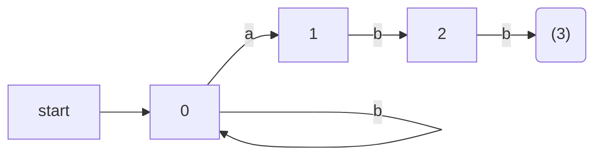

Figure 3.24: A nondeterministic finite automaton

Following our convention for transition diagrams, the double circle around state 3 indicates that this state is accepting. Notice that the only ways to get from the start state 0 to the accepting state is to follow some path that stays in state 0 for a while, then goes to states 1, 2, and 3 by reading abb from the input. Thus, the only strings getting to the accepting state are those that end in abb. □

### 3.6.2 Transition Tables

We can also represent an NFA by a *transition table*, whose rows correspond to states, and whose columns correspond to the input symbols and €. The entry for a given state and input is the value of the transition function applied to those arguments. If the transition function has no information about that state-input pair, we put Ø in the table for the pair.

**Example 3.15:** The transition table for the NFA of Fig. 3.24 is shown in Fig. 3.25. □

The transition table has the advantage that we can easily find the transitions on a given state and input. Its disadvantage is that it takes a lot of space, when the input alphabet is large, yet most states do not have any moves on most of the input symbols.

|STATE | a      | b   | €   |
|---   | ---    | --- | --- |
|0     | {0, 1} | {0} | Ø   |
|1     | Ø      | {2} | Ø   |
|2     | Ø      | {3} | Ø   |
|3     | Ø      | Ø   | Ø   |

Figure 3.25: Transition table for the NFA of Fig. 3.24

用F#語言表示NFA轉換表：

```F#
let nfaTransitionTable = Map [
    (0,Some 'a'),[0;1]
    (0,Some 'b'),[0]
    (0,None)    ,[]
    (1,Some 'a'),[]
    (1,Some 'b'),[2]
    (1,None)    ,[]
    (2,Some 'a'),[]
    (2,Some 'b'),[3]
    (2,None)    ,[]
    (3,Some 'a'),[]
    (3,Some 'b'),[]
    (3,None)    ,[]
]
```

用列表表示集合，注意其中的狀態從小到大排列，不能重複。目標狀態集合為空，可以省略，不列出。

### 3.6.3 Acceptance of Input Strings by Automata

An NFA *accepts* input string x if and only if there is some path in the transition graph from the start state to one of the accepting states, such that the symbols along the path spell out x. Note that € labels along the path are effectively ignored, since the empty string does not contribute to the string constructed along the path.

**Example 3.16:** The string `aabb` is accepted by the NFA of Fig. 3.24. The path labeled by `aabb` from state 0 to state 3 demonstrating this fact is:

```fs
0--a-->0--a-->1--b-->2--b-->3
```

Note that several paths labeled by the same string may lead to different states. For instance, path

```fs
0--a-->0--a-->0--b-->0--b-->0
```

is another path from state 0 labeled by the string `aabb`. This path leads to state 0, which is not accepting. However, remember that an NFA accepts a string as long as some path labeled by that string leads from the start state to an accepting state. The existence of other paths leading to a nonaccepting state is irrelevant. □

The *language defined* ( or *accepted*) by an NFA is the set of strings labeling some path from the start to an accepting state. As was mentioned, the NFA of Fig. 3.24 defines the same language as does the regular expression `(a|b)*abb`, that is, all strings from the alphabet {a , b} that end in `abb`. We may use *L(A)* to stand for the language accepted by automaton A.

**Example 3.17:** Figure 3.26 is an NFA accepting L(`aa*|bb*`). String aaa is accepted because of the path

```fs
0--€-->1--a-->2--a-->2--a-->2
```

Note that €'s "disappear" in a concatenation, so the label of the path is `aaa`.

□

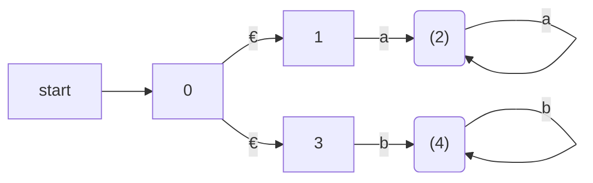

Figure 3.26: NFA accepting `aa*|bb*`

### 3.6.4 Deterministic Finite Automata

A *deterministic finite automaton* ( DFA ) is a special case of an NFA where:

1. There are no moves on input €, and

2. For each state s and input symbol a, there is exactly one edge out of s labeled a.

If we are using a transition table to represent a DFA, then each entry is a single state. we may therefore represent this state without the curly braces that we use to form sets.

While the NFA is an abstract representation of an algorithm to recognize the strings of a certain language, the DFA is a simple, concrete algorithm for recognizing strings. It is fortunate indeed that every regular expression and every NFA can be converted to a DFA accepting the same language, because it is the DFA that we really implement or simulate when building lexical analyzers. The following algorithm shows how to apply a DFA to a string.

**Algorithm 3.18:** Simulating a DFA.

**INPUT:** An input string x terminated by an end-of-file character **eof**. A DFA D with start state s~0~, accepting states F, and transition function `move`.

**OUTPUT:** Answer "yes" if D accepts x; "no" otherwise.

**METHOD:** Apply the algorithm in Fig. 3.27 to the input string x. The function `move(s, c)` gives the state to which there is an edge from state s on input c. The function `nextChar` returns the next character of the input string x. □

```c++
    s  =  s.[0]; 
    c  =  nextChar(); 
    while ( c  !=  eof )  { 
        s  =  move(s, c ); 
        c  =  nextChar(); 
    } 
    if ( s is in F ) return "yes"; 
    else return "no"; 
```

Figure 3.27: Simulating a DFA

F#代碼：

```F#
let move s c = transitionTable.[s,c]

let simulate (inp:string) =
    let iterator = (inp.ToCharArray():>seq<Char>).GetEnumerator()
    let nextChar() =
        if iterator.MoveNext() then
            Some(iterator.Current)
        else
            None

    let rec loop s =
        Console.WriteLine(sprintf "%A" s)

        match nextChar() with
        | Some c ->
            let s = move s c
            loop s
        | _ ->     
            Console.WriteLine(if finals.Contains s then "yes" else "no")

    loop 0
```

**Example 3.19:** In Fig. 3.28 we see the transition graph of a DFA accepting the language `(a|b)*abb`, the same as that accepted by the NFA of Fig. 3.24. Given the input string `ababb`, this DFA enters the sequence of states 0, 1, 2, 1, 2, 3 and returns "yes." □

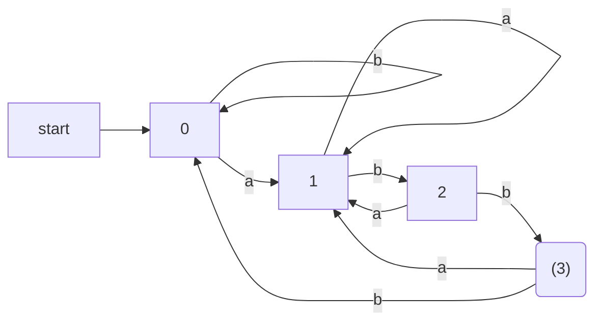

Figure 3.28: DFA accepting `(a|b)*abb` 

DFA的轉換表，上圖的代碼表示：

```F#
let dfaTransitionTable = Map.ofList[
    (0,'a'),1
    (0,'b'),0
    (1,'a'),1
    (1,'b'),2
    (2,'a'),1
    (2,'b'),3
    (3,'a'),1
    (3,'b'),0
]

let finals = set [3]
```

## 3.7 From Regular Expressions to Automata

The regular expression is the notation of choice for describing lexical analyzers and other pattern-processing software, as was reflected in Section 3.5. However, implementation of that software requires the simulation of a DFA, as in Algorithm 3.18, or,perhaps simulation of an NFA. Because an NFA often has a choice of move on an input symbol ( as Fig. 3.24 does on input a from state 0) or on € ( as Fig. 3.26 does from state 0), or even a choice of making a transition on € or on a real input symbol, its simulation is less straightforward than for a DFA. Thus often it is important to convert an NFA to a DFA that accepts the same language.

In this section we shall first show how to convert NFA's to DFA's. Then, we use this technique, known as "the subset construction," to give a useful algorithm for simulating NFA's directly, in situations ( other than lexical analysis ) where the NFA-to-DFA conversion takes more time than the direct simulation. Next, we show how to convert regular expressions to NFA's, from which a DFA can be constructed if desired. We conclude with a discussion of the time-space tradeoffs inherent in the various methods for implementing regular expressions, and see how to choose the appropriate method for your application.

### 3.7.1 Conversion of an NFA to a DFA

The general idea behind the subset construction is that each state of the constructed DFA corresponds to a set of NFA states. After reading input a1 a2 ... an, the DFA is in that state which corresponds to the set of states that the NFA can reach, from its start state, following paths labeled a1 a2 ... an.

It is possible that the number of DFA states is exponential in the number of NFA states, which could lead to difficulties when we try to implement this DFA. However, part of the power of the automaton-based approach to lexical analysis is that for real languages, the NFA and DFA have approximately the same number of states, and the exponential behavior is not seen.

**Algorithm 3.20:** The *subset construction* of a DFA from an NFA.

**INPUT:** An NFA N.

**OUTPUT:** A DFA D accepting the same language as N.

**METHOD:** Our algorithm constructs a transition table `Dtran` for D. Each state of D is a set of NFA states, and we construct `Dtran` so D will simulate "in parallel" all possible moves N can make on a given input string. Our first problem is to deal with €-transitions of N properly. In Fig. 3.31 we see the definitions of several functions that describe basic computations on the states of N that are needed in the algorithm. Note that s is a single state of N, while T is a set of states of N.

+ €-closure( s ) ：
  Set of NFA states reachable from NFA state `s` on €-transitions alone.
  
+ €-closure( T ) ：
  Set of NFA states reachable from some NFA state s in set `T` on €-transitions alone; =`∪s in T €-closure(s)`.
  
+ move( T, a ) ：
  Set of NFA states to which there is a transition on input symbol `a` from some state s in T. 

Figure 3.31: Operations on NFA states

We must explore those sets of states that N can be in after seeing some input string. As a basis, before reading the first input symbol, N can be in any of the states of €-closure(s~0~), where s~0~ is its start state. For the induction, suppose that N can be in set of states `T` after reading input string `x`. If it next reads input `a`, then N can immediately go to any of the states in `move(T, a)` . However, after reading `a`, it may also make several €-transitions; thus N could be in any state of `€-closure(move(T, a))` after reading input `xa`. Following these ideas, the construction of the set of D's states, `Dstates`, and its transition function `Dtran`, is shown in Fig. 3.32.

```C++
initially, €-closure( s0 ) is the only state in `Dstates`, and it is unmarked;
while ( there is an unmarked state T in Dstates ) {
    mark T;
    for ( each input symbol a ) {
        U  = €-closure(move(T, a)) ;
        if ( U is not in Dstates )
            add U as an unmarked state to Dstates;
        Dtran[T, a] =  U;
    }
}
```

Figure 3.32: The subset construction

The start state of D is €-closure( s~0~ ), and the accepting states of D are all those sets of N's states that include at least one accepting state of N. To complete our description of the subset construction, we need only to show how `€-closure(T)` is computed for any set of NFA states `T`. This process, shown in Fig. 3.33, is a straightforward search in a graph from a set of states. In this case, imagine that only the €-labeled edges are available in the graph. □

```C++
push all states of T onto stack;
initialize €-closure(T) to T;
while ( stack is not empty ) {
    pop t, the top element, off stack;
    for ( each state u with an edge from t to u labeled € )
    if ( u is not in €-closure(T) ) {
        add u to €-closure(T);
        push u onto stack;
    }
}
```

Figure 3.33: Computing €-closure(T)

**Example 3.21:** Figure 3.34 shows another NFA accepting `(a|b)*abb`; it happens to be the one we shall construct directly from this regular expression in Section 3.9. Let us apply Algorithm 3.20 to Fig. 3.34.

| STATE | a    | b    | €     |
| ----- | ---- | ---- | ----- |
| 0     |      |      | {1,7} |
| 1     |      |      | {2,4} |
| 2     | {3}  |      |       |
| 3     |      |      | {6}   |
| 4     |      | {5}  |       |
| 5     |      |      | {6}   |
| 6     |      |      | {1,7} |
| 7     | {8}  |      |       |
| 8     |      | {9}  |       |
| 9     |      | {10} |       |
| 10    |      |      |       |

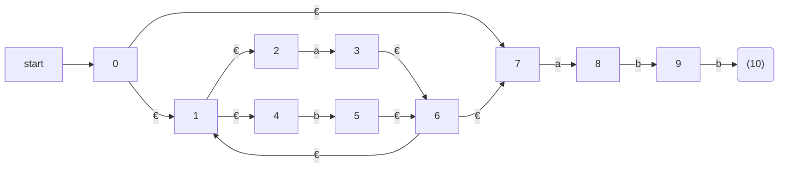

Figure 3.34: NFA N for `(a|b)*abb`

```F#
let nfaTransitionTable = [
    (0, None, 1);
    (0, None, 7);
    (1, None, 2);
    (1, None, 4);
    (2, Some 'a', 3);
    (4, Some 'b', 5);
    (3, None, 6);
    (5, None, 6);
    (6, None, 1);
    (6, None, 7);
    (7, Some 'a', 8);
    (8, Some 'b', 9);
    (9, Some 'b', 10)
]
```

The start state A of the equivalent DFA is €-closure(0), or A = {0, 1, 2, 4, 7}, since these are exactly the states reachable from state 0 via a path all of whose edges have label €. Note that a path can have zero edges, so state 0 is reachable from itself by an €-labeled path.

The input alphabet is {a, b}. Thus, our first step is to mark A and compute Dtran[A, a] = €-closure(move(A, a)) and Dtran[A, b] = €-closure(move(A, b)) . Among the states 0, 1, 2, 4, and 7, only 2 and 7 have transitions on a, to 3 and 8, respectively. Thus, move(A, a) = {3, 8}. Also, €-closure( {3, 8}) = {1, 2, 3, 4, 6, 7, 8 } , so we conclude 

```fs
Dtran[A, a] = €-closure( move(A, a)) = €-closure( {3, 8}) = {1, 2, 3, 4, 6, 7, 8} 
```

Let us call this set B, so Dtran[A, a] = B.

Now, we must compute Dtran[A, b]. Among the states in A, only 4 has a transition on b, and it goes to 5. Thus,

```fs
Dtran[A, b] = €-closure( {5}) = {1, 2, 4, 5, 6, 7}
```

Let us call the above set C, so Dtran[A, b] = C.

| NFA STATE              | DFA STATE | a    | b    |
| ---------------------- | --------- | ---- | ---- |
| {0, 1, 2, 4, 7}        | A         | B    | C    |
| {1, 2, 3, 4, 6, 7, 8}  | B         | B    | D    |
| {1, 2, 4, 5, 6, 7}     | C         | B    | C    |
| {1, 2, 4, 5, 6, 7, 9}  | D         | B    | E    |
| {1, 2, 3, 5, 6, 7, 10} | E         | B    | C    |

Figure 3.35: Transition table Dtran for DFA D

If we continue this process with the unmarked sets B and C, we eventually reach a point where all the states of the DFA are marked. This conclusion is guaranteed, since there are "only" 2^11^ different subsets of a set of eleven NFA states. The five different DFA states we actually construct, their corresponding sets of NFA states, and the transition table for the DFA D are shown in Fig. 3.35, and the transition graph for D is in Fig. 3.36. State A is the start state, and state E, which contains state 10 of the NFA, is the only accepting state.

Note that D has one more state than the DFA of Fig. 3.28 for the same language. States A and C have the same move function, and so can be merged. We discuss the matter of minimizing the number of states of a DFA in Section 3.9.6. □

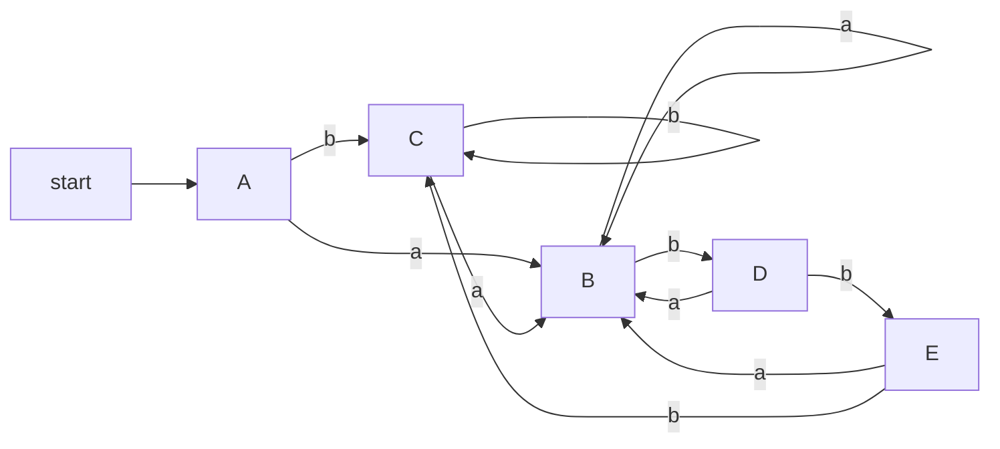

Figure 3.36: Result of applying the subset construction to Fig. 3.34

### 3.7.2 Simulation of an NFA

A strategy that has been used in a number of text-editing programs is to construct an NFA from a regular expression and then simulate the NFA using something like an on-the-fly subset construction. The simulation is outlined below.

**Algorithm 3.22:** Simulating an NFA.

**INPUT:** An input string x terminated by an end-of-file character **eof**. An NFA N with start state s~0~, accepting states F, and transition function `move`.

**OUTPUT:** Answer "yes" if N accepts x ; "no" otherwise.

**METHOD:** The algorithm keeps a set of current states S, those that are reached from s~0~ following a path labeled by the inputs read so far. If c is the next input character, read by the function `nextChar()`, then we first compute `move(S, c)` and then close that set using €-closure(). The algorithm is sketched in Fig. 3.37. □

```C++
1)  S = €-closure(s0) ;  
2)  c = nextChar(); 
3)  while ( c != eof )  { 
4)      S = €-closure(move(S, c)) ;
5)      c = nextChar(); 
6)  } 
7)  if ( S ∩ F  != Ø ) return "yes" ;
8)  else return "no"; 
```

Figure 3.37: Simulating an NFA

### 3.7.3 Efficiency of NFA Simulation

If carefully implemented, Algorithm 3.22 can be quite efficient . As the ideas involved are useful in a number of similar algorithms involving search of graphs, we shall look at this implementation in additional detail. The data structures we need are:

1. Two stacks, each of which holds a set of NFA states. One of these stacks, `oldStates`, holds the "current" set of states, i.e., the value of S on the right side of line (4) in Fig. 3.37. The second, `newStates`, holds the "next" set of states S on the left side of line (4). Unseen is a step where, as we go around the loop of lines ( 3 ) through (6), `newStates` is transferred to `oldStates`.

2. A boolean array `alreadyOn`, indexed by the NFA states, to indicate which states are in `newStates`. While the array and stack hold the same information, it is much faster to interrogate `alreadyOn[s]` than to search for state s on the stack `newStates`. It is for this efficiency that we maintain both representations.

3. A two-dimensional array move[s, a] holding the transition table of the NFA. The entries in this table, which are sets of states, are represented by linked lists.

To implement line (1) of Fig. 3.37, we need to set each entry in array `alreadyOn` to FALSE, then for each state s in €-closure(s~0~), push s onto `oldStates` and set `alreadyOn[s]` to TRUE. This operation on state s, and the implementation of line (4) as well, are facilitated by a function we shall call `addState(s)`. This function pushes state s onto `newStates`, sets `alreadyOn[s]` to TRUE, and calls itself recursively on the states in `move[s, €]` in order to further the computation of €-closure(s). However, to avoid duplicating work, we must be careful never to call `addState` on a state that is already on the stack `newStates`. Figure 3.38 sketches this function. 

```fs
 9) addState(s) { 
10)   push s onto newStates; 
11)   alreadyOn[s]  =  TRUE; 
12)   for ( t on move[s, €] ) 
13)     if ( !alreadyOn(t) ) 
14)       addState( t) ; 
15) } 
```

Figure 3.38: Adding a new state s, which is known not to be on newStates

We implement line (4) of Fig. 3.37 by looking at each state s on `oldStates`. We first find the set of states `move[s,c]`, where c is the next input, and for each of those states that is not already on `newStates`, we apply `addState` to it. Note that `addState` has the effect of computing the €-closure and adding all those states to `newStates` as well, if they were not already on. This sequence of steps is summarized in Fig. 3.39. 

```fs
16)  for ( s on oldStates )  { 
17)    for ( t on move[s, c] ) 
18)      if ( !alreadyOn[t] ) 
19)        addState(t); 
20)    pop s from oldStates; 
21)  } 

22)  for ( s on newStates ) { 
23)    pop s from newStates; 
24)    push s onto oldStates; 
25)    alreadyOn[s] = FALSE; 
26)  } 
```

Figure 3.39: Implementation of step (4) of Fig. 3.37

---

#### Big-Oh Notation

An expression like O(n) is a shorthand for "at most some constant times n." Technically, we say a function ƒ(n), perhaps the running time of some step of an algorithm, is O(g(n)) if there are constants c and n~0~, such that whenever n ≥ n~0~, it is true that ƒ(n) ≤ cg(n). A useful idiom is "O(1)," Which means "some constant." The use of this big-oh notation enables us to avoid getting too far into the details of what we count as a unit of execution time, yet lets us express the rate at which the running time of an algorithm grows.

---

Now, suppose that the NFA N has n states and m transitions; i.e., m is the sum over all states of the number of symbols ( or €) on which the state has a transition out. Not counting the call to `addState` at line (19) of Fig. 3.39, the time spent in the loop of lines (16) through (21) is O(n). That is, we can go around the loop at most n times, and each step of the loop requires constant work, except for the time spent in `addState`. The same is true of the loop of lines (22) through (26).

During one execution of Fig. 3.39, i.e., of step (4) of Fig. 3.37, it is only possible to call `addState` on a given state once. The reason is that whenever we call `addState(s)`, we set `alreadyOn[s]` to TRUE at line (11) of Fig. 3.39. Once `alreadyOn[s]` is TRUE, the tests at line (13) of Fig. 3.38 and line (18 ) of Fig. 3.39 prevent another call.

The time spent in one call to `addState`, exclusive of the time spent in recursive calls at line (14), is O(1) for lines (10) and (11). For lines (12) and (13), the time depends on how many €-transitions there are out of state s. We do not know this number for a given state, but we know that there are at most m transitions in total, out of all states. As a result, the aggregate time spent in lines (11) over all calls to `addState` during one execution of the code of Fig. 3.39 is O(m). The aggregate for the rest of the steps of `addState` is O(n), since it is a constant per call, and there are at most n calls.

We conclude that, implemented properly, the time to execute line (4) of Fig. 3.37 is O(n + m). The rest of the while-loop of lines (3) through (6) takes O(1) time per iteration. If the input x is of length k, then the total work in that loop is O(k(n + m)) . Line (1) of Fig. 3.37 can be executed in O(n + m) time, since it is essentially the steps of Fig. 3.39 with `oldStates` containing only the state s~0~. Lines (2), (7), and (8) each take O(1) time. Thus, the running time of Algorithm 3.22, properly implemented, is O((k(n + m)) . That is, the time taken is proportional to the length of the input times the size (nodes plus edges) of the transition graph.

### 3.7.4 Construction of an NFA from a Regular Expression

We now give an algorithm for converting any regular expression to an NFA that defines the same language. The algorithm is syntax-directed, in the sense that it works recursively up the parse tree for the regular expression. For each subexpression the algorithm constructs an NFA with a single accepting state.

**Algorithm 3.23:** The McNaughton-Yamada-Thompson algorithm to convert a regular expression to an NFA.

**INPUT:** A regular expression r over alphabet ∑.

**OUTPUT:** An NFA N accepting L(r).

**METHOD:** Begin by parsing r into its constituent subexpressions. The rules for constructing an NFA consist of basis rules for handling subexpressions with no operators, and inductive rules for constructing larger NFA's from the NFA's for the immediate subexpressions of a given expression.

**BASIS:** For expression € construct the NFA

```fs
start->(i)--€-->((ƒ))
```

Here, i is a new state, the start state of this NFA, and ƒ is another new state, the accepting state for the NFA.

For any subexpressiop a in ∑, construct the NFA

```fs
start->(i)--a-->((ƒ))
```

where again i and ƒ are new states,  the start and accepting states, respectively. Note that in both of the basis constructions, we construct a distinct NFA, with new states, for every occurrence of € or some a as a subexpression of r.

**INDUCTION:** Suppose N(s) and N(t) are NFA's for regular expressions s and t, respectively.

1. Suppose `r = s|t`. Then N(r), the NFA for r, is constructed as in Fig. 3.40. Here, i and f are new states, the start and accepting states of N(r), respectively. There are €-transitions from i to the start states of N (s) and N (t), and each of their accepting states have €-transitions to the accepting state f. Note that the accepting states of N (s) and N (t) are not accepting in N (r) . Since any path from i to f must pass through either N(s) or N(t) exclusively, and since the label of that path is not changed by the €'s leaving i or entering f, we conclude that N(r) accepts `L(s) ∪ L(t)`, which is the same as L(r). That is, Fig. 3.40 is a correct construction for the union operator.

   ```mermaid
   graph LR
   s0(start)
   1["/"]
   2["/"]
   3["/"]
   4["/"]
   f(f)
   s0 -->i
   i --€-->1
   subgraph Ns
   1-.-3
   end
   i--€-->2
   3--€-->f
   4--€-->f
   subgraph Nt
   2-.-4
   end
   ```

   Figure 3.40: NFA for the union of two regular expressions

2. Suppose `r = st`. Then construct N(r) as in Fig. 3.41. The start state of N(s) becomes the start state of N(r), and the accepting state of N(t) is the only accepting state of N(r). The accepting state of N(s) and the start state of N(t) are merged into a single state, with all the transitions in or out of either state. A path from i to f in Fig. 3.41 must go first through N(s), and therefore its label will begin with some string in L(s). The path then continues through N(t), so the path's label finishes with a string in L(t). As we shall soon argue, accepting states never have edges out and start states never have edges in, so it is not possible for a path to re-enter N(s) after leaving it. Thus, N(r) accepts exactly `L(s)L(t)`, and is a correct NFA for r = st.

   ```mermaid
   graph LR
   s0(start)-->i
   i-.-|"N(s)"|j
   j-.-|"N(t)"|f
   
   ```

   Figure 3.41: NFA for the concatenation of two regular expressions

3. Suppose `r = s*` . Then for r we construct the NFA N(r) shown in Fig. 3.42. Here, i and f are new states, the start state and lone accepting state of N(r). To get from i to f, we can either follow the introduced path labeled €, which takes care of the one string in L(s)^0^, or we can go to the start state of N(s), through that NFA, then from its accepting state back to its start state zero or more times. These options allow N(r) to accept all the strings in L(s)^1^, L(s)^2^, and so on, so the entire set of strings accepted by N(r) is L(s*) :

   ```mermaid
   graph LR
   f(f)
   0(start) -->i
   i--€-->j
   i--€-->f
   subgraph Ns
   j-.-k
   k--€-->j
   end
   k--€-->f
   ```

   Figure 3.42: NFA for the closure of a regular expression

4. Finally, suppose r = (s). Then L(r) = L(s), and we can use the NFA N(s) as N(r).

□

The method description in Algorithm 3.23 contains hints as to why the inductive construction works as it should. We shall not give a formal correctness proof, but we shall list several properties of the constructed NFA's, in addition to the all-important fact that N(r) accepts language L(r). These properties are interesting in their own right, and helpful in making a formal proof.

1. N(r) has at most twice as many states as there are operators and operands in r. This bound follows from the fact that each step of the algorithm creates at most two new states.

2. N(r) has one start state and one accepting state. The accepting state has no outgoing transitions, and the start state has no incoming transitions.

3. Each state of N(r) other than the accepting state has either one outgoing transition on a symbol in ∑ or two outgoing transitions, both on €.

**Example 3.24:** Let us use Algorithm 3.23 to construct an NFA for `r = (a|b)*abb`. Figure 3.43 shows a parse tree for r that is analogous to the parse trees constructed for arithmetic expressions in Section 2.2.3. For subexpression r~1~, the first a, we construct the NFA:

```F#
let r1 = Leaf 'a'
let r2 = Leaf 'b'
let r6 = Leaf 'a'
let r8 = Leaf 'b'
let r10 = Leaf 'b'
let r3 = Union(r1,r2)
let r5 = Star r3
let r7 = Cat(r5,r6)
let r9 = Cat(r7,r8)
let r11 = Cat(r9,r10)
```

Figure 3.43: Parse tree for `(a|b)*abb` 

```fs
start->(2)-a->((3))
```

State numbers have been chosen for consistency with what follows. For r~2~ we construct:

```fs
start->(4)-b->((5))
```

We can now combine N(r~1~) and N(r~2~), using the construction of Fig. 3.40 to obtain the NFA for r~3~ = r~1~ | r~2~ ; this NFA is shown in Fig. 3.44.

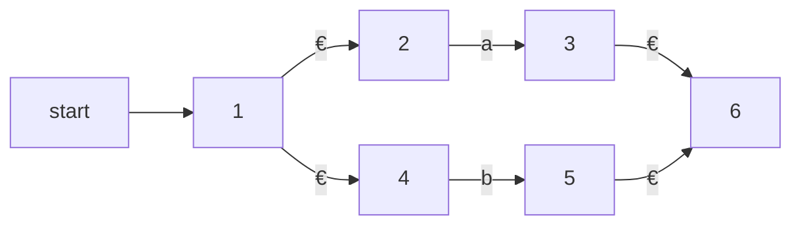

Figure 3.44: NFA for r~3~

The NFA for r~4~ = (r~3~) is the same as that for r~3~ . The NFA for r~5~ = (r~3~ )* is then as shown in Fig. 3.45. We have used the construction in Fig. 3.42 to build this NFA from the NFA in Fig. 3.44.

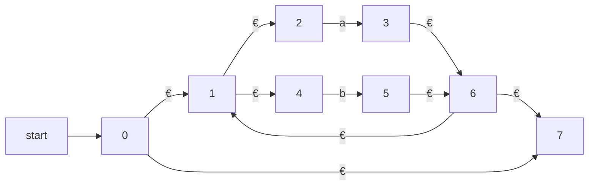

Figure 3.45: NFA for r~5~

Now, consider subexpression r~6~ , which is another a. We use the basis construction for a again, but we must use new states. It is not permissible to reuse the NFA we constructed for r~1~ , even though r~1~ and r~6~ are the same expression. The NFA for r~6~ is:

```fs
start->(7')-a->((8))
```

To obtain the NFA for r~7~ = r~5~ r~6~ , we apply the construction of Fig. 3.41. We merge states 7 and 7', yielding the NFA of Fig. 3.46. Continuing in this fashion with new NFA's for the two subexpressions b called r~8~ and r_10 , we eventually construct the NFA for (a|b)*abb that we first met in Fig. 3.34. □

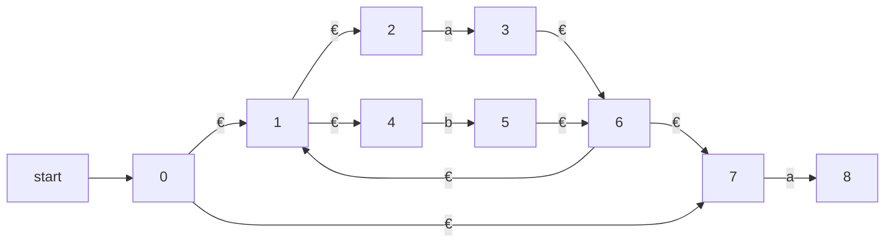

Figure 3.46: NFA for r~7~

### 3.7.5 Efficiency of String-Processing Algorithms

We observed that Algorithm 3.18 processes a string x in time O(|x|) , while in Section 3.7.3 we concluded that we could simulate an NFA in time proportional to the product of |x| and the size of the NFA's transition graph. Obviously, it is faster to have a DFA to simulate than an NFA, so we might wonder whether it ever makes sense to simulate an NFA.

One issue that may favor an NFA is that the subset construction can, in the worst case, exponentiate the number of states. While in principle, the number of DFA states does not influence the running time of Algorithm 3.18, should the number of states become so large that the transition table does not fit in main memory, then the true running time would have to include disk I/O and therefore rise noticeably.

**Example 3.25:** Consider the family of languages described by regular expressions of the form `Ln = (a|b)*a(a|b){n-1}`, that is, each language Ln consists of strings of a's and b's such that the nth character to the left of the right end holds a. An n + 1-state NFA is easy to construct. It stays in its initial state under any input, but also has the option, on input a, of going to state 1. From state 1, it goes to state 2 on any input, and so on, until in state n it accepts. Figure 3.47 suggests this NFA.

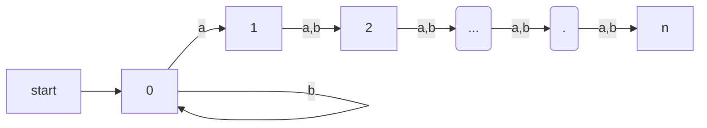

Figure 3.47: An NFA that has many fewer states than the smallest equivalent DFA

However, any DFA for the language Ln must have at least 2^n^ states. We shall not prove this fact, but the idea is that if two strings of length n can get the DFA to the same state, then we can exploit the last position where the strings differ ( and therefore one must have a, the other b) to continue the strings identically, until they are the same in the last n - 1 positions. The DFA will then be in a state where it must both accept and not accept. Fortunately, as we mentioned, it is rare for lexical analysis to involve patterns of this type, and we do not expect to encounter DFA's with outlandish numbers of states in practice. □

However, lexical-analyzer generators and other string-processing systems often start with a regular expression. We are faced with a choice of converting the regular expression to an NFA or DFA. The additional cost of going to a DFA is thus the cost of executing Algorithm 3.23 on the NFA ( one could go directly from a regular expression to a DFA, but the work is essentially the same) . If the string-processor is one that will be executed many times, as is the case for lexical analysis, then any cost of converting to a DFA is worthwhile. However, in other string-processing applications, such as grep, where the user specifies one regular expression and one or several files to be searched for the pattern of that expression, it may be more efficient to skip the step of constructing a DFA, and simulate the NFA directly.

Let us consider the cost of converting a regular expression r to an NFA by Algorithm 3.23. A key step is constructing the parse tree for r. In Chapter 4 we shall see several methods that are capable of constructing this parse tree in linear time, that is, in time O(|r|), where |r| stands for the size of r the sum of the number of operators and operands in r. It is also easy to check that each of the basis and inductive constructions of Algorithm 3.23 takes constant time, so the entire time spent by the conversion to an NFA is O(|r|) .

Moreover, as we observed in Section 3.7.4, the NFA we construct has at most 2|r| states and at most 4|r| transitions. That is, in terms of the analysis in Section 3.7.3, we have n ≤ 2|r| and m ≤ 4|r|. Thus, simulating this NFA on an input string x takes time O(|r| × |x|). This time dominates the time taken by the NFA construction, which is O(|r|), and therefore, we conclude that it is possible to take a regular expression r and string x, and tell whether x is in L(r) in time O(|r| × |x|).

The time taken by the subset construction is highly dependent on the number of states the resulting DFA has. To begin, notice that in the subset construction of Fig. 3.32, the key step, the construction of a set of states U from a set of states T and an input symbol a, is very much like the construction of a new set of states from the old set of states in the NFA simulation of Algorithm 3.22. We already concluded that, properly implemented, this step takes time at most proportional to the number of states and transitions of the NFA.

Suppose we start with a regular expression r and convert it to an NFA. This NFA has at most 2|r| states and at most 4|r| transitions. Moreover, there are at most |r| input symbols. Thus, for every DFA state constructed, we must construct at most |r| new states, and each one takes at most O(|r|) time. The time to construct a DFA of s states is thus O(|r|^2^ s).

In the common case where s is about |r|, the subset construction takes time O(|r|^3^). However, in the worst case, as in Example 3.25, this time is O(|r|^2^ 2^|r|^). Figure 3.48 summarizes the options when one is given a regular expression r and wants to produce a recognizer that will tell whether one or more strings x are in L(r).

```fs
| AUTOMATON        | INITIAL            | PER STRING   |
| ---------------- | ------------------ | -------------|
| NFA              | O(|r|)             | O(|r| × |x|) |
| DFA typical case | O(|r|^3)           | O(|x|)       |
| DFA worst case   | O(|r|^2 2^|r|)     | O(|x|)       |
```

Figure 3.48: Initial cost and per-string-cost of various methods of recognizing the language of a regular expression

If the per-string cost dominates, as it does when we build a lexical analyzer, we clearly prefer the DFA. However, in commands like grep, where we run the automaton on only one string, we generally prefer the NFA. It is not until |x| approaches |r|^3^ that we would even think about converting to a DFA.

There is, however, a mixed strategy that is about as good as the better of the NFA and the DFA strategy for each expression r and string x. Start off simulating the NFA, but remember the sets of NFA states ( i.e., the DFA states ) and their transitions, as we compute them. Before processing the current set of NFA states and the current input symbol, check to see whether we have already computed this transition, and use the information if so. 

## 3.8 Design of a Lexical-Analyzer Generator

In this section we shall apply the techniques presented in Section 3.7 to see how a lexical-analyzer generator such as Lex is architected. We discuss two approaches, based on NFA's and DFA's; the latter is essentially the implementation of Lex.

### 3.8.1 The Structure of the Generated Analyzer

Figure 3.49 overviews the architecture of a lexical analyzer generated by Lex. The program that serves as the lexical analyzer includes a fixed program that simulates an automaton; at this point we leave open whether that automaton is deterministic or nondeterministic. The rest of the lexical analyzer consists of components that are created from the Lex program by Lex itself.

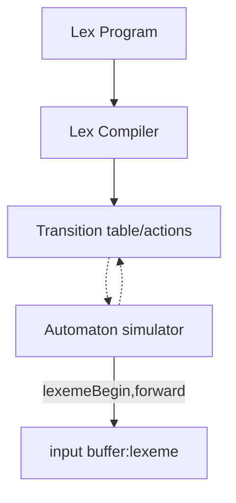

Figure 3.49: A Lex program is turned into a transition table and actions, which are used by a finite-automaton simulator

These components are:

1. A transition table for the automaton.

2. Those functions that are passed directly through Lex to the output ( see Section 3.5.2).

3. The actions from the input program, which appear as fragments of code to be invoked at the appropriate time by the automaton simulator.

To construct the automaton, we begin by taking each regular-expression pattern in the Lex program and converting it, using Algorithm 3.23, to an NFA. We need a single automaton that will recognize lexemes matching any of the patterns in the program, so we combine all the NFA's into one by introducing a new start state with €-transitions to each of the start states of the NFA's N~i~ for pattern p~i~. This construction is shown in Fig. 3.50.

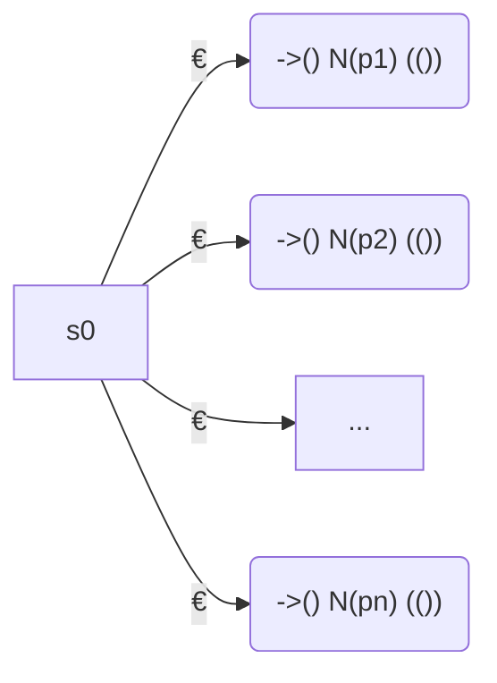

Figure 3.50: An NFA constructed from a Lex program

**Example 3.26:** We shall illustrate the ideas of this section with the following simple, abstract example:

```fs
a    { action A1  for pattern P1  } 
abb  { action A2  for pattern P2  } 
a*b+ { action A3  for pattern P3  } 
```

Note that these three patterns present some conflicts of the type discussed in Section 3.5.3. In particular, string `abb` matches both the second and third patterns, but we shall consider it a lexeme for pattern p~2~ , since that pattern is listed first in the above Lex program. Then, input strings such as `aabbb...` have many prefixes that match the third pattern. The Lex rule is to take the longest, so we continue reading b's, until another a is met, whereupon we report the lexeme to be the initial a's followed by as many b's as there are.

Figure 3.51 shows three NFA's that recognize the three patterns. The third is a simplification of what would come out of Algorithm 3.23. Then, Fig. 3.52 shows these three NFA's combined into a single NFA by the addition of start state 0 and three €-transitions. □

```fs
start->(1)-a->((2))

start->(3)-a->(4)-b->(5)-b->((6))

start->(7)-b->((8))
        U       U
```

Figure 3.51: NFA's for `a`, `abb`, and `a*b+`

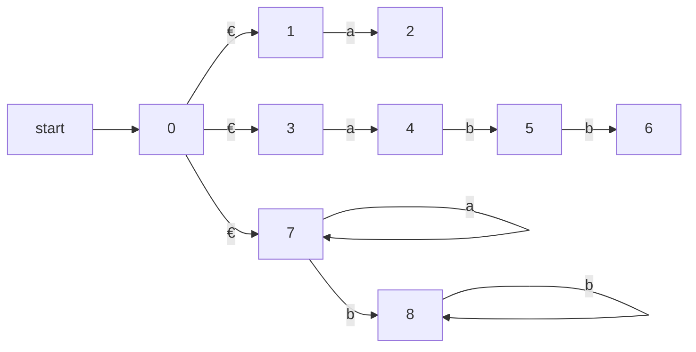

Figure 3.52: Combined NFA

### 3.8.2 Pattern Matching Based on NFA's

If the lexical analyzer simulates an NFA such as that of Fig. 3.52, then it must read input beginning at the point on its input which we have referred to as `lexemeBegin`. As it moves the pointer called `forward` ahead in the input, it calculates the set of states it is in at each point, following Algorithm 3.22.

Eventually, the NFA simulation reaches a point on the input where there are no next states. At that point, there is no hope that any longer prefix of the input would ever get the NFA to an accepting state; rather, the set of states will always be empty. Thus, we are ready to decide on the longest prefix that is a lexeme matching some pattern.

We look backwards in the sequence of sets of states, until we find a set that includes one or more accepting states. If there are several accepting states in that set, pick the one associated with the earliest pattern p~i~ in the list from the Lex program. Move the `forward` pointer back to the end of the lexeme, and perform the action Ai associated with pattern p~i~.

**Example 3.27:** Suppose we have the patterns of Example 3.26 and the input begins `aaba`. Figure 3.53 shows the sets of states of the NFA of Fig. 3.52 that we enter, starting with €-closure of the initial state 0, which is {0, 1, 3, 7}, and proceeding from there. After reading the fourth input symbol, we are in an empty set of states, since in Fig. 3.52, there are no transitions out of state 8 on input a.

```fs
{0,1,3,7} -a-> {2,4,7} -a-> {7} -b-> {8} -a-> none
                 /a/                /a*b+/
```

Figure 3.53: Sequence of sets of states entered when processing input `aaba`

Thus, we need to back up, looking for a set of states that includes an accepting state. Notice that, as indicated in Fig. 3.53, after reading a we are in a set that includes state 2 and therefore indicates that the pattern a has been matched. However, after reading aab, we are in state 8, which indicates that `a*b+` has been matched; prefix aab is the longest prefix that gets us to an accepting state. We therefore select aab as the lexeme, and execute action A3, which should include a return to the parser indicating that the token whose pattern is `p3 = a*b+` has been found. □

### 3.8.3 DFA's for Lexical Analyzers

Another architecture, resembling the output of Lex, is to convert the NFA for all the patterns into an equivalent DFA, using the subset construction of Algorithm 3.20. Within each DFA state, if there are one or more accepting NFA states, determine the first pattern whose accepting state is represented, and make that pattern the output of the DFA state.

**Example 3.28:** Figure 3.54 shows a transition diagram based on the DFA that is constructed by the subset construction from the NFA in Fig. 3.52. The accepting states are labeled by the pattern that is identified by that state. For instance, the state {6, 8} has two accepting states, corresponding to patterns `abb` and `a*b+`. Since the former is listed first , that is the pattern associated with state {6, 8}. □

We use the DFA in a lexical analyzer much as we did the NFA. We simulate the DFA until at some point there is no next state ( or strictly speaking, the next state is Ø, the dead state corresponding to the empty set of NFA states ) . At that point, we back up through the sequence of states we entered and, as soon as we meet an accepting DFA state, we perform the action associated with the pattern for that state.

**Example 3.29:** Suppose the DFA of Fig. 3.54 is given input abba. The sequence of states entered is 0137, 247, 58, 68, and at the final a there is no transition out of state 68. Thus, we consider the sequence from the end, and in this case, 68 itself is an accepting state that reports pattern p2 = abb. □

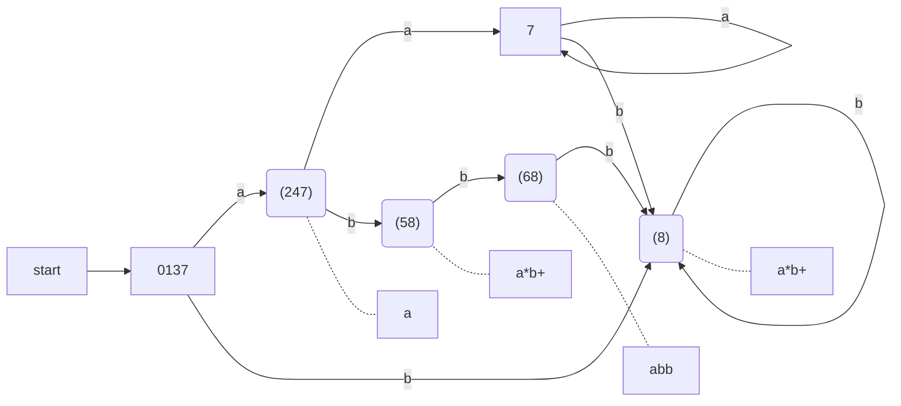

Figure 3.54: Transition graph for DFA handling the patterns a, abb, and a*b+

### 3.8.4 Implementing the Lookahead Operator

Recall from Section 3.5.4 that the Lex lookahead operator `/` in a Lex pattern `r1 / r2` is sometimes necessary, because the pattern `r1` for a particular token may need to describe some trailing context `r2` in order to correctly identify the actual lexeme. When converting the pattern `r1 / r2` to an NFA, we treat the `/` as if it were €, so we do not actually look for a `/` on the input. However, if the NFA recognizes a prefix `xy` of the input buffer as matching this regular expression, the end of the lexeme is not where the NFA entered its accepting state. Rather the end occurs when the NFA enters a state `s` such that

1. `s` has an €-transition on the ( imaginary ) `/`,

2. There is a path from the start state of the NFA to state `s` that spells out x.

3. There is a path from state `s` to the accepting state that spells out y .

4. x is as long as possible for any xy satisfying conditions 1-3.

If there is only one €-transition state on the imaginary `/` in the NFA, then the end of the lexeme occurs when this state is entered for the last time as the following example illustrates. If the NFA has more than one €-transition state on the imaginary `/`, then the general problem of finding the correct state s is much more difficult.

**Example 3.30:** An NFA for the pattern for the Fortran IF with lookahead, from Example 3.13, is shown in Fig. 3.55. Notice that the €-transition from state 2 to state 3 represents the lookahead operator. State 6 indicates the presence of the keyword IF. However, we find the lexeme IF by scanning backwards to the last occurrence of state 2, whenever state 6 is entered. □

```fs
                                    +->(4)
                        (/)         | any
start->(0)-I->(1)-F->(2)-€->(3)-(->(4)-)->(5)-letter->((6))
```

Figure 3.55: NFA recognizing the keyword IF

---

#### Dead States in DFA's

Technically, the automaton in Fig. 3.54 is not quite a DFA. The reason is that a DFA has a transition from every state on every input symbol in its input alphabet. Here, we have omitted transitions to the dead state Ø, and we have therefore omitted the transitions from the dead state to itself on every input. Previous NFA-to-DFA examples did not have a way to get from the start state to Ø, but the NFA of Fig. 3.52 does.

However, when we construct a DFA for use in a lexical analyzer, it is important that we treat the dead state differently, since we must know when there is no longer any possibility of recognizing a longer lexeme. Thus, we suggest always omitting transitions to the dead state and eliminating the dead state itself. In fact, the problem is harder than it appears, since an NFA-to-DFA construction may yield several states that cannot reach any accepting state, and we must know when any of these states have been reached. Section 3.9.6 discusses how to combine all these states into one dead state, so their identification becomes easy. It is also interesting to note that if we construct a DFA from a regular expression using Algorithms 3.20 and 3.23, then the DFA will not have any states besides Ø that cannot lead to an accepting state.

---

## 3.9 Optimization of DFA-Based Pattern Matchers

In this section we present three algorithms that have been used to implement and optimize pattern matchers constructed from regular expressions.

1. The first algorithm is useful in a Lex compiler, because it constructs a DFA directly from a regular expression, without constructing an intermediate NFA. The resulting DFA also may have fewer states than the DFA constructed via an NFA.

2. The second algorithm minimizes the number of states of any DFA, by combining states that have the same future behavior. The algorithm itself is quite efficient, running in time O( n log n ) , where n is the number of states of the DFA.

3. The third algorithm produces more compact representations of transition tables than the standard, two-dimensional table.

### 3.9.1 Important States of an NFA

To begin our discussion of how to go directly from a regular expression to a DFA, we must first dissect the NFA construction of Algorithm 3.23 and consider the roles played by various states. We call a state of an NFA *important* if it has a non-€ out-transition. Notice that the subset construction ( Algorithm 3.20) uses only the important states in a set T when it computes `€-closure(move(T, a))` , the set of states reachable from T on input a. That is, the set of states `move(s, a)` is nonempty only if state s is important. During the subset construction, two sets of NFA states can be identified ( treated as if they were the same set ) if they:

1. Have the same important states, and

2. Either both have accepting states or neither does.

When the NFA is constructed from a regular expression by Algorithm 3.23, we can say more about the important states. The only important states are those introduced as initial states in the basis part for a particular symbol position in the regular expression. That is, each important state corresponds to a particular operand in the regular expression.

The constructed NFA has only one accepting state, but this state, having no out-transitions, is not an important state. By concatenating a unique right endmarker `#` to a regular expression r, we give the accepting state for r a transition on `#`, making it an important state of the NFA for `(r)#`. In other words, by using the augmented regular expression `(r)#`, we can forget about accepting states as the subset construction proceeds; when the construction is complete, any state with a transition on `#` must be an accepting state.

The important states of the NFA correspond directly to the positions in the regular expression that hold symbols of the alphabet. It is useful, as we shall see, to present the regular expression by its syntax tree, where the leaves correspond to operands and the interior nodes correspond to operators. An interior node is called a *cat-node*, *or-node*, or *star-node* if it is labeled by the concatenation operator (dot), union operator |, or star operator *, respectively. We can construct a syntax tree for a regular expression just as we did for arithmetic expressions in Section 2.5.1.

**Example 3.31:** Figure 3.56 shows the syntax tree for the regular expression of our running example. Cat-nodes are represented by circles. □

```F#
let r1 = Union(Leaf(1, 'a'),Leaf(2, 'b'))
let r2 = Star r1
let r3 = Cat(r2, Leaf(3, 'a'))
let r4 = Cat(r3, Leaf(4, 'b'))
let r5 = Cat(r4, Leaf(5, 'b'))
let r6 = Cat(r5, Leaf(6, '#'))
```

Figure 3.56: Syntax tree for `(a|b)*abb#`

Leaves in a syntax tree are labeled by € or by an alphabet symbol. To each leaf not labeled €, we attach a unique integer. We refer to this integer as the position of the leaf and also as a position of its symbol. Note that a symbol can have several positions; for instance, a has positions 1 and 3 in Fig. 3.56. The positions in the syntax tree correspond to the important states of the constructed NFA.

**Example 3.32:** Figure 3.57 shows the NFA for the same regular expression as Fig. 3.56, with the important states numbered and other states represented by letters. The numbered states in the NFA and the positions in the syntax tree correspond in a way we shall soon see. □

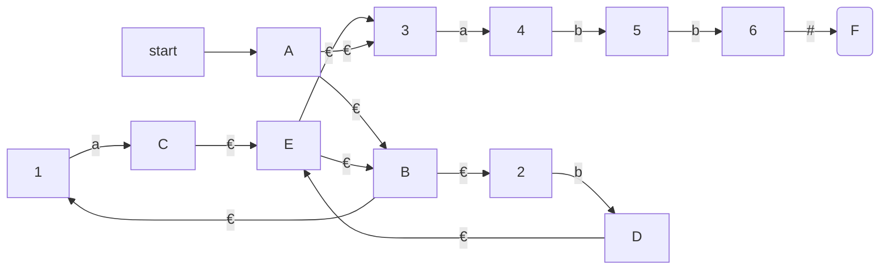

Figure 3.57: NFA constructed by Algorithm 3.23 for `(a|b)*abb#`

### 3.9.2 Functions Computed From the Syntax Tree

To construct a DFA directly from a regular expression, we construct its syntax tree and then compute four functions: `nullable`, `firstpos`, `lastpos`, and `followpos`, defined as follows. Each definition refers to the syntax tree for a particular augmented regular expression `(r)#`.

1. `nullable(n)` is true for a syntax-tree node n if and only if the subexpression represented by n has € in its language. That is, the subexpression can be "made null" or the empty string, even though there may be other strings it can represent as well.

2. `firstpos(n)` is the set of positions in the subtree rooted at n that correspond to the first symbol of at least one string in the language of the subexpression rooted at n.

3. `lastpos(n)` is the set of positions in the subtree rooted at n that correspond to the last symbol of at least one string in the language of the subexpression rooted at n. 

4. `followpos(p)`, for a position p, is the set of positions q in the entire syntax tree such that there is some string x = a1 a2 ... an in L(`(r)#`) such that for some i, there is a way to explain the membership of x in L(`(r)#`) by matching a~i~ to position p of the syntax tree and a~i+1~ to position q.

**Example 3.33:** Consider the cat-node n in Fig. 3.56 that corresponds to the expression `(a|b)*a`. We claim `nullable(n)` is false, since this node generates all strings of a's and b's ending in an a; it does not generate €. On the other hand, the star-node below it is nullable; it generates € along with all other strings of a's and b's.

`firstpos(n) = {1, 2, 3}`. In a typical generated string like aa, the first position of the string corresponds to position 1 of the tree, and in a string like ba, the first position of the string comes from position 2 of the tree. However, when the string generated by the expression of node n is just a, then this a comes from position 3.

`lastpos(n) = {3}`. That is, no matter what string is generated from the expression of node n, the last position is the a from position 3 of the tree.

`followpos` is trickier to compute, but we shall see the rules for doing so shortly. Here is an example of the reasoning: `followpos(1) = {1, 2, 3}`. Consider a string `... ac ...` , where the c is either a or b, and the a comes from position 1. That is, this a is one of those generated by the a in expression `(a|b)*`. This a could be followed by another a or b coming from the same subexpression, in which case c comes from position 1 or 2. It is also possible that this a is the last in the string generated by `(a|b)*`, in which case the symbol c must be the a that comes from position 3. Thus, 1, 2, and 3 are exactly the positions that can follow position 1. □

### 3.9.3 Computing nullable, firstpos, and lastpos

We can compute `nullable`, `firstpos`, and `lastpos` by a straightforward recursion on the height of the tree. The basis and inductive rules for `nullable` and `firstpos` are summarized in Fig. 3.58. The rules for `lastpos` are essentially the same as for `firstpos`, but the roles of children c1 and c2 must be swapped in the rule for a cat-node.

| Node n                 | nullable(n)                     | firstpos(n)                                                  |
| ---------------------- | ------------------------------- | ------------------------------------------------------------ |
| A leaf labeled €       | true                            | Ø                                                            |
| A leaf with position i | false                           | {i}                                                          |
| An or-node n = c1\|c2  | nullable(c1) or nullable(c2)    | firstpos( c1 ) ∪ firstpos(c2)                                |
| A cat-node n = c1 c2   | nullable( c1 ) and nullable(c2) | if nullable( c1 ) then firstpos( c1 ) ∪ firstpos(c2) else firstpos(c1) |
| A star-node n = c1 *   | nullable(n) = true              | firstpos( c1 )                                               |

Figure 3.58: Rules for computing nullable and firstpos

**Example 3.34:** Of all the nodes in Fig. 3.56 only the star-node is nullable. We note from the table of Fig. 3.58 that none of the leaves are nullable, because they each correspond to non-€ operands. The or-node is not nullable, because neither of its children is. The star-node is nullable, because every star-node is nullable. Finally, each of the cat-nodes, having at least one non nullable child, is not nullable.

The computation of firstpos and lastpos for each of the nodes is shown in Fig. 3.59, with `firstpos(n)` to the left of node n, and `lastpos(n)` to its right. Each of the leaves has only itself for firstpos and lastpos, as required by the rule for non-€ leaves in Fig. 3.58. For the or-node, we take the union of firstpos at the children and do the same for lastpos. The rule for the star-node says that we take the value of firstpos or lastpos at the one child of that node.

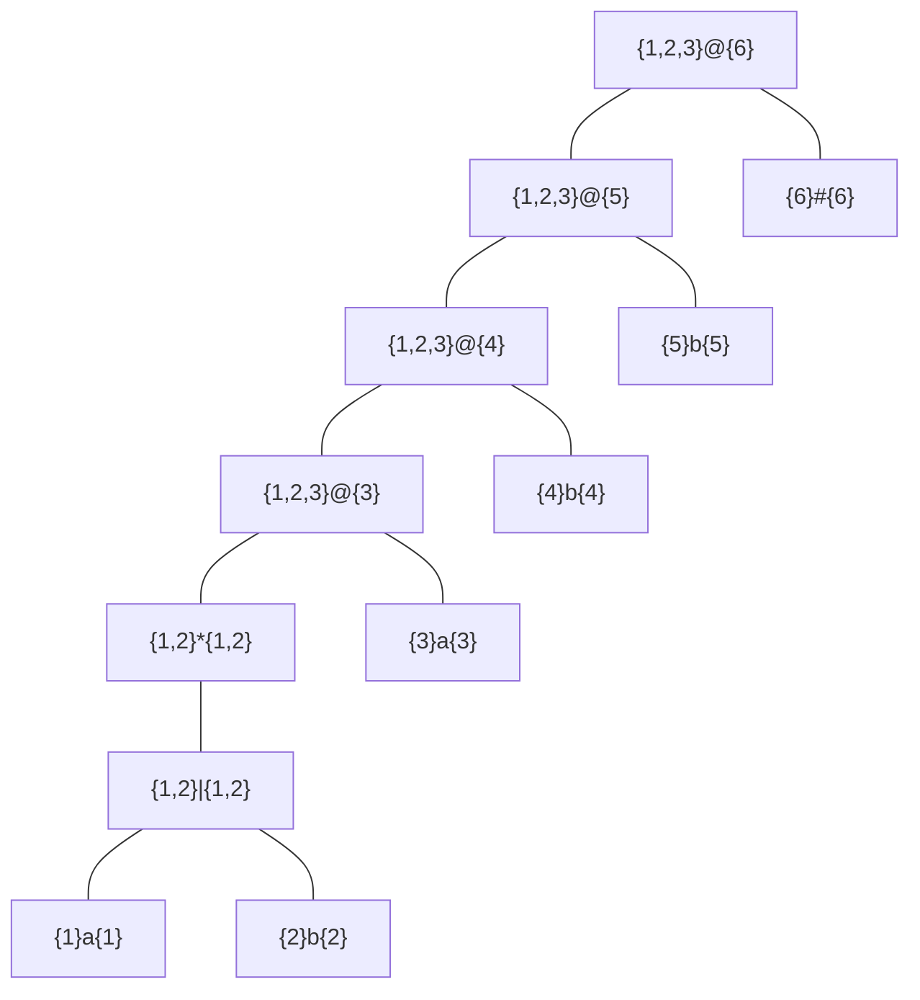

Figure 3.59: firstpos and lastpos for nodes in the syntax tree for `(a|b)*abb#`

Now, consider the lowest cat-node, which we shall call n. To compute `firstpos(n)`, we first consider whether the left operand is nullable, which it is in this case. Therefore, firstpos for n is the union of firstpos for each of its children, that is {1, 2} ∪ {3} = {1, 2, 3}. The rule for lastpos does not appear explicitly in Fig. 3.58, but as we mentioned, the rules are the same as for firstpos, with the children interchanged. That is, to compute `lastpos(n)` we must ask whether its right child ( the leaf with position 3) is nullable, which it is not. Therefore, lastpos(n) is the same as lastpos of the right child, or {3}. □

### 3.9.4 Computing followpos

Finally, we need to see how to compute *followpos*. There are only two ways that a position of a regular expression can be made to follow another.

1. If n is a cat-node with left child c1 and right child c2 , then for every position i in `lastpos(c1)` , all positions in `firstpos(c2)` are in `followpos(i)`.

2. If n is a star-node, and i is a position in `lastpos(n)`, then all positions in `firstpos(n)` are in `followpos(i)`.

**Example 3.35:** Let us continue with our running example; recall that firstpos and lastpos were computed in Fig. 3.59. Rule 1 for followpos requires that we look at each cat-node, and put each position in firstpos of its right child in followpos for each position in lastpos of its left child. For the lowest cat-node in Fig. 3.59, that rule says position 3 is in `followpos(1)` and `followpos(2)`. The next cat-node above says that 4 is in `followpos(3)`, and the remaining two cat-nodes give us 5 in `followpos(4)` and 6 in `followpos(5)`. 

We must also apply rule 2 to the star-node. That rule tells us positions 1 and 2 are in both `followpos(1)` and `followpos(2)`, since both firstpos and lastpos for this node are {1, 2}. The complete sets followpos are summarized in Fig. 3.60. □

| POSITION n | followpos(n) |
| ---------- | ------------ |
| 1          | {1, 2, 3}    |
| 2          | {1, 2, 3}    |
| 3          | {4}          |
| 4          | {5}          |
| 5          | {6}          |
| 6          | Ø            |

Figure 3.60: The function followpos

We can represent the function `followpos` by creating a directed graph with a node for each position and an arc from position i to position j if and only if j is in `followpos(i)`. Figure 3.61 shows this graph for the function of Fig. 3.60.

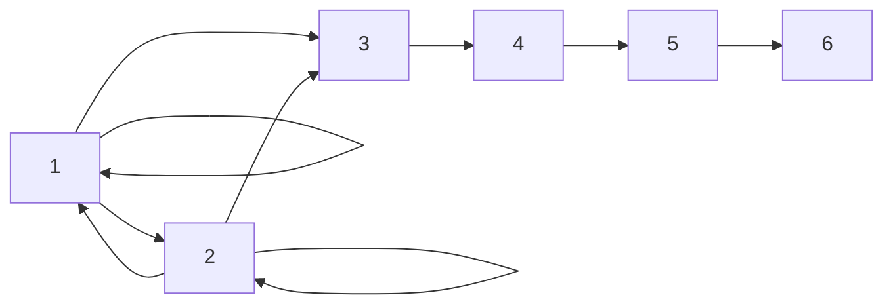

Figure 3.61: Directed graph for the function followpos

It should come as no surprise that the graph for *followpos* is almost an NFA without €-transitions for the underlying regular expression, and would become one if we:

1. Make all positions in *firstpos* of the root be initial states,

2. Label each arc from i to j by the symbol at position i, and

3. Make the position associated with endmarker # be the only accepting state.

### 3.9.5 Converting a Regular Expression Directly to a DFA

**Algorithm 3.36:** Construction of a DFA from a regular expression r.

**INPUT:** A regular expression r.

**OUTPUT:** A DFA D that recognizes L(r).

**METHOD:**

1. Construct a syntax tree T from the augmented regular expression `(r)#`.

2. Compute `nullable`, `firstpos`, `lastpos`, and `followpos` for T, using the methods of Sections 3.9.3 and 3.9.4.

3. Construct `Dstates`, the set of states of DFA D, and `Dtran`, the transition function for D, by the procedure of Fig. 3.62. The states of D are sets of positions in T. Initially, each state is "unmarked," and a state becomes "marked" just before we consider its out-transitions. The start state of D is `firstpos(n0)`, where node n~0~ is the root of T. The accepting states are those containing the position for the endmarker symbol #.

□

```C
initialize Dstates to contain only the unmarked state firstpos( n_0 ), where n_0 is the root of syntax tree T for (r)#; 
while (there is an unmarked state S in Dstates)  {
    mark S; 
    for ( each input symbol a ) { 
        let U be the union of followpos(p) for all p in S that correspond to a; 
        if ( U is not in Dstates )
            add U as an unmarked state to Dstates; 
        Dtran[S, a]  =  U; 
    } 
} 
```

Figure 3.62: Construction of a DFA directly from a regular expression

**Example 3.37:** We can now put together the steps of our running example to construct a DFA for the regular expression r = `(a|b)*abb`. The syntax tree for `(r)#` appeared in Fig. 3.56. We observed that for this tree, nullable is true only for the star-node, and we exhibited firstpos and lastpos in Fig. 3.59. The values of followpos appear in Fig. 3.60.

The value of firstpos for the root of the tree is {1, 2, 3}, so this set is the start state of D. Call this set of states A. We must compute Dtran[A, a ] and Dtran[A, b]. Among the positions of A, 1 and 3 correspond to a, while 2 corresponds to b. Thus, Dtran[A, a] = followpos(1) ∪ followpos(3) = {1, 2, 3, 4}, and Dtran[A, b] = followpos(2) = {1, 2, 3}. The latter is state A, and so does not have to be added to Dstates, but the former, B = {1, 2, 3, 4}, is new, so we add it to Dstates and proceed to compute its transitions. The complete DFA is shown in Fig. 3.63. □

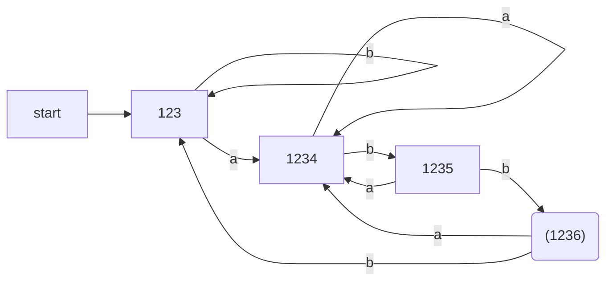

Figure 3.63: DFA constructed from Fig. 3.57

### 3.9.6 Minimizing the Number of States of a DFA

There can be many DFA's that recognize the same language. For instance, note that the DFA's of Figs. 3.36 and 3.63 both recognize language L (`(a|b)*abb`) . Not only do these automata have states with different names, but they don't even have the same number of states. If we implement a lexical analyzer as a DFA, we would generally prefer a DFA with as few states as possible, since each state requires entries in the table that describes the lexical analyzer.

The matter of the names of states is minor. We shall say that two automata are **the same up to state names** if one can be transformed into the other by doing nothing more than changing the names of states. Figures 3.36 and 3.63 are not the same up to state names. However, there is a close relationship between the states of each. States A and C of Fig. 3.36 are actually equivalent, in the sense that neither is an accepting state, and on any input they transfer to the same state to B on input `a` and to C on input `b`. Moreover, both states A and C behave like state 123 of Fig. 3.63. Likewise, state B of Fig. 3.36 behaves like state 1234 of Fig. 3.63, state D behaves like state 1235, and state E behaves like state 1236.

It turns out that there is always a unique (up to state names) minimum state DFA for any regular language. Moreover, this minimum-state DFA can be constructed from any DFA for the same language by grouping sets of equivalent states. In the case of L(`(a|b)*abb`) , Fig. 3.63 is the minimum-state DFA, and it can be constructed by partitioning the states of Fig. 3.36 as {A, C}{B}{D}{E}.

In order to understand the algorithm for creating the partition of states that converts any DFA into its minimum-state equivalent DFA, we need to see how input strings distinguish states from one another. We say that string `x` *distinguishes* state s from state t if exactly one of the states reached from s and t by following the path with label `x` is an accepting state. State s is *distinguishable* from state t if there is some string that distinguishes them.

---

#### Why the State-Minimization Algorithm Works

We need to prove two things: that states remaining in the same group in ∏~final~ are indistinguishable by any string, and that states winding up in different groups are distinguishable. The first is an induction on i that if after the ith iteration of step (2) of Algorithm 3.39, s and t are in the same group, then there is no string of length i or less that distinguishes them. We shall leave the details of the induction to you.

The second is an induction on i that if states s and t are placed in different groups at the ith iteration of step (2), then there is a string that distinguishes them. The basis, when s and t are placed in different groups of the initial partition, is easy: one must be accepting and the other not, so € distinguishes them. For the induction, there must be an input a and states p and q such that s and t go to states p and q, respectively, on input a. Moreover, p and q must already have been placed in different groups. Then by the inductive hypothesis, there is some string x that distinguishes p from q. Therefore, ax distinguishes s from t.

---

**Example 3.38:** The empty string distinguishes any accepting state from any nonaccepting state. In Fig. 3.36, the string `bb` distinguishes state `A` from state `B`, since `bb` takes `A` to a non accepting state `C`, but takes `B` to accepting state `E`. □

The state-minimization algorithm works by partitioning the states of a DFA into groups of states that cannot be distinguished. Each group of states is then merged into a single state of the minimum-state DFA. The algorithm works by maintaining a partition, whose groups are sets of states that have not yet been distinguished, while any two states from different groups are known to be distinguishable. When the partition cannot be refined further by breaking any group into smaller groups, we have the minimum-state DFA.

Initially, the partition consists of two groups: the accepting states and the nonaccepting states. The fundamental step is to take some group of the current partition, say A = {s1 , s2 , ... , s~k~ }, and some input symbol `a`, and see whether `a` can be used to distinguish between any states in group `A`. We examine the transitions from each of s1 , s2 , ... , s~k~ on input `a`, and if the states reached fall into two or more groups of the current partition, we split `A` into a collection of groups, so that s~i~ and s~j~ are in the same group if and only if they go to the same group on input `a`. We repeat this process of splitting groups, until for no group, and for no input symbol, can the group be split further. The idea is formalized in the next algorithm.

**Algorithm 3.39:** Minimizing the number of states of a DFA.

**INPUT:** A DFA D with set of states S, input alphabet ∑ , state state s_0 , and set of accepting states F.

**OUTPUT:** A DFA D' accepting the same language as D and having as few states as possible. 

**METHOD:**

1. Start with an initial partition ∏ with two groups, F and S - F, the accepting and nonaccepting states of D.

2. Apply the procedure of Fig. 3.64 to construct a new partition ∏~new~.

   ```C
   initially, let ∏new =  ∏ ;
   for ( each group G of ∏  ) {
       partition G into subgroups such that two states s and t are in the same subgroup if and only if
       for all input symbols `a`, states s and t have transitions on `a` to states in the same group of ∏ ;
       /* at worst, a state will be in a subgroup by itself */
       replace G in ∏new by the set of all subgroups formed;
   }
   ```

   Figure 3.64: Construction of ∏~new~

3. If ∏~new~ = ∏ , let ∏~final~ = ∏ and continue with step (4). Otherwise, repeat step (2) with ∏~new~ in place of ∏ .

4. Choose one state in each group of ∏final as the representative for that group. The representatives will be the states of the minimum-state DFA D'. The other components of D' are constructed as follows:

   (a) The start state of D' is the representative of the group containing the start state of D.

   (b) The accepting states of D' are the representatives of those groups that contain an accepting state of D. Note that each group contains either only accepting states, or only nonaccepting states, because we started by separating those two classes of states, and the procedure of Fig. 3.64 always forms new groups that are subgroups of previously constructed groups.

   (c) Let `s` be the representative of some group `G` of ∏final, and let the transition of `D` from `s` on input `a` be to state `t`. Let `r` be the representative of `t`'s group `H`. Then in D', there is a transition from `s` to `r` on input `a`. Note that in D, every state in group `G` must go to some state of group `H` on input `a`, or else, group `G` would have been split according to Fig. 3.64.

□

**Example 3.40:** Let us reconsider the DFA of Fig. 3.36. The initial partition consists of the two groups {A, B, C, D}{E}, which are respectively the nonaccepting states and the accepting states. To construct ∏~new~, the procedure of Fig. 3.64 considers both groups and inputs `a` and `b`. The group {E} cannot be split, because it has only one state, so {E} will remain intact in ∏~new~.

The other group {A, B, C, D} can be split, so we must consider the effect of each input symbol. On input `a`, each of these states goes to state B, so there is no way to distinguish these states using strings that begin with `a`. On input `b`, states A, B, and C go to members of group {A, B, C, D}, while state D goes to E, a member of another group. Thus, in ∏~new~, group {A, B, C, D} is split into {A, B, C}{D}, and ∏~new~ for this round is {A, B, C}{D}{E}.

In the next round, we can split {A, B, C} into {A, C}{B}, since A and C each go to a member of {A, B, C} on input `b`, while B goes to a member of another group, {D}. Thus, after the second round, ∏~new~ = {A, C}{B}{D}{E}. For the third round, we cannot split the one remaining group with more than one state, since A and C each go to the same state (and therefore to the same group) on each input. We conclude that ∏~final~ = {A, C}{B}{D}{E}.

Now, we shall construct the minimum-state DFA. It has four states, corresponding to the four groups of ∏~final~, and let us pick A, B, D, and E as the representatives of these groups. The initial state is A, and the only accepting state is E. Figure 3.65 shows the transition function for the DFA. For instance, the transition from state E on input `b` is to A, since in the original DFA, E goes to C on input `b`, and A is the representative of C's group. For the same reason, the transition on `b` from state A is to A itself, while all other transitions are as in Fig. 3.36. □

| STATE | a    | b    |
| ----- | ---- | ---- |
| A     | B    | A    |
| B     | B    | D    |
| D     | B    | E    |
| E     | B    | A    |

Figure 3.65: Transition table of minimum-state DFA

---

#### Eliminating the Dead State

The minimization algorithm sometimes produces a DFA with one dead state — one that is not accepting and transfers to itself on each input symbol. This state is technically needed, because a DFA must have a transition from every state on every symbol. However, as discussed in Section 3.8.3, we often want to know when there is no longer any possibility of acceptance, so we can establish that the proper lexeme has already been seen. Thus, we may wish to eliminate the dead state and use an automaton that is missing some transitions. This automaton has one fewer state than the minimum-state DFA, but is strictly speaking not a DFA, because of the missing transitions to the dead state.

---

### 3.9.7 State Minimization in Lexical Analyzers

To apply the state minimization procedure to the DFA's generated in Section 3.8.3, we must begin Algorithm 3.39 with the partition that groups together all states that recognize a particular token, and also places in one group all those states that do not indicate any token. An example should make the extension clear.

**Example 3.41:** For the DFA of Fig. 3.54, the initial partition is

```C#
{0137,7}{247}{8,58}{7}{68}{Ø}
```

That is, states 0137 and 7 belong together because neither announces any token. States 8 and 58 belong together because they both announce token `a*b+` . Note that we have added a dead state Ø, which we suppose has transitions to itself on inputs `a` and `b`. The dead state is also the target of missing transitions on a from states 8, 58, and 68.

We must split 0137 from 7, because they go to different groups on input `a`. We also split 8 from 58, because they go to different groups on `b`. Thus, all states are in groups by themselves, and Fig. 3.54 is the minimum-state DFA recognizing its three tokens. Recall that a DFA serving as a lexical analyzer will normally drop the dead state, while we treat missing transitions as a signal to end token recognition. □

### 3.9.8 Trading Time for Space in DFA Simulation

The simplest and fastest way to represent the transition function of a DFA is a two-dimensional table indexed by states and characters. Given a state and next input character, we access the array to find the next state and any special action we must take, e.g., returning a token to the parser. Since a typical lexical analyzer has several hundred states in its DFA and involves the ASCII alphabet of 128 input characters, the array consumes less than a megabyte.

However, compilers are also appearing in very small devices, where even a megabyte of storage may be too much. For such situations, there are many methods that can be used to compact the transition table. For instance, we can represent each state by a list of transitions that is, character-state pairs ended by a default state that is to be chosen for any input character not on the list. If we choose as the default the most frequently occurring next state, we can often reduce the amount of storage needed by a large factor.

There is a more subtle data structure that allows us to combine the speed of array access with the compression of lists with defaults. We may think of this structure as four arrays, as suggested in Fig. 3.66.[^5] The base array is used to determine the base location of the entries for state s, which are located in the next and check arrays. The default array is used to determine an alternative base location if the check array tells us the one given by base[s] is invalid.

[^5]: In practice, there would be another array indexed by states to give the action associated with that state, if any.

Figure 3.66: Data structure for representing transition tables

To compute nextState(s, a), the transition for state s on input a, we examine the next and check entries in location l = base[s] + a, where character a is treated as an integer, presumably in the range 0 to 127. If check[l] = s, then this entry is valid, and the next state for state s on input a is next[l]. If check[l] ≠ s, then we determine another state t = default[ s] and repeat the process as if t were the current state. More formally, the function `nextState` is defined as follows:

```C++
int nextState( s, a) { 
    if ( check[base[s] + a] == s ) return next[base[s] + a]; 
    else return nextState( default[s], a); 
} 
```

The intended use of the structure of Fig. 3.66 is to make the next-check arrays short by taking advantage of the similarities among states. For instance, state t, the default for state s, might be the state that says "we are working on an identifier," like state 10 in Fig. 3.14. Perhaps state s is entered after seeing the letters `th`, which are a prefix of keyword `then` as well as potentially being the prefix of some lexeme for an identifier. On input character e, we must go from state s to a special state that remembers we have seen the, but otherwise, state s behaves as t does. Thus, we set check[base[s] + e] to s (to confirm that this entry is valid for s) and we set next[ base[ s] + e] to the state that remembers `the`. Also, default[s] is set to `t`.

While we may not be able to choose base values so that no next-check entries remain unused, experience has shown that the simple strategy of assigning base values to states in turn, and assigning each base[s] value the lowest integer so that the special entries for state s are not previously occupied utilizes little more space than the minimum possible. 

## 3.10 Summary of Chapter 3

+ Tokens. The lexical analyzer scans the source program and produces as output a sequence of tokens, which are normally passed, one at a time to the parser. Some tokens may consist only of a token name while others may also have an associated lexical value that gives information about the particular instance of the token that has been found on the input.

+ Lexemes. Each time the lexical analyzer returns a token to the parser, it has an associated lexeme the sequence of input characters that the token represents.

+ Buffering. Because it is often necessary to scan ahead on the input in order to see where the next lexeme ends, it is usually necessary for the lexical analyzer to buffer its input. Using a pair of buffers cyclicly and ending each buffer's contents with a sentinel that warns of its end are two techniques that accelerate the process of scanning the input.

+ Patterns. Each token has a pattern that describes which sequences of characters can form the lexemes corresponding to that token. The set of words, or strings of characters, that match a given pattern is called a language.

+ Regular Expressions. These expressions are commonly used to describe patterns. Regular expressions are built from single characters, using union, concatenation, and the Kleene closure, or any-number-of, operator.

+ Regular Definitions. Complex collections of languages, such as the patterns that describe the tokens of a programming language, are often defined by a regular definition, which is a sequence of statements that each define one variable to stand for some regular expression. The regular expression for one variable can use previously defined variables in its regular expression.

+ Extended Regular-Expression Notation. A number of additional operators may appear as shorthands in regular expressions, to make it easier to express patterns. Examples include the + operator ( one-or-more-of ) , ? ( zero-or-one-of ) , and character classes ( the union of the strings each consisting of one of the characters ) .

+ Transition Diagrams. The behavior of a lexical analyzer can often be described by a transition diagram. These diagrams have states, each of which represents something about the history of the characters seen during the current search for a lexeme that matches one of the possible patterns. There are arrows, or transitions, from one state to another, each of which indicates the possible next input characters that cause the lexical analyzer to make that change of state.

+ Finite Automata. These are a formalization of transition diagrams that include a designation of a start state and one or more accepting states, as well as the set of states, input characters, and transitions among states. Accepting states indicate that the lexeme for some token has been found. Unlike transition diagrams, finite automata can make transitions on empty input as well as on input characters .

+ Deterministic Finite Automata. A DFA is a special kind of finite automaton that has exactly one transition out of each state for each input symbol. Also, transitions on empty input are disallowed. The DFA is easily simulated and makes a good implementation of a lexical analyzer, similar to a transition diagram .

+ Nondeterministic Finite Automata. Automata that are not DFA's are called nondeterministic. NFA's often are easier to design than are DFA's. Another possible architecture for a lexical analyzer is to tabulate all the states that NFA's for each of the possible patterns can be in, as we scan the input characters .

+ Conversion Among Pattern Representations. It is possible to convert any regular expression into an NFA of about the same size, recognizing the same language as the regular expression defines. Further, any NFA can be converted to a DFA for the same pattern, although in the worst case ( never encountered in common programming languages ) the size of the automaton can grow exponentially. It is also possible to convert any nondeterministic or deterministic finite automaton into a regular expression that defines the same language recognized by the finite automaton .

+ Lex. There is a family of software systems, including Lex and Flex, that are lexical-analyzer generators. The user specifies the patterns for tokens using an extended regular-expression notation. Lex converts these expressions into a lexical analyzer that is essentially a deterministic finite automaton that recognizes any of the patterns.

+ Minimization of Finite Automata. For every DFA there is a minimum-state DFA accepting the same language. Moreover, the minimum-state DFA for a given language is unique except for the names given to the various states.