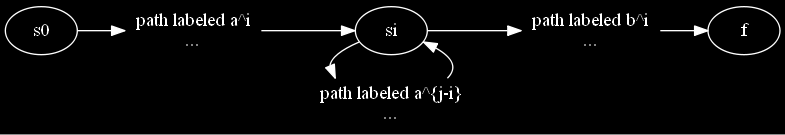
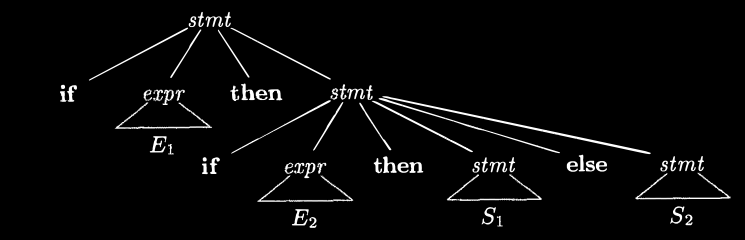
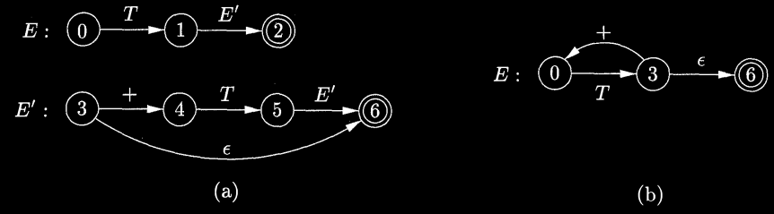
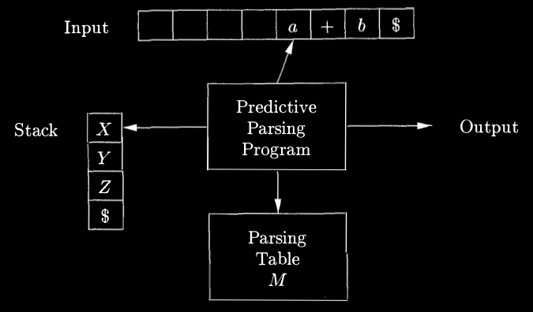

# Chapter 4 Syntax Analysis

This chapter is devoted to parsing methods that are typically used in compilers. We first present the basic concepts, then techniques suitable for hand implementation, and finally algorithms that have been used in automated tools. Since programs may contain syntactic errors, we discuss extensions of the parsing methods for recovery from common errors.

By design, every programming language has precise rules that prescribe the syntactic structure of well-formed programs. In C, for example, a program is made up of functions, a function out of declarations and statements, a statement out of expressions, and so on. The syntax of programming language constructs can be specified by context-free grammars or BNF (Backus-Naur Form) notation, introduced in Section 2.2. Grammars order significant benefits for both language designers and compiler writers.

- A grammar gives a precise, yet easy-to-understand, syntactic specification of a programming language.

- From certain classes of grammars, we can construct automatically an efficient parser that determines the syntactic structure of a source program. As a side benefit, the parser-construction process can reveal syntactic ambiguities and trouble spots that might have slipped through the initial design phase of a language.

- The structure imparted to a language by a properly designed grammar is useful for translating source programs into correct object code and for detecting errors.

- A grammar allows a language to be evolved or developed iteratively, by adding new constructs to perform new tasks. These new constructs can be integrated more easily into an implementation that follows the grammatical structure of the language.

## 4.1 Introduction

In this section, we examine the way the parser fits into a typical compiler. We then look at typical grammars for arithmetic expressions. Grammars for expressions suffice for illustrating the essence of parsing, since parsing techniques for expressions carry over to most programming constructs. This section ends with a discussion of error handling, since the parser must respond gracefully to finding that its input cannot be generated by its grammar.

### 4.1.1 The Role of the Parser

In our compiler model, the parser obtains a string of tokens from the lexical analyzer, as shown in Fig. 4.1, and verifies that the string of token names can be generated by the grammar for the source language. We expect the parser to report any syntax errors in an intelligible fashion and to recover from commonly occurring errors to continue processing the remainder of the program. Conceptually, for well-formed programs, the parser constructs a parse tree and passes it to the rest of the compiler for further processing. In fact, the parse tree need not be constructed explicitly, since checking and translation actions can be interspersed with parsing, as we shall see. Thus, the parser and the rest of the front end could well be implemented by a single module.

```fsharp
source program -->[Lexical Analyzer]--token-->[Parser]--parseTree-->[rest of front end]-->intermediate representation
                          |                      |                          |
                          |----------------Symbol Table---------------------|
```

Figure 4.1: Position of parser in compiler model

There are three general types of parsers for grammars: universal, top-down, and bottom-up. Universal parsing methods such as the Cocke-Younger-Kasami algorithm and Earley's algorithm can parse any grammar (see the bibliographic notes). These general methods are, however, to off inefficient to use in production compilers.

The methods commonly used in compilers can be classified as being either top-down or bottom-up. As implied by their names, top-down methods build parse trees from the top (root) to the bottom (leaves), while bottom-up methods start from the leaves and work their way up to the root. In either case, the input to the parser is scanned from left to right, one symbol at a time.

The most efficient top-down and bottom-up methods work only for subclasses of grammars, but several of these classes, particularly, LL and LR grammars, are expressive enough to describe most of the syntactic constructs in modern programming languages. Parsers implemented by hand often use LL grammars; for example, the predictive-parsing approach of Section 2.4.2 works for LL grammars. Parsers for the larger class of LR grammars are usually constructed using automated tools.

In this chapter, we assume that the output of the parser is some representation of the parse tree for the stream of tokens that comes from the lexical analyzer. In practice, there are a number of tasks that might be conducted during parsing, such as collecting information about various tokens into the symbol table, performing type checking and other kinds of semantic analysis, and generating intermediate code. We have lumped all of these activities into the “rest of the front end” box in Fig. 4.1. These activities will be covered in detail in subsequent chapters.

### 4.1.2 Representative Grammars

Some of the grammars that will be examined in this chapter are presented here for ease of reference. Constructs that begin with keywords like `while` or `int`, are relatively easy to parse, because the keyword guides the choice of the grammar production that must be applied to match the input. We therefore concentrate on expressions, which present more of challenge, because of the associativity and precedence of operators.

Associativity and precedence are captured in the following grammar, which is similar to ones used in Chapter 2 for describing expressions, terms, and factors. `E` represents expressions consisting of terms separated by `+` signs, `T` represents terms consisting of factors separated by `*` signs, and `F` represents factors that can be either parenthesized expressions or identifiers:

```fsharp
E -> E + T | T
T -> T * F | F
F -> ( E ) | id
(4.1)
```

Expression grammar (4.1) belongs to the class of LR grammars that are suitable for bottom-up parsing. This grammar can be adapted to handle additional operators and additional levels of precedence. However, it cannot be used for top-down parsing because it is left recursive.

The following non-left-recursive variant of the expression grammar (4.1) will be used for top-down parsing:

```fsharp
E  -> T E'
E' -> + T E' | epsilon
T  -> F T'
T' -> * F T' | epsilon
F  -> ( E ) | id
(4.2)
```

The following grammar treats `+` and `*` alike, so it is useful for illustrating techniques for handling ambiguities during parsing:

```fsharp
E -> E + E | E * E | ( E ) | id 
(4.3)
```

Here, `E` represents expressions of all types. Grammar (4.3) permits more than one parse tree for expressions like `a + b * c`.

### 4.1.3 Syntax Error Handling

The remainder of this section considers the nature of syntactic errors and general strategies for error recovery. Two of these strategies, called panic-mode and phrase-level recovery, are discussed in more detail in connection with specific parsing methods.

If a compiler had to process only correct programs, its design and implementation would be simplified greatly. However, a compiler is expected to assist the programmer in locating and tracking down errors that inevitably creep into programs, despite the programmer's best efforts. Strikingly, few languages have been designed with error handling in mind, even though errors are so common-place. Our civilization would be radically different if spoken languages had the same requirements for syntactic accuracy as computer languages. Most programming language specifications do not describe how a compiler should respond to errors; error handling is left to the compiler designer. Planning the error handling right from the start can both simplify the structure of a compiler and improve its handling of errors.

Common programming errors can occur at many different levels.

- *Lexical* errors include misspellings of identifiers, keywords, or operators—e.g., the use of an identifier `elipseSize` instead of `ellipseSize`—and missing quotes around text intended as a string.

- *Syntactic* errors include misplaced semicolons or extra or missing braces; that is, `{` or `}`. As another example, in C or Java, the appearance of a `case` statement without an enclosing `switch` is a syntactic error (however, this situation is usually allowed by the parser and caught later in the processing, as the compiler attempts to generate code).

- *Semantic* errors include type mismatches between operators and operands, e.g., the return of a value in a Java method with result type `void`.

- *Logical* errors can be anything from incorrect reasoning on the part of the programmer to the use in a C program of the assignment operator `=` instead of the comparison operator `==`. The program containing `=` may be well formed; however, it may not reflect the programmer's intent.

The precision of parsing methods allows syntactic errors to be detected very efficiently. Several parsing methods, such as the LL and LR methods, detect an error as soon as possible; that is, when the stream of tokens from the lexical analyzer cannot be parsed further according to the grammar for the language. More precisely, they have the *viable-prefix property*, meaning that they detect that an error has occurred as soon as they see a prefix of the input that cannot be completed to form a string in the language.

Another reason for emphasizing error recovery during parsing is that many errors appear syntactic, whatever their cause, and are exposed when parsing cannot continue. A few semantic errors, such as type mismatches, can also be detected efficiently; however, accurate detection of semantic and logical errors at compile time is in general a difficult task.

The error handler in a parser has goals that are simple to state but challenging to realize:

- Report the presence of errors clearly and accurately.

- Recover from each error quickly enough to detect subsequent errors.

- Add minimal overhead to the processing of correct programs.

Fortunately, common errors are simple ones, and a relatively straightforward error-handling mechanism often suffices.

How should an error handler report the presence of an error? At the very least, it must report the place in the source program where an error is detected, because there is a good chance that the actual error occurred within the previous few tokens. A common strategy is to print the offending line with a pointer to the position at which an error is detected.

### 4.1.4 Error-Recovery Strategies

Once an error is detected, how should the parser recover? Although no strategy has proven itself universally acceptable, a few methods have broad applicability. The simplest approach is for the parser to quit with an informative error message when it detects the first error. Additional errors are often uncovered if the parser can restore itself to a state where processing of the input can continue with reasonable hopes that the further processing will provide meaningful diagnostic information. If errors pile up, it is better for the compiler to give up after exceeding some error limit than to produce an annoying avalanche of “spurious” errors.

The balance of this section is devoted to the following recovery strategies: panic-mode, phrase-level, error-productions, and global-correction.

#### Panic-Mode Recovery

With this method, on discovering an error, the parser discards input symbols one at a time until one of a designated set of *synchronizing tokens* is found. The synchronizing tokens are usually delimiters, such as semicolon or `}`, whose role in the source program is clear and unambiguous. The compiler designer must select the synchronizing tokens appropriate for the source language. While panic-mode correction often skips a considerable amount of input without checking it for additional errors, it has the advantage of simplicity, and, unlike some methods to be considered later, is guaranteed not to go into an infinite loop.

#### Phrase-Level Recovery

On discovering an error, a parser may perform local correction on the remaining input; that is, it may replace a prefix of the remaining input by some string that allows the parser to continue. A typical local correction is to replace a comma by a semicolon, delete an extraneous semicolon, or insert a missing semicolon. The choice of the local correction is left to the compiler designer. Of course, we must be careful to choose replacements that do not lead to infinite loops, as would be the case, for example, if we always inserted something on the input ahead of the current input symbol.

Phrase-level replacement has been used in several error-repairing compilers, as it can correct any input string. Its major drawback is the difficulty it has in coping with situations in which the actual error has occurred before the point of detection.

#### Error Productions

By anticipating common errors that might be encountered, we can augment the grammar for the language at hand with productions that generate the erroneous constructs. A parser constructed from a grammar augmented by these error productions detects the anticipated errors when an error production is used during parsing. The parser can then generate appropriate error diagnostics about the erroneous construct that has been recognized in the input.

#### Global Correction

Ideally, we would like a compiler to make as few changes as possible in processing an incorrect input string. There are algorithms for choosing a minimal sequence of changes to obtain a globally least-cost correction. Given an incorrect input string `x` and grammar `G`, these algorithms will find a parse tree for a related string `y`, such that the number of insertions, deletions, and changes of tokens required to transform `x` into `y` is as small as possible. Unfortunately, these methods are in general too costly to implement in terms of time and space, so these techniques are currently only of theoretical interest.

Do note that a closest correct program may not be what the programmer had in mind. Nevertheless, the notion of least-cost correction provides a yardstick for evaluating error-recovery techniques, and has been used for finding optimal replacement strings for phrase-level recovery.

## 4.2 Context-Free Grammars

Grammars were introduced in Section 2.2 to systematically describe the syntax of programming language constructs like expressions and statements. Using a syntactic variable `stmt` to denote statements and variable `expr` to denote expressions, the production

```c
stmt -> if ( expr ) stmt else stmt 
(4.4)
```

specifies the structure of this form of conditional statement. Other productions then define precisely what an `expr` is and what else a `stmt` can be.

This section reviews the definition of a context-free grammar and introduces terminology for talking about parsing. In particular, the notion of derivations is very helpful for discussing the order in which productions are applied during parsing.

### 4.2.1 The Formal Definition of a Context-Free Grammar

From Section 2.2, a context-free grammar (grammar for short) consists of terminals, nonterminals, a start symbol, and productions.

1. **Terminals** are the basic symbols from which strings are formed. The term “token name” is a synonym for “terminal” and frequently we will use the word “token” for terminal when it is clear that we are talking about just the token name. We assume that the terminals are the first components of the tokens output by the lexical analyzer. In (4.4), the terminals are the keywords if and else and the symbols `(` and `)`.

2. **Nonterminals** are syntactic variables that denote sets of strings. In (4.4), `stmt` and `expr` are nonterminals. The sets of strings denoted by nonterminals help define the language generated by the grammar. Nonterminals impose a hierarchical structure on the language that is key to syntax analysis and translation.

3. In a grammar, one nonterminal is distinguished as the *start symbol*, and the set of strings it denotes is the language generated by the grammar. Conventionally, the productions for the start symbol are listed first.

4. The productions of a grammar specify the manner in which the terminals and nonterminals can be combined to form strings. Each production consists of:

   (a) A nonterminal called the *head* or *left side* of the production; this production defines some of the strings denoted by the head.

   (b) The symbol `->`. Sometimes `::=` has been used in place of the arrow.

   (c) A *body* or *right side* consisting of zero or more terminals and nonterminals. The components of the body describe one way in which strings of the nonterminal at the head can be constructed.

**Example 4.5**: The grammar in Fig. 4.2 defines simple arithmetic expressions. In this grammar, the terminal symbols are

```fsharp
id + - * / ( )
```

The nonterminal symbols are `expression`, `term` and `factor`, and `expression` is the start symbol. □

```fsharp
expression -> expression + term
expression -> expression - term
expression -> term
term       -> term * factor
term       -> term / factor
term       -> factor
factor     -> ( expression )
factor     -> id
```

Figure 4.2: Grammar for simple arithmetic expressions

### 4.2.2 Notational Conventions

To avoid always having to state that “these are the terminals,” “these are the nonterminals,” and so on, the following notational conventions for grammars will be used throughout the remainder of this book.

1. These symbols are terminals:

   (a) Lowercase letters early in the alphabet, such as `a`, `b`, `c`.

   (b) Operator symbols such as `+`, `*`, and so on.

   (c) Punctuation symbols such as parentheses, comma, and so on.

   (d) The digits `0`, `1`, ... , `9`.

   (e) Boldface strings such as `id` or `if`, each of which represents a single terminal symbol.

2. These symbols are nonterminals:

   (a) Uppercase letters early in the alphabet, such as `A`, `B`, `C`.

   (b) The letter `S`, which, when it appears, is usually the start symbol.

   (c) Lowercase, italic names such as `expr` or `stmt`.

   (d) When discussing programming constructs, uppercase letters may be used to represent nonterminals for the constructs. For example, nonterminals for expressions, terms, and factors are often represented by `E`, `T`, and `F`, respectively.

3. Uppercase letters late in the alphabet, such as `X`, `Y`, `Z`, represent grammar symbols; that is, either nonterminals or terminals.

4. Lowercase letters late in the alphabet, chiefly `u`, `v`, ... , `z`, represent (possibly empty) strings of terminals.

5. Lowercase Greek letters, `ɑ`, `β`, `γ`  for example, represent (possibly empty) strings of grammar symbols. Thus, a generic production can be written as `A -> ɑ`, where `A` is the head and `ɑ` the body.

6. A set of productions

   ```fsharp
   A -> ɑ_1
   A -> ɑ_2
   ....
   A -> ɑ_k
   ```

   with a common head `A` (call them A-productions), may be written

   ```fsharp
   A -> ɑ_1 | ɑ_2 | .... | ɑ_k
   ```

   . Call `ɑ_1`, `ɑ_2`, ..., `ɑ_k` the *alternatives* for `A`.

7. Unless stated otherwise, the head of the first production is the start symbol.

**Example 4.6**: Using these conventions, the grammar of Example 4.5 can be rewritten concisely as

```fsharp
E -> E + T | E - T | T
T -> T * F | T / F | F
F -> ( E ) | id
```

The notational conventions tell us that `E`, `T`, and `F` are nonterminals, with `E` the start symbol. The remaining symbols are terminals. □

### 4.2.3 Derivations

The construction of a parse tree can be made precise by taking a derivational view, in which productions are treated as rewriting rules. Beginning with the start symbol, each rewriting step replaces a nonterminal by the body of one of its productions. This derivational view corresponds to the top-down construction of a parse tree, but the precision a order by derivations will be especially helpful when bottom-up parsing is discussed. As we shall see, bottom-up parsing is related to a class of derivations known as “rightmost” derivations, in which the rightmost nonterminal is rewritten at each step.

For example, consider the following grammar, with a single nonterminal `E`, which adds a production `E -> - E` to the grammar (4.3):

```fsharp
E -> E + E | E * E | - E | ( E ) | id
(4.7)
```

The production `E -> - E` signifies that if `E` denotes an expression, then `- E` must also denote an expression. The replacement of a single `E` by `- E` will be described by writing

```fsharp
E => - E
```

which is read, “`E` derives `- E`.” The production `E \to ( E )` can be applied to replace any instance of `E` in any string of grammar symbols by `( E )`, e.g., `E * E =>  (E ) * E` or `E * E =>  E * ( E )`. We can take a single `E` and repeatedly apply productions in any order to get a sequence of replacements. For example,

```fsharp
E => - E => - ( E ) => - ( id )
```

We call such a sequence of replacements a *derivation* of `- ( id )` from `E`. This derivation provides a proof that the string `- ( id )` is one particular instance of an expression.

For a general definition of derivation, consider a nonterminal `A` in the middle of a sequence of grammar symbols, as in `ɑ Aβ`, where `ɑ` and `β` are arbitrary strings of grammar symbols. Suppose `A \to γ` is a production. Then, we write `ɑ Aβ=> ɑ γβ`. The symbol `=>`  means, “derives in one step.” When a sequence of derivation steps `ɑ_1 =>  ɑ_2 =>  ...  =>  ɑ_n` rewrites `ɑ_1` to `ɑ_n`, we say `ɑ_1` derives `ɑ_n`. Often, we wish to say, “derives in zero or more steps.” For this purpose, we can use the symbol $\overset*\implies$. Thus,

1. $α \overset*\implies α$, for any string `ɑ`, and

2. If $α \overset*\implies β$ and $β \implies γ$, then $α \overset*\implies γ$.

Likewise, $\overset+\implies$  means, “derives in one or more steps.”

If $S \overset*\implies α$, where $S$ is the start symbol of a grammar *G*, we say that `ɑ` is a *sentential form* of *G*. Note that a sentential form may contain both terminals and nonterminals, and may be empty. A *sentence* of *G* is a sentential form with no nonterminals. The *language* generated by a grammar is its set of sentences. Thus, a string of terminals $w$  is in $L(G)$, the language generated by *G*, if and only if $w$  is a sentence of *G* (or $S \overset*\implies w$). A language that can be generated by a grammar is said to be a *context-free language*. If two grammars generate the same language, the grammars are said to be *equivalent*.

The string $- (\textbf{id} + \textbf{id})$ is a sentence of grammar (4.7) because there is a derivation

$$
E \implies - E \implies - (E) \implies - (E + E) \implies - (id + E) \implies  - (\textbf{id} + \textbf{id}) \tag{4.8}
$$

The strings $E, - E, - (E), \dots  , - (\textbf{id} + \textbf{id})$ are all sentential forms of this grammar. We write $E \overset*\implies  - (\textbf{id} + \textbf{id})$ to indicate that $- (\textbf{id} + \textbf{id})$ can be derived from $E$.

At each step in a derivation, there are two choices to be made. We need to choose which nonterminal to replace, and having made this choice, we must pick a production with that nonterminal as head. For example, the following alternative derivation of $- (\textbf{id} + \textbf{id})$ differs from derivation (4.8) in the last two steps:

$$
E \implies - E \implies - (E) \implies - (E + E) \implies - (E + \textbf{id}) \implies - (\textbf{id} + \textbf{id}) \tag{4.9}
$$

Each nonterminal is replaced by the same body in the two derivations, but the order of replacements is different.

To understand how parsers work, we shall consider derivations in which the nonterminal to be replaced at each step is chosen as follows:

1. In *leftmost* derivations, the leftmost nonterminal in each sentential is always chosen. If $α\implies β$ is a step in which the leftmost nonterminal in `ɑ` is replaced, we write $α \underset{lm}\implies β$.

2. In *rightmost* derivations, the rightmost nonterminal is always chosen; we write $α \underset{rm}\implies  β$ in this case.

Derivation (4.8) is leftmost, so it can be rewritten as

$$
E \underset{lm}\implies  - E \underset{lm}\implies  - (E) \underset{lm}\implies  - (E + E) \underset{lm}\implies  - (\textbf{id} + E) \underset{lm}\implies  - (\textbf{id} + \textbf{id})
$$

Note that (4.9) is a rightmost derivation.

Using our notational conventions, every leftmost step can be written as $w Aγ \underset{lm}\implies  w\deltaγ$, where $w$  consists of terminals only, $A \to \delta$ is the production applied, and `γ` is a string of grammar symbols. To emphasize that `ɑ` derives `β` by a leftmost derivation, we write $α \underset{lm}{\overset * \implies}  β$. If $S \underset{lm}{\overset * \implies} α$, then we say that `ɑ` is a *left-sentential form* of the grammar at hand.

Analogous definitions hold for rightmost derivations. Rightmost derivations are sometimes called *canonical* derivations.

### 4.2.4 Parse Trees and Derivations

A parse tree is a graphical representation of a derivation that alters out the order in which productions are applied to replace nonterminals. Each interior node of a parse tree represents the application of a production. The interior node is labeled with the nonterminal $A$ in the head of the production; the children of the node are labeled, from left to right, by the symbols in the body of the production by which this A was replaced during the derivation.

For example, the parse tree for `- ( id + id )` in Fig. 4.3, results from the derivation (4.8) as well as derivation (4.9).

```fsharp
    E
-        E
    (    E    )
       E + E
      id   id
```

Figure 4.3: Parse tree for `- ( id + id )`

The leaves of a parse tree are labeled by nonterminals or terminals and, read from left to right, constitute a sentential form, called the *yield* or *frontier* of the tree.

節點路徑會組成一個序列，序列按F#值進行排序，小值在左邊，大值在右邊。比如：

```fsharp
let a = paths.['('] = [ 0; 1; 0]
let b = paths.['+'] = [ 0; 1; 1; 1]
a < b -> '(' 在 '+' 左邊
```

To see the relationship between derivations and parse trees, consider any derivation $α_1 \implies  α_2 \implies  \dots  \implies  α_n$, where $α_1$ is a single nonterminal `A`. For each sentential form $α_i$ in the derivation, we can construct a parse tree whose yield is $α_i$. The process is an induction on $i$.

**BASIS**: The tree for $α_1 = A$ is a single node labeled $A$.

**INDUCTION**: Suppose we already have constructed a parse tree with yield $α_{i-1} = X_1 X_2 \dots  X_k$ (note that according to our notational conventions, each grammar symbol $X_i$ is either a nonterminal or a terminal). Suppose $α_i$ is derived from $α_{i-1}$ by replacing $X_j$, a nonterminal, by $β = Y_1 Y_2 \dots  Y_m$. That is, at the ith step of the derivation, production $X_j \to β$ is applied to $α_{i-1}$ to derive $α_i = X_1 X_2 \dots  X_{j-1} β X_{j+1} \dots X_k$.

To model this step of the derivation, find the $j$th non-`ε` leaf from the left in the current parse tree. This leaf is labeled $X_j$. Give this leaf $m$ children, labeled $Y_1, Y_2, \dots , Y_m$, from the left. As a special case, if $m = 0$, then $β = ε$, and we give the $j$th leaf one child labeled `ε`.

**Example 4.10**: The sequence of parse trees constructed from the derivation (4.8) is shown in Fig. 4.4. In the first step of the derivation, $E \implies  - E$. To model this step, add two children, labeled `-` and `E`, to the root `E` of the initial tree. The result is the second tree.

In the second step of the derivation $- E \implies  - ( E )$. Consequently, add three children, labeled $($, $E$, and $)$, to the leaf labeled $E$ of the second tree, to obtain the third tree with yield $- (E)$. Continuing in this fashion we obtain the complete parse tree as the sixth tree. □


Figure 4.4: Sequence of parse trees for derivation (4.8)

Since a parse tree ignores variations in the order in which symbols in sentential forms are replaced, there is a many-to-one relationship between derivations and parse trees. For example, both derivations (4.8) and (4.9), are associated with the same final parse tree of Fig. 4.4.

In what follows, we shall frequently parse by producing a leftmost or a rightmost derivation, since there is a one-to-one relationship between parse trees and either leftmost or rightmost derivations. Both leftmost and rightmost derivations pick a particular order for replacing symbols in sentential forms, so they too alter out variations in the order. It is not hard to show that every parse tree has associated with it a unique leftmost and a unique rightmost derivation.

### 4.2.5 Ambiguity

From Section 2.2.4, a grammar that produces more than one parse tree for some sentence is said to be ambiguous. Put another way, an ambiguous grammar is one that produces more than one leftmost derivation or more than one rightmost derivation for the same sentence.

**Example 4.11**: The arithmetic expression grammar (4.3) permits two distinct leftmost derivations for the sentence `id + id * id`:

$$
\begin{array}{ll}
&E &\implies & E + E        & E & \implies & E * E       \\
&  &\implies & \textbf{id} + E       &   & \implies & E + E * E   \\
&  &\implies & \textbf{id} + E * E   &   & \implies & \textbf{id} + E * E  \\
&  &\implies & \textbf{id} + \textbf{id} * E  &   & \implies & \textbf{id} + \textbf{id} * E \\
&  &\implies & \textbf{id} + \textbf{id} * \textbf{id} &   & \implies & \textbf{id} + \textbf{id} * \textbf{id} \\
\end{array}
$$

The corresponding parse trees appear in Fig. 4.5.

Note that the parse tree of Fig. 4.5(a) reflects the commonly assumed precedence of `+` and  `*`, while the tree of Fig. 4.5(b) does not. That is, it is customary to treat operator `*` as having higher precedence than `+`, corresponding to the fact that we would normally evaluate an expression like `a + b * c` as `a + (b * c)`, rather than as `(a + b) * c`. □

  

Figure 4.5: Two parse trees for `id + id * id`

For most parsers, it is desirable that the grammar be made unambiguous, for if it is not, we cannot uniquely determine which parse tree to select for a sentence. In other cases, it is convenient to use carefully chosen ambiguous grammars, together with disambiguating rules that “throw away” undesirable parse trees, leaving only one tree for each sentence.

### 4.2.6 Verifying the Language Generated by a Grammar

Although compiler designers rarely do so for a complete programming-language grammar, it is useful to be able to reason that a given set of productions generates a particular language. Troublesome constructs can be studied by writing a concise, abstract grammar and studying the language that it generates. We shall construct such a grammar for conditional statements below.

A proof that a grammar G generates a language L has two parts: show that every string generated by G is in L, and conversely that every string in L can indeed be generated by G.

**Example 4.12**: Consider the following grammar:

```fsharp
S -> ( S ) S | ε 
(4.13)
```

It may not be initially apparent, but this simple grammar generates all strings of balanced parentheses, and only such strings. To see why, we shall show first that every sentence derivable from `S` is balanced, and then that every balanced string is derivable from `S`. To show that every sentence derivable from `S` is balanced, we use an inductive proof on the number of steps `n` in a derivation.

**BASIS**: The basis is `n = 1`. The only string of terminals derivable from `S` in one step is the empty string, which surely is balanced.

**INDUCTION**: Now assume that all derivations of fewer than `n` steps produce balanced sentences, and consider a leftmost derivation of exactly `n` steps. Such a derivation must be of the form

$$
S \underset{lm}\implies (S)S \underset{lm}{\overset*\implies} (x)S \underset{lm}{\overset*\implies} (x)y
$$

The derivations of `x` and `y` from `S` take fewer than `n` steps, so by the inductive hypothesis `x` and `y` are balanced. Therefore, the string `(x)y` must be balanced. That is, it has an equal number of left and right parentheses, and every prefix has at least as many left parentheses as right.

Having thus shown that any string derivable from `S` is balanced, we must next show that every balanced string is derivable from `S`. To do so, use induction on the length of a string.

**BASIS**: If the string is of length 0, it must be `ε`, which is balanced.

**INDUCTION**: First, observe that every balanced string has even length. Assume that every balanced string of length less than `2n` is derivable from `S`, and consider a balanced string `w` of length $2n, n\ge 1$. Surely `w` begins with a left parenthesis. Let `(x)` be the shortest nonempty prefix of `w` having an equal number of left and right parentheses. Then `w` can be written as `w = (x)y` where both `x` and `y` are balanced. Since `x` and `y` are of length less than `2n`, they are derivable from `S` by the inductive hypothesis. Thus, we can find a derivation of the form

$$
S \implies (S)S \overset*\implies (x)S \overset*\implies (x)y
$$

proving that `w = (x)y` is also derivable from `S`. □

### 4.2.7 Context-Free Grammars Versus Regular Expressions

Before leaving this section on grammars and their properties, we establish that grammars are a more powerful notation than regular expressions. Every construct that can be described by a regular expression can be described by a grammar, but not vice-versa. Alternatively, every regular language is a context-free language, but not vice-versa.

For example, the regular expression `(a|b) * abb` and the grammar

```fsharp
A_0 -> a A_0 | b A_0 | a A_1
A_1 -> b A_2
A_2 -> b A_3
A_3 -> ε
```

describe the same language, the set of strings of `a`’s and `b`’s ending in `a b b`.

We can construct mechanically a grammar to recognize the same language as a nondeterministic finite automaton (NFA). The grammar above was constructed from the NFA in Fig. 3.24 using the following construction:

1. For each state `i` of the NFA, create a nonterminal $A_i$.

2. If state $i$ has a transition to state $j$ on input $a$, add the production $A_i \to aA_j$. If state $i$ goes to state $j$ on input `ε`, add the production $A_i \to A_j$.

3. If i is an accepting state, add $A_i \to ε$.

4. If i is the start state, make $A_i$ be the start symbol of the grammar.

On the other hand, the language $L = \{a^n b^n | n\ge 1\}$ with an equal number of $a$’s and $b$’s is a prototypical example of a language that can be described by a grammar but not by a regular expression. To see why, Suppose $L$ were the language defined by some regular expression. We could construct a DFA $D$ with a finite number of states, say $k$, to accept $L$. Since $D$ has only $k$ states, for an input beginning with more than $k$ $a$’s, $D$ must enter some state twice, say $s_i$, as in Fig. 4.6. Suppose that the path from $s_i$ back to itself is labeled with a sequence $a^{j-i}$. Since $a^i b^i$ is in the language, there must be a path labeled $b^i$ from $s_i$ to an accepting state $f$. But, then there is also a path from the initial state $s_0$ through $s_i$ to $f$ labeled $a^j b^i$, as shown in Fig. 4.6. Thus, $D$ also accepts $a^j b^i$, which is not in the language, contradicting the assumption that $L$ is the language accepted by $D$.



Figure 4.6: DFA D accepting both $a^i b^i$ and $a^j b^i$.

Colloquially, we say that “finite automaton cannot count,” meaning that a finite automaton cannot accept a language like $\{a^n b^n | n\ge 1\}$ that would require it to keep count of the number of $a$’s before it sees the $b$’s. Likewise, “a grammar can count two items but not three,” as we shall see when we consider non-context-free language constructs in Section 4.3.5.

## 4.3 Writing a Grammar

Grammars are capable of describing most, but not all, of the syntax of programming languages. For instance, the requirement that identifiers be declared before they are used, cannot be described by a context-free grammar. Therefore, the sequences of tokens accepted by a parser form a superset of the programming language; subsequent phases of the compiler must analyze the output of the parser to ensure compliance with rules that are not checked by the parser.

This section begins with a discussion of how to divide work between a lexical analyzer and a parser. We then consider several transformations that could be applied to get a grammar more suitable for parsing. One technique can eliminate ambiguity in the grammar, and other techniques—left-recursion elimination and left factoring—are useful for rewriting grammars so they become suitable for top-down parsing. We conclude this section by considering some programming language constructs that cannot be described by any grammar.

### 4.3.1 Lexical Versus Syntactic Analysis

As we observed in Section 4.2.7, everything that can be described by a regular expression can also be described by a grammar. We may therefore reasonably ask: “Why use regular expressions to define the lexical syntax of a language?” There are several reasons.

1. Separating the syntactic structure of a language into lexical and non-lexical parts provides a convenient way of modularizing the front end of a compiler into two manageable-sized components.

2. The lexical rules of a language are frequently quite simple, and to describe them we do not need a notation as powerful as grammars.

3. Regular expressions generally provide a more concise and easier-to-understand notation for tokens than grammars.

4. More efficient lexical analyzers can be constructed automatically from regular expressions than from arbitrary grammars.

There are no firm guidelines as to what to put into the lexical rules, as opposed to the syntactic rules. Regular expressions are most useful for describing the structure of constructs such as identifiers, constants, keywords, and white space. Grammars, on the other hand, are most useful for describing nested structures such as balanced parentheses, matching begin-end's, corresponding if-then-else's, and soon. These nested structures cannot be described by regular expressions.

### 4.3.2 Eliminating Ambiguity

Sometimes an ambiguous grammar can be rewritten to eliminate the ambiguity. As an example, we shall eliminate the ambiguity from the following “dangling-else” grammar:

$$
\begin{array}{lrl}
stmt   &\to &\textbf{if } expr \textbf{ then } stmt \\ \tag{4.14}
& | &\textbf{if } expr \textbf{ then } stmt \textbf{ else } stmt \\
& | & other
\end{array}
$$

Here "$ other $" stands for any other statement. According to this grammar, the compound conditional statement

$$
\textbf{if } E_1 \textbf{ then } S_1 \textbf{ else if } E_2 \textbf{ then } S_2 \textbf{ else } S_3
$$

has the parse tree shown in Fig. 4.8. [^1]


Figure 4.8: Parse tree for a conditional statement

Grammar (4.14) is ambiguous since the string

$$
\textbf{if } E_1\textbf{ then if } E_2 \textbf{ then } S_1 \textbf{ else } S_2 \tag{4.15}
$$

has the two parse trees shown in Fig. 4.9.




Figure 4.9: Two parse trees for an ambiguous sentence

In all programming languages with conditional statements of this form, the first parse tree is preferred. The general rule is, “Match each else with the closest unmatched then.”[^2] This disambiguating rule can theoretically be incorporated directly into a grammar, but in practice it is rarely built into the productions.

[^1]: The subscripts on $E$ and $S$ are just to distinguish different occurrences of the same nonterminal, and do not imply distinct nonterminals.

[^2]: We should note that C and its derivatives are included in this class. Even though the C family of languages do not use the keyword **then**, its role is played by the closing parenthesis for the condition that follows **if**.

**Example 4.16**: We can rewrite the dangling-else grammar (4.14) as the following unambiguous grammar. The idea is that a statement appearing between a **then** and an **else** must be “matched”; that is, the interior statement must not end with an unmatched or open **then**. A matched statement is either an if-then-else statement containing no open statements or it is any other kind of unconditional statement. Thus, we may use the grammar in Fig. 4.10. This grammar generates the same strings as the dangling-else grammar (4.14), but it allows only one parsing for string (4.15); namely, the one that associates each **else** with the closest previous unmatched **then**. □
$$
\begin{array}{rrl}
stmt &\to &matched\_stmt \\
&|&open\_stmt\\
matched\_stmt &\to &\textbf{if }expr\ \textbf{then}\ matched\_stmt\ \textbf{else}\ matched\_stmt \\
&|&other\\
open\_stmt &\to &\textbf{if }expr\ \textbf{then}\ stmt \\
&| &\textbf{if }expr\ \textbf{then}\ matched\_stmt\ \textbf{else}\ open\_stmt
\end{array}
$$

Figure 4.10: Unambiguous grammar for if-then-else statements

### 4.3.3 Elimination of Left Recursion

A grammar is *left recursive* if it has a nonterminal `A` such that there is a derivation `A =*> Aɑ` for some string `ɑ`. ~~Top-down parsing methods cannot handle left-recursive grammars, so a transformation is needed to eliminate left recursion.~~ In Section 2.4.5, we discussed *immediate left recursion*, where there is a production of the form `A -> Aɑ`. Here, we study the general case. In Section 2.4.5, we showed how the left-recursive pair of productions

```fsharp
A -> A ɑ | β
```

could be replaced by the non-left-recursive productions:

```fsharp
A -> β A'
A'-> α A' | ε
```

without changing the strings derivable from `A`. This rule by itself suffices for many grammars.

**Example 4.17**: The non-left-recursive expression grammar (4.2), repeated here,

```fsharp
E  -> T E'
E' -> + T E' | ε
T  -> F T'
T' -> * F T' | ε
F  -> ( E ) | id
```

is obtained by eliminating immediate left recursion from the expression grammar (4.1). The left-recursive pair of productions

```fsharp
E -> E + T | T
```

are replaced by

```fsharp
E  -> T E'
E' -> + T E' | ε
```

. The new productions for `T` and `T'` are obtained similarly by eliminating immediate left recursion. □

Immediate left recursion can be eliminated by the following technique, which works for any number of A-productions. First, group the productions as

```fsharp
A -> A α_1 | A α_2 | ... | A α_m 
   | β_1 | β_2 | ... | β_n
```

where no `β_i` begins with an `A`. Then, replace the A-productions by

```fsharp
A  -> β_1 A' | β_2 A' | ... | β_n A'
A' -> α_1 A' | α_2 A' | ... | α_m A' | ε
```

The nonterminal `A` generates the same strings as before but is no longer left recursive. This procedure eliminates all left recursion from the `A` and `A'` productions (provided no `α_i` is `ε`), but it does not eliminate left recursion involving derivations of two or more steps. For example, consider the grammar

```fsharp
S -> A a | b
A -> A c | S d | ε
(4.18)
```

The nonterminal `S` is left recursive because

```fsharp
S => A a => S d a
```

, but it is not immediately left recursive.

Algorithm 4.19, below, systematically eliminates left recursion from a grammar. It is guaranteed to work if the grammar has no cycles (derivations of the form `A =+> A`) or `ε`-productions (productions of the form `A -> ε`). Cycles can be eliminated systematically from a grammar, as can `ε`-productions (see Exercises 4.4.6 and 4.4.7).

---
! Exercise 4.4.6 : A grammar is *ε-free* if no production body is ε (called an *ε-production*).

a) Give an algorithm to convert any grammar into an ε-free grammar that generates the same language (with the possible exception of the empty string — no ε-free grammar can generate ε).

Hint: First find all the nonterminals that are *nullable*, meaning that they generate ε, perhaps by a long derivation.

b) Apply your algorithm to the grammar `S -> aSbS | bSaS | ε`.

! Exercise 4.4.7 : A *single production* is a production whose body is a single nonterminal, i.e., a production of the form `A -> B`.

a) Give an algorithm to convert any grammar into an ε-free grammar, with no single productions, that generates the same language (with the possible exception of the empty string)

Hint: First eliminate ε-productions, and then find for which pairs of nonterminals `A` and `B` does `A =*> B` by a sequence of single productions.

b) Apply your algorithm to the grammar (4.1) in Section 4.1.2.

c) Show that, as a consequence of part (a), we can convert a grammar into an equivalent grammar that has no *cycles* (derivations of one or more steps in which `A =*> A` for some nonterminal `A`).

---

**Algorithm 4.19**: Eliminating left recursion.

**INPUT**: Grammar G with no cycles or ε-productions.

**OUTPUT**: An equivalent grammar with no left recursion.

**METHOD**: Apply the algorithm in Fig. 4.11 to G. Note that the resulting non-left-recursive grammar may have ε-productions.  □

```fsharp
1)  arrange the nonterminals in some order A_1, A_2, ... ,A_n.

2)  for ( each i from 1 to n ) {

3)   for ( each j from 1 to i-1 ) {

4)   replace each production of the form `A_i -> A_j γ` by the productions `A_i -> δ_1 γ |δ_2 γ | ...  |δ_k γ`, where `A_j -> δ_1 |δ_2 | ...  |δ_k` are all current A_j-productions

5)   }

6)   eliminate the immediate left recursion among the A_i-productions

7)   }
```

Figure 4.11: Algorithm to eliminate left recursion from a grammar

The procedure in Fig. 4.11 works as follows. In the first iteration for `i = 1`, the outer for-loop of lines (2) through (7) eliminates any immediate left recursion among A_1-productions. Any remaining `A_1` productions of the form `A_1 -> A_t α` must therefore have `t > 1`. After the `i-1`st iteration of the outer for-loop, all nonterminals `A_k`, where `k < i`, are “cleaned”; that is, any production `A_k -> A_t α`, must have `t > k`. As a result, on the `i`th iteration, the inner loop of lines (3) through (5) progressively raises the lower limit in any production `A_i -> A_m α`, until we have `m >= i`. Then, eliminating immediate left recursion for the `A_i` productions at line (6) forces `m` to be greater than `i`.

**Example 4.20**: Let us apply Algorithm 4.19 to the grammar (4.18). Technically, the algorithm is not guaranteed to work, because of the `ε`-production, but in this case, the production `A -> ε` turns out to be harmless.

We order the nonterminals `S, A`. There is no immediate left recursion among the `S`-productions, so nothing happens during the outer loop for `i = 1`. For `i = 2`, we substitute for `S` in `A -> S d` to obtain the following `A`-productions.

```fsharp
A -> A c | A a d | b d | ε
```

Eliminating the immediate left recursion among these A-productions yields the following grammar.

```fsharp
S  -> A a | b
A  -> b d A' | A'
A' -> c A' | a d A' | ε
```

□

### 4.3.4 Left Factoring

Left factoring is a grammar transformation that is useful for producing a grammar suitable for predictive, or top-down, parsing. When the choice between two alternative A-productions is not clear, we may be able to rewrite the productions to defer the decision until enough of the input has been seen that we can make the right choice.

For example, if we have the two productions

```fsharp
stmt -> if expr then stmt else stmt
      | if expr then stmt
```

on seeing the input `if`, we cannot immediately tell which production to choose to expand `stmt`. In general, if `A -> α β_1 | α β_2` are two A-productions, and the input begins with a nonempty string derived from `ɑ`, we do not know whether to expand `A` to `α β_1` or `α β_2`. However, we may defer the decision by expanding `A` to `A'`. Then, after seeing the input derived from `ɑ`, we expand `A'` to `β_1` or to `β_2`. That is, left-factored, the original productions become

```fsharp
A  -> α A'
A' -> β_1 | β_2
```

**Algorithm 4.21**: Left factoring a grammar.

**INPUT**: Grammar G.

**OUTPUT**: An equivalent left-factored grammar.

**METHOD**: For each nonterminal `A`, find the longest prefix `ɑ` common to two or more of its alternatives. If `α != ε` i.e., there is a nontrivial common prefix — replace all of the A-productions 

```fsharp
A -> α β_1 | α β_2 | ...  | α β_n | γ
```
, where represents all alternatives that do not begin with `ɑ`, by

```fsharp
A  -> α A' | γ
A' -> β_1 | β_2 | ... | β_n
```

Here `A'` is a new nonterminal. Repeatedly apply this transformation until no two alternatives for a nonterminal have a common prefix. □

**Example 4.22**: The following grammar abstracts the **dangling-else** problem:

```fsharp
S ->  i E t S | i E t S e S | a
E ->  b
(4.23)
```

Here, `i`, `t`, and `e` stand for `if`, `then`, and `else`; `E` and `S` stand for “conditional expression” and “statement.” Left-factored, this grammar becomes:

```fsharp
S  -> i E t S S' | a 
S' -> e S | ε
E  -> b
(4.24)
```

Thus, we may expand `S` to `iEtSS'` on input `i`, and wait until `iEtS` has been seen to decide whether to expand `S'` to `eS` or to `ε`. Of course, these grammars are both ambiguous, and on input `e`, it will not be clear which alternative for `S'` should be chosen. Example 4.33 discusses a way out of this dilemma. □

### 4.3.5 Non-Context-Free Language Constructs

A few syntactic constructs found in typical programming languages cannot be specified using grammars alone. Here, we consider two of these constructs, using simple abstract languages to illustrate the difficulties.

**Example 4.25**: The language in this example abstracts the problem of checking that identifiers are declared before they are used in a program. The language consists of strings of the form $w c w$, where the first $w$ represents the declaration of an identifier $w$, $c$ represents an intervening program fragment, and the second $w$ represents the use of the identifier.

The abstract language is $L_1 = \{w c w  | w \text{  is in }(a|b) * \}$. $L_1$ consists of all words composed of a repeated string of $a$’s and $b$’s separated by $c$, such as $aabcaab$. While it is beyond the scope of this book to prove it, the non-context-freedom of $L_1$ directly implies the non-context-freedom of programming languages like C and Java, which require declaration of identifiers before their use and which allow identifiers of arbitrary length.

For this reason, a grammar for C or Java does not distinguish among identifiers that are different character strings. Instead, all identifiers are represented by a token such as **id** in the grammar. In a compiler for such a language, the semantic-analysis phase checks that identifiers are declared before they are used. □

**Example 4.26**: The non-context-free language in this example abstracts the problem of checking that the number of formal parameters in the declaration of a function agrees with the number of actual parameters in a use of the function. The language consists of strings of the form $a^nb^mc^nd^m$. (Recall $a^n$ means a written n times.) Here $a^n$ and $b^m$ could represent the formal-parameter lists of two functions declared to have $n$ and $m$ arguments, respectively, while $c^n$ and $d^m$ represent the actual-parameter lists in calls to these two functions.

The abstract language is $L_2 = \{ a^n b^m c^n d^m | n \ge 1 \text{ and } m \ge 1\}$. That is, $L_2$ consists of strings in the language generated by the regular expression `a*b*c*d*` ​ such that the number of $a$’s and $c$’s are equal and the number of $b$’s and $d$’s are equal. This language is not context free.

Again, the typical syntax of function declarations and uses does not concern itself with counting the number of parameters. For example, a function call in C-like language might be specified by
$$
\begin{array}{rrl}
stmt         &\to& \textbf{id}\ ( expr\_list ) \\
expr\_list   &\to& expr\_list , expr \\
             &|& expr
\end{array}
$$
with suitable productions for $expr$. Checking that the number of parameters in a call is correct is usually done during the semantic-analysis phase. □

## 4.4 Top-Down Parsing

Top-down parsing can be viewed as the problem of constructing a parse tree for the input string, starting from the root and creating the nodes of the parse tree in preorder (depth-first, as discussed in Section 2.3.4). Equivalently, top-down parsing can be viewed as finding a leftmost derivation for an input string.

**Example 4.27**: The sequence of parse trees in Fig. 4.12 for the input $\textbf{id} + \textbf{id}*\textbf{id}$ is a top-down parse according to grammar (4.2), repeated here:
$$
\begin{array}{lll}
E  &\to&  T E'           \\ \tag{4.28}
E' &\to&  + T E' | ε \\ 
T  &\to&  F T'           \\
T' &\to&  * F T' | ε \\   
F  &\to&  ( E ) | \textbf{id}
\end{array}
$$

This sequence of trees corresponds to a leftmost derivation of the input. □

At each step of a top-down parse, the key problem is that of determining the production to be applied for a nonterminal, say $A$. Once an $A$-production is chosen, the rest of the parsing process consists of “matching” the terminal symbols in the production body with the input string.

The section begins with a general form of top-down parsing, called recursive-descent parsing, which may require **backtracking** to find the correct A-production to be applied. Section 2.4.2 introduced predictive parsing, a special case of recursive-descent parsing, where no backtracking is required. Predictive parsing chooses the correct A-production by looking ahead at the input a fixed number of symbols, typically we may look only at one (that is, the next input symbol).

For example, consider the top-down parse in Fig. 4.12, which constructs a tree with two nodes labeled $E'$. At the first $E'$ node (in preorder), the production $E' \to +T E'$ is chosen; at the second $E'$ node, the production $E' \to ε$ is chosen. A predictive parser can choose between $E'$-productions by looking at the next input symbol.


Figure 4.12: Top-down parse for $\textbf{id} + \textbf{id} * \textbf{id}$

The class of grammars for which we can construct predictive parsers looking $k$ symbols ahead in the input is sometimes called the *LL(k)* class. We discuss the *LL(1)* class in Section 4.4.3, but introduce certain computations, called FIRST and FOLLOW, in a preliminary Section 4.4.2. From the FIRST and FOLLOW sets for a grammar, we shall construct “predictive parsing tables,” which make explicit the choice of production during top-down parsing. These sets are also useful during bottom-up parsing, as we shall see.

In Section 4.4.4 we give a non-recursive parsing algorithm that maintains a stack explicitly, rather than implicitly via recursive calls. Finally, in Section 4.4.5 we discuss error recovery during top-down parsing.

### 4.4.1 Recursive-Descent Parsing

A recursive-descent parsing program consists of a set of procedures, one for each nonterminal. Execution begins with the procedure for the start symbol, which halts and announces success if its procedure body scans the entire input string. Pseudo-code for a typical nonterminal appears in Fig. 4.13. Note that this pseudo-code is nondeterministic, since it begins by choosing the A-production to apply in a manner that is not specified.

```C++
void A() {
1. Choose an A-production, `A -> X_1 X_2 ... X_k`;
2. for ( i = 1 to k ) {
3. if ( X_i is a nonterminal )
4.     call procedure X_i();
5. else if ( X_i equals the current input symbol `a` )
6.     advance the input to the next symbol;
7. else /* an error has occurred */;
    }
}
```

Figure 4.13: A typical procedure for a nonterminal in a top-down parser

General recursive-descent may require backtracking; that is, it may require repeated scans over the input. However, backtracking is rarely needed to parse programming language constructs, so backtracking parsers are not seen frequently. Even for situations like natural language parsing, backtracking is not very efficient, and tabular methods such as the dynamic programming algorithm of Exercise 4.4.9 or the method of Earley (see the bibliographic notes) are preferred.

To allow backtracking, the code of Fig. 4.13 needs to be modified. First, we cannot choose a unique A-production at line (1), so we must try each of several productions in some order. Then, failure at line (7) is not ultimate failure, but suggests only that we need to return to line (1) and try another A-production. Only if there are no more A-productions to try do we declare that an input error has been found. In order to try another A-production, we need to be able to reset the input pointer to where it was when we first reached line (1). Thus, a local variable is needed to store this input pointer for future use.

**Example 4.29**: Consider the grammar

$$
\begin{array}{lll}
S &\to&  c\ A\ d     \\
A &\to&  a\ b\ |\ a
\end{array}
$$

To construct a parse tree top-down for the input string $w  = cad$, begin with a tree consisting of a single node labeled $S$, and the input pointer pointing to $c$, the first symbol of $w$. $S$ has only one production, so we use it to expand $S$ and obtain the tree of Fig. 4.14(a). The leftmost leaf, labeled $c$, matches the first symbol of input $w$, so we advance the input pointer to $a$, the second symbol of $w$, and consider the next leaf, labeled $A$.


Figure 4.14: Steps in a top-down parse

Now, we expand $A$ using the first alternative $A \to a b$ to obtain the tree of Fig. 4.14(b). We have a match for the second input symbol, $a$, so we advance the input pointer to $d$, the third input symbol, and compare $d$ against the next leaf, labeled $b$. Since $b$ does not match $d$, we report failure and go back to $A$ to see whether there is another alternative for $A$ that has not been tried, but that might produce a match.

In going back to $A$, we must reset the input pointer to position 2, the position it had when we first came to $A$, which means that the procedure for $A$ must store the input pointer in a local variable.

The second alternative for $A$ produces the tree of Fig. 4.14(c). The leaf a matches the second symbol of $w$ and the leaf $d$ matches the third symbol. Since we have produced a parse tree for $w$, we halt and announce successful completion of parsing. □

A left-recursive grammar can cause a recursive-descent parser, even one with backtracking, to go into an infinite loop. That is, when we try to expand a nonterminal $A$, we may eventually find ourselves again trying to expand $A$ without having consumed any input.

### 4.4.2 FIRST and FOLLOW

The construction of both top-down and bottom-up parsers is aided by two functions, FIRST and FOLLOW, associated with a grammar *G*. During top-down parsing, FIRST and FOLLOW allow us to choose which production to apply, based on the next input symbol. During panic-mode error recovery, sets of tokens produced by FOLLOW can be used as synchronizing tokens.

Define *FIRST(`ɑ`)*, where `ɑ` is any string of grammar symbols, to be the set of terminals that begin strings derived from `ɑ`. If $α\overset*\implies ε$, then `ε` is also in FIRST(`ɑ`). For example, in Fig. 4.15, $A \overset*\implies c γ$, so $c$ is in FIRST($A$).


Figure 4.15: Terminal $c$ is in FIRST($A$) and $a$ is in FOLLOW($A$)

For a preview of how FIRST can be used during predictive parsing, consider two $A$-productions $A \to α|β$, where FIRST(`ɑ`) and FIRST(`β`) are disjoint sets. We can then choose between these $A$-productions by looking at the next input symbol $a$, since $a$ can be in at most one of FIRST(`ɑ`) and FIRST(`β`), not both. For instance, if $a$ is in FIRST(`β`) choose the production $A \to β$. This idea will be explored when LL(1) grammars are defined in Section 4.4.3.

Define *FOLLOW(A)*, for nonterminal $A$, to be the set of terminals $a$ that can appear immediately to the right of $A$ in some sentential form; that is, the set of terminals $a$ such that there exists a derivation of the form $S \overset*\implies α A a β$, for some `ɑ` and `β`, as in Fig. 4.15. Note that there may have been symbols between $A$ and $a$, at some time during the derivation, but if so, they derived `ε` and disappeared. In addition, if $A$ can be the rightmost symbol in some sentential form, then \$ is in FOLLOW($A$); recall that \$ is a special "endmarker" symbol that is assumed not to be a symbol of any grammar.

To compute FIRST($X$) for all grammar symbols $X$, apply the following rules until no more terminals or can be added to any FIRST set.

1. If $X$ is a terminal, then $FIRST(X) = \{X\}$.
2. If $X$ is a nonterminal and $X \to Y_1 Y_2 ...  Y_k$ is a production for some $k\ge 1$, then place $a$ in FIRST($X$) if for some $i$, $a$ is in FIRST($Y_i$), and is in all of FIRST($Y_1$), $\dots$, FIRST($Y _ {i-1}$); that is, $Y_1 \dots  Y _ {i-1} \overset*\implies ε$. If `ε` is in FIRST($Y_j$) for all $j = 1, 2, \dots  k$, then add `ε` to FIRST($X$). For example, everything in FIRST($Y_1$) is surely in FIRST($X$). If $Y_1$ does not derive `ε`, then we add nothing more to FIRST($X$), but if $Y_1 \overset*\implies ε$, then we add FIRST($Y_2$), and so on.

3. If $X \to ε$ is a production, then add `ε` to $FIRST(X)$.

Now, we can compute FIRST for any string $X_1 X_2 \dots  X_n$ as follows. Add to FIRST($X_1 X_2 \dots  X_n$) all non-`ε` symbols of FIRST($X_1$). Also add the non-`ε` symbols of FIRST($X_2$), if `ε` is in FIRST($X_1$); the non-`ε` symbols of FIRST($X_3$), if `ε` is in FIRST($X_1$) and FIRST($X_2$); and so on. Finally, add `ε` to FIRST($X_1 X_2 \dots  X_n$) if, for all $i$, `ε` is in FIRST($X_i$).

To compute FOLLOW($A$) for all nonterminals $A$, apply the following rules until nothing can be added to any FOLLOW set.

1. Place \$ in FOLLOW($S$), where $S$ is the start symbol, and $ is the input right endmarker.

2. If there is a production $A \to α B β$, then everything in FIRST(`β`) except `ε` is in FOLLOW($B$).

3. If there is a production $A \to α B$, or a production $A \to α B β$, where FIRST(`β`) contains `ε`, then everything in FOLLOW($A$) is in FOLLOW($B$).

**Example 4.30**: Consider again the non-left-recursive grammar (4.28). Then:

1. FIRST($F$) = FIRST($T$) = FIRST($E$) = {$($, $\textbf{id}$}. To see why, note that the two productions for $F$ have bodies that start with these two terminal symbols, **id** and the left parenthesis. $T$ has only one production, and its body starts with $F$. Since $F$ does not derive `ε`, FIRST($T$) must be the same as FIRST($F$). The same argument covers FIRST($E$).

2. FIRST($E'$) = {$+$, `ε`}. The reason is that one of the two productions for $E'$ has a body that begins with terminal $+$, and the other's body is `ε`. Whenever a nonterminal derives `ε`, we place in FIRST for that nonterminal.

3. FIRST($T'$) = {$ * $, `ε`}. The reasoning is analogous to that for FIRST($E'$).

4. FOLLOW($E$) = FOLLOW($E'$) = $\{), \$\}$. Since $E$ is the start symbol, FOLLOW($E$) must contain \$. The production body $(E)$ explains why the right parenthesis is in FOLLOW($E$). For $E'$, note that this nonterminal appears only at the ends of bodies of $E$-productions. Thus, FOLLOW($E'$) must be the same as FOLLOW($E$).

5. FOLLOW($T$) = FOLLOW($T'$) = {$+$, $)$, \$}. Notice that $T$ appears in bodies only followed by $E'$. Thus, everything except `ε` that is in FIRST($E'$) must be in FOLLOW($T$); that explains the symbol $+$. However, since FIRST($E'$) contains `ε` (i.e., $E' \overset*\implies ε$), and $E'$ is the entire string following $T$ in the bodies of the $E$-productions, everything in FOLLOW($E$) must also be in FOLLOW($T$). That explains the symbols \$ and the right parenthesis. As for $T'$, since it appears only at the ends of the $T$-productions, it must be that FOLLOW($T'$) = FOLLOW($T$).

6. FOLLOW($F$) = {$+$,$ * $, $)$, \$}. The reasoning is analogous to that for $T$ in point (5).

□

### 4.4.3 LL(1) Grammars

Predictive parsers, that is, recursive-descent parsers needing no backtracking, can be constructed for a class of grammars called LL(1). The first “L” in LL(1) stands for scanning the input from left to right, the second “L” for producing a leftmost derivation, and the “1” for using one input symbol of lookahead at each step to make parsing action decisions.

---

##### Transition Diagrams for Predictive Parsers

Transition diagrams are useful for visualizing predictive parsers. For example, the transition diagrams for nonterminals $E$ and $E'$ of grammar (4.28) appear in Fig. 4.16(a). To construct the transition diagram from a grammar, first eliminate left recursion and then left factor the grammar. Then, for each nonterminal $A$,

1. Create an initial and final (return) state.

2. For each production $A \to X_1 X_2 \dots  X_k$, create a path from the initial to the final state, with edges labeled $X_1, X_2, \dots , X_k$. If $A \to ε$, the path is an edge labeled `ε`.

Transition diagrams for predictive parsers differ from those for lexical analyzers. Parsers have one diagram for each nonterminal. The labels of edges can be tokens or nonterminals. A transition on a token (terminal) means that we take that transition if that token is the next input symbol. A transition on a nonterminal $A$ is a call of the procedure for $A$.

With an $LL(1)$ grammar, the ambiguity of whether or not to take an `ε`-edge can be resolved by making `ε`-transitions the default choice.

Transition diagrams can be simplified, provided the sequence of grammar symbols along paths is preserved. We may also substitute the diagram for a nonterminal A in place of an edge labeled $A$. The diagrams in Fig. 4.16(a) and (b) are equivalent: if we trace paths from $E$ to an accepting state and substitute for $E'$, then, in both sets of diagrams, the grammar symbols along the paths make up strings of the form $T + T + \dots  + T$. The diagram in (b) can be obtained from (a) by transformations akin to those in Section 2.5.4, where we used tail-recursion removal and substitution of procedure bodies to optimize the procedure for a nonterminal.



Figure 4.16: Transition diagrams for nonterminals $E$ and $E'$ of grammar 4.28

---

The class of LL(1) grammars is rich enough to cover most programming constructs, although care is needed in writing a suitable grammar for the source language. For example, no left-recursive or ambiguous grammar can be LL(1).

A grammar *G* is LL(1) if and only if whenever $A \to α\ |\ β$  are two distinct productions of *G*, the following conditions hold:

1.  For no terminal $a$ do both `ɑ` and `β`  derive strings beginning with $a$.

2.  At most one of `ɑ` and `β` can derive the empty string.

3.  If $β \overset*\implies ε$, then `ɑ` does not derive any string beginning with a terminal in FOLLOW($A$). Likewise, if $α \overset*\implies ε$, then `β` does not derive any string beginning with a terminal in FOLLOW($A$).

The first two conditions are equivalent to the statement that FIRST(`ɑ`) and FIRST(`β`) are disjoint sets. The third condition is equivalent to stating that if `ε` is in FIRST(`β`), then FIRST(`ɑ`) and FOLLOW($A$) are disjoint sets, and likewise if `ε` is in FIRST(`ɑ`).

Predictive parsers can be constructed for $LL(1)$ grammars since the proper production to apply for a nonterminal can be selected by looking only at the current input symbol. Flow-of-control constructs, with their distinguishing keywords, generally satisfy the $LL(1)$ constraints. For instance, if we have the productions

$$
\begin{array}{rrl}
stmt&\to&  \textbf{if } ( expr ) stmt \textbf{ else } stmt \\
    &|& \textbf{while } ( expr ) stmt \\
    &|& \{ stmt\_list \} 
\end{array}
$$

then the keywords **if**, **while**, and the symbol **{** tell us which alternative is the only one that could possibly succeed if we are to find a statement.

The next algorithm collects the information from FIRST and FOLLOW sets into a predictive parsing table $M[A, a]$, a two-dimensional array, where $A$ is a nonterminal, and $a$ is a terminal or the symbol \$, the input endmarker. The algorithm is based on the following idea: the production $A \to α$ is chosen if the next input symbol a is in FIRST(`ɑ`). The only complication occurs when $α = ε$ or, more generally, $α \overset*\implies ε$. In this case, we should again choose $A \to α$, if the current input symbol is in FOLLOW($A$), or if the \$ on the input has been reached and \$ is in FOLLOW($A$).

**Algorithm 4.31**: Construction of a predictive parsing table.

**INPUT**: Grammar *G*.

**OUTPUT**: Parsing table $M$.

**METHOD**: For each production $A \to α$ of the grammar, do the following:

1.  For each terminal $a$ in FIRST(`ɑ`), add $A \to α$ to $M[A, a]$.

2.  If `ε` is in FIRST(`ɑ`), then for each terminal b in FOLLOW($A$), add $A \to α$ to $M[A, b]$. If `ε` is in FIRST(`ɑ`) and \$ is in FOLLOW($A$), add $A \to α$ to $M[A, \$]$ as well.

If, after performing the above, there is no production at all in $M[A, a]$, then set $M[A, a]$ to error (which we normally represent by an empty entry in the table). □

**Example 4.32**: For the expression grammar (4.28), Algorithm 4.31 produces the parsing table in Fig. 4.17. Blanks are error entries; non-blanks indicate a production with which to expand a nonterminal.

| NONTERMINAL | id           | +         | *              | (        | )     | $     |
| ---- | ------------ | --------- | -------------- | -------- | ----- | ----- |
| $E$  | $E \to T E'$ |           |                | $E \to T E'$ |       |       |
| $E'$ |              | $E' \to +T E'$ |                |          | $E' \to ε$ | $E' \to ε$ |
| $T$  | $T \to F T'$     |           |                | $T \to F T'$ |       |       |
| $T'$ |              | $T' \to ε$     | $T' \to *F T'$ |          | $T' \to ε$ | $T' \to ε$ |
| $F$  | $F \to \textbf{id}$ |           |                | $F \to (E)$  |       |       |

Figure 4.17: Parsing table M for Example 4.32

Consider production $E \to T E'$. Since

$$
FIRST(T\ E') = FIRST(T) = \{(, \textbf{id}\}
$$

this production is added to $M[E, (]$ and $M[E, \textbf{id}]$. production $E' \to +\ T\ E'$ is added to $M[E', +]$ since $FIRST(+T\ E') = \{+\}$. Since $FOLLOW(E') = \{), \$\}$, production $E' \to ε$ is added to $M[E', )]$ and $M[E', \$]$. □

Algorithm 4.31 can be applied to any grammar *G* to produce a parsing table $M$. For every LL(1) grammar, each parsing-table entry uniquely identifies a production or signals an error. For some grammars, however, $M$ may have some entries that are multiply defined. For example, if *G* is left-recursive or ambiguous, then $M$ will have at least one multiply defined entry. Although left-recursion elimination and left factoring are easy to do, there are some grammars for which no amount of alteration will produce an LL(1) grammar.

The language in the following example has no $LL(1)$ grammar at all.

**Example 4.33**: The following grammar, which abstracts the dangling-else problem, is repeated here from Example 4.22:

$$
\begin{array}{lll}
S &\to& iEtSS’ | a \\
S'&\to& eS | ε \\
E &\to& b
\end{array}
$$

The parsing table for this grammar appears in Fig. 4.18. The entry for $M[S', e]$ contains both $S'\to e S$ and $S'\to ε$.

| NONTERMINAL | a         | b         | e                     | i              | t    | $                |
| ----------- | --------- | --------- | --------------------- | -------------- | ---- | ---------------- |
| $S$         | $S \to a$ |           |                       | $S \to iEtSS’$ |      |                  |
| $S'$        |           |           | $S'\to ε | eS$ |                |      | $S'\to ε$ |
| $E$         |           | $E \to b$ |                       |                |      |                  |

Figure 4.18: Parsing table M for Example 4.33

The grammar is ambiguous and the ambiguity is manifested by a choice in what production to use when an e (**else**) is seen. We can resolve this ambiguity by choosing $S'\to eS$. This choice corresponds to associating an **else** with the closest previous **then**. Note that the choice $S'\to ε$ would prevent $e$ from ever being put on the stack or removed from the input, and is surely wrong. □

### 4.4.4 Nonrecursive Predictive Parsing

A nonrecursive predictive parser can be built by maintaining a stack explicitly, rather than implicitly via recursive calls. The parser mimics a leftmost derivation. If $w$  is the input that has been matched so far, then the stack holds a sequence of grammar symbols `ɑ` such that

$$
S \underset{lm}{\overset*\implies} w α
$$

The table-driven parser in Fig. 4.19 has an input buffer, a stack containing a sequence of grammar symbols, a parsing table constructed by Algorithm 4.31, and an output stream. The input buffer contains the string to be parsed, followed by the endmarker \$. We reuse the symbol \$ to mark the bottom of the stack, which initially contains the start symbol of the grammar on top of \$.

The parser is controlled by a program that considers $X$, the symbol on top of the stack, and a, the current input symbol. If $X$ is a nonterminal, the parser chooses an $X$-production by consulting entry $M[X, a]$ of the parsing table $M$. (Additional code could be executed here, for example, code to construct a node in a parse tree.) Otherwise, it checks for a match between the terminal $X$ and current input symbol $a$.

The behavior of the parser can be described in terms of its *configurations*, which give the stack contents and the remaining input. The next algorithm describes how configurations are manipulated.

**Algorithm 4.34**: Table-driven predictive parsing.

**INPUT**: A string $w$ and a parsing table $M$ for grammar *G*.

**OUTPUT**: If $w$ is in $L(G)$, a leftmost derivation of $w$; otherwise, an error indication.



Figure 4.19: Model of a table-driven predictive parser

**METHOD**: Initially, the parser is in a configuration with $w\$$ in the input buffer and the start symbol $S$ of *G* on top of the stack, above \$. The program in Fig. 4.20 uses the predictive parsing table M to produce a predictive parse for the input. □

let $a$ be the first symbol of $w$ ;
let $X$ be the top stack symbol;
while ( $X\not=\$$ ) { /\* stack is not empty \*/
if ( X = a ) pop the stack and let a be the next symbol of $w$ ;
else if ( X is a terminal ) error();
else if ( M [X, a] is an error entry ) error();
else if ( M [X, a] = $X \to Y_1 Y_2 \dots  Y_k$ ) {
output the production $X \to Y_1 Y_2 \dots  Y_k$;
pop the stack;
push $Y_k, Y _ {k-1}, \dots  Y_1$ onto the stack, with $Y_1$ on top;
}
let $X$ be the top stack symbol;
}

Figure 4.20: Predictive parsing algorithm

**Example 4.35**: Consider grammar (4.28); we have already seen it's the parsing table in Fig. 4.17. On input $\textbf{id} + \textbf{id}*\textbf{id}$, the nonrecursive predictive parser of Algorithm 4.34 makes the sequence of moves in Fig. 4.21. These moves correspond to a leftmost derivation (see Fig. 4.12 for the full derivation):

$$
E \underset{lm}\implies T E' \underset{lm}\implies F T'E' \underset{lm}\implies \textbf{id} T'E'\underset{lm}\implies \textbf{id} E'\underset{lm}\implies \textbf{id} + T E' \underset{lm}\implies \dots
$$

$$
\begin{array}{lrrl}
\text{MATCHED}      & \text{STACK}    & \text{INPUT}          & \text{ACTION} \\
\hline
             &      E \$& \textbf{id} + \textbf{id} * \textbf{id}\$ & \\
             &    T E'\$& \textbf{id} + \textbf{id} * \textbf{id}\$ & \text{output }E \to T E'\\
             &  F T'E'\$& \textbf{id} + \textbf{id} * \textbf{id}\$ & \text{output }T \to F T'\\
             & \textbf{id} T'E'\$& \textbf{id} + \textbf{id} * \textbf{id}\$ & \text{output }F \to \textbf{id}\\
\textbf{id}           &    T'E'\$&    + \textbf{id} * \textbf{id}\$ & \text{match }\textbf{id}\\
\textbf{id}           &      E'\$&    + \textbf{id} * \textbf{id}\$ & \text{output }T'\to ε\\
\textbf{id}           &  + T E'\$&    + \textbf{id} * \textbf{id}\$ & \text{output }E'\to + T E'\\
\textbf{id} +         &    T E'\$&      \textbf{id} * \textbf{id}\$ & \text{match }+\\
\textbf{id} +         &  F T'E'\$&      \textbf{id} * \textbf{id}\$ & \text{output }T \to F T'\\
\textbf{id} +         & \textbf{id} T'E'\$&      \textbf{id} * \textbf{id}\$ & \text{output }F \to \textbf{id}\\
\textbf{id} + \textbf{id}      &    T'E'\$&         * \textbf{id}\$ & \text{match }\textbf{id}\\
\textbf{id} + \textbf{id}      &* F T'E'\$&         * \textbf{id}\$ & \text{output }T'\to * F T'\\
\textbf{id} + \textbf{id} *    &  F T'E'\$&           \textbf{id}\$ & \text{match }*\\
\textbf{id} + \textbf{id} *    & \textbf{id} T'E'\$&           \textbf{id}\$ & \text{output }F \to \textbf{id}\\
\textbf{id} + \textbf{id} * \textbf{id} &    T'E'\$&             \$ & \text{match }\textbf{id}\\
\textbf{id} + \textbf{id} * \textbf{id} &      E'\$&             \$ & \text{output }T'\to ε\\
\textbf{id} + \textbf{id} * \textbf{id} &        \$&             \$ & \text{output }E'\to ε
\end{array}
$$

Figure 4.21: Moves made by a predictive parser on input $\textbf{id} + \textbf{id} * \textbf{id}$

Note that the sentential forms in this derivation correspond to the input that has already been matched (in column MATCHED) followed by the stack contents. The matched input is shown only to highlight the correspondence. For the same reason, the top of the stack is to the left; when we consider bottom-up parsing, it will be more natural to show the top of the stack to the right. The input pointer points to the leftmost symbol of the string in the INPUT column. □

### 4.4.5 Error Recovery in Predictive Parsing

This discussion of error recovery refers to the stack of a table-driven predictive parser, since it makes explicit the terminals and nonterminals that the parser hopes to match with the remainder of the input; the techniques can also be used with recursive-descent parsing.

An error is detected during predictive parsing when the terminal on top of the stack does not match the next input symbol or when nonterminal $A$ is on top of the stack, a is the next input symbol, and $M[A, a]$ is error (i.e., the parsing-table entry is empty).

#### Panic Mode

Panic-mode error recovery is based on the idea of skipping over symbols on the input until a token in a selected set of synchronizing tokens appears. Its effectiveness depends on the choice of synchronizing set. The sets should be chosen so that the parser recovers quickly from errors that are likely to occur in practice. Some heuristics are as follows:

1.  As a starting point, place all symbols in FOLLOW($A$) into the synchronizing set for nonterminal A. If we skip tokens until an element of FOLLOW($A$) is seen and pop A from the stack, it is likely that parsing can continue.

2.  It is not enough to use FOLLOW($A$) as the synchronizing set for $A$. For example, if semicolons terminate statements, as in C, then keywords that begin statements may not appear in the FOLLOW set of the nonterminal representing expressions. A missing semicolon after an assignment may therefore result in the keyword beginning the next statement being skipped. Often, there is a hierarchical structure on constructs in a language; for example, expressions appear within statements, which appear within blocks, and so on. We can add to the synchronizing set of a lower-level construct the symbols that begin higher-level constructs. For example, we might add keywords that begin statements to the synchronizing sets for the nonterminals generating expressions.

3.  If we add symbols in FIRST($A$) to the synchronizing set for nonterminal $A$, then it may be possible to resume parsing according to $A$ if a symbol in FIRST($A$) appears in the input.

4.  If a nonterminal can generate the empty string, then the production deriving can be used as a default. Doing so may postpone some error detection, but cannot cause an error to be missed. This approach reduces the number of nonterminals that have to be considered during error recovery.

5.  If a terminal on top of the stack cannot be matched, a simple idea is to pop the terminal, issue a message saying that the terminal was inserted, and continue parsing. In effect, this approach takes the synchronizing set of a token to consist of all other tokens.

**Example 4.36**: Using FIRST and FOLLOW symbols as synchronizing tokens works reasonably well when expressions are parsed according to the usual grammar (4.28). The parsing table for this grammar in Fig. 4.17 is repeated in Fig. 4.22, with “synch” indicating synchronizing tokens obtained from the FOLLOW set of the nonterminal in question. The FOLLOW sets for the nonterminals are obtained from Example 4.30.

The table in Fig. 4.22 is to be used as follows. If the parser looks up entry M [$A$, $a$] and finds that it is blank, then the input symbol a is skipped. If the entry is “synch,” then the nonterminal on top of the stack is popped in an attempt to resume parsing. If a token on top of the stack does not match the input symbol, then we pop the token from the stack, as mentioned above.

| NON-TERMINAL |      id      |         +         |        *        |       (       |         )         |         $         |
| :----------: | :----------: | :---------------: | :-------------: | :-----------: | :---------------: | :---------------: |
|     $E$      | $E \to T E'$ |                   |                 | $E \to T E'$  |       synch       |       synch       |
|     $E'$     |              |  $E \to + T E'$   |                 |               | $E \to ε$  | $E \to ε$  |
|     $T$      | $T \to F T'$ |       synch       |                 | $T \to F T'$  |       synch       |       synch       |
|     $T'$     |              | $T' \to ε$ | $T' \to * F T'$ |               | $T' \to ε$ | $T' \to ε$ |
|     $F$      |  $F \to id$  |       synch       |      synch      | $F \to ( E )$ |       synch       |       synch       |

  Figure 4.22: Synchronizing tokens added to the parsing table of Fig. 4.17

On the erroneous input $) \textbf{id} * + \textbf{id}$, the parser and error recovery mechanism of Fig. 4.22 behave as in Fig. 4.23. □

$$
\begin{array}{rrl}
\text{STACK}     &    \text{INPUT}     &        \text{REMARK}           \\
\hline
      E \$& ) \textbf{id} * + \textbf{id}\$& \text{error, skip )}    \\
      E \$&   \textbf{id} * + \textbf{id}\$& \textbf{id}\text{ is in FIRST}(E)\\  
    T E'\$&   \textbf{id} * + \textbf{id}\$&                         \\
  F T'E'\$&   \textbf{id} * + \textbf{id}\$&                         \\
 \textbf{id} T'E'\$&   \textbf{id} * + \textbf{id}\$&                         \\
    T'E'\$&      * + \textbf{id}\$&                         \\
* F T'E'\$&      * + \textbf{id}\$&                          \\
  F T'E'\$&        + \textbf{id}\$& \text{error, }M[F, +] = synch\\
    T'E'\$&        + \textbf{id}\$& F\text{ has been popped}\\
      E'\$&        + \textbf{id}\$&                          \\
  + T E'\$&        + \textbf{id}\$&                          \\
    T E'\$&          \textbf{id}\$&                          \\       
  F T'E'\$&          \textbf{id}\$&                          \\       
 \textbf{id} T'E'\$&          \textbf{id}\$&                          \\       
    T'E'\$&            \$&                          \\          
      E'\$&            \$&                          \\          
        \$&            \$&                          \\          
\end{array}
$$

Figure 4.23: Parsing and error recovery moves made by a predictive parser

The above discussion of panic-mode recovery does not address the important issue of error messages. The compiler designer must supply informative error messages that not only describe the error, they must draw attention to where the error was discovered.

#### Phrase-level Recovery

Phrase-level error recovery is implemented by filling in the blank entries in the predictive parsing table with pointers to error routines. These routines may change, insert, or delete symbols on the input and issue appropriate error messages. They may also pop from the stack. Alteration of stack symbols or the pushing of new symbols onto the stack is questionable for several reasons. First, the steps carried out by the parser might then not correspond to the derivation of any word in the language at all. Second, we must ensure that there is no possibility of an infinite loop. Checking that any recovery action eventually results in an input symbol being consumed (or the stack being shortened if the end of the input has been reached) is a good way to protect against such loops.

## 4.5 Bottom-Up Parsing

A bottom-up parse corresponds to the construction of a parse tree for an input string beginning at the leaves (the bottom) and working up towards the root (the top). It is convenient to describe parsing as the process of building parse trees, although a front end may in fact carry out a translation directly without building an explicit tree. The sequence of tree snapshots in Fig. 4.25 illustrates a bottom-up parse of the token stream `id * id`, with respect to the expression grammar (4.1).


Figure 4.25: A bottom-up parse for $\textbf{id} * \textbf{id}$

This section introduces a general style of bottom-up parsing known as shift reduce parsing. The largest class of grammars for which shift-reduce parsers can be built, the LR grammars, will be discussed in Sections 4.6 and 4.7. Although it is too much work to build an LR parser by hand, tools called automatic parser generators make it easy to construct efficient LR parsers from suitable grammars. The concepts in this section are helpful for writing suitable grammars to make effective use of an LR parser generator. Algorithms for implementing parser generators appear in Section 4.7.

### 4.5.1 Reductions

We can think of bottom-up parsing as the process of "reducing" a string $w$  to the start symbol of the grammar. At each reduction step, a specific substring matching the body of a production is replaced by the nonterminal at the head of that production.

The key decisions during bottom-up parsing are about when to reduce and about what production to apply, as the parse proceeds.

**Example 4.37**: The snapshots in Fig. 4.25 illustrate a sequence of reductions; the grammar is the expression grammar (4.1). The reductions will be discussed in terms of the sequence of strings

$$
\textbf{id} * \textbf{id},\ F * \textbf{id},\ T * \textbf{id},\ T * F,\ T,\ E
$$

The strings in this sequence are formed from the roots of all the subtrees in the snapshots. The sequence starts with the input string $\textbf{id} * \textbf{id}$. The first reduction produces $F * \textbf{id}$ by reducing the leftmost **id** to $F$, using the production $F \to \textbf{id}$. The second reduction produces $T * \textbf{id}$ by reducing $F$ to $T$.

Now, we have a choice between reducing the string $T$, which is the body of $E \to T$, and the string consisting of the second **id**, which is the body of $F \to \textbf{id}$. Rather than reduce $T$ to $E$, the second **id** is reduced to $T$, resulting in the string $T * F$. This string then reduces to $T$. The parse completes with the reduction of $T$ to the start symbol $E$. □

By definition, a reduction is the reverse of a step in a derivation (recall that in a derivation, a nonterminal in a sentential form is replaced by the body of one of its productions). The goal of bottom-up parsing is therefore to construct a derivation in reverse. The following derivation corresponds to the parse in Fig. 4.25:

$$
E \implies T \implies T * F \implies T * \textbf{id} \implies F * \textbf{id} \implies \textbf{id} * \textbf{id}
$$

This derivation is in fact a rightmost derivation.

### 4.5.2 Handle Pruning

Bottom-up parsing during a left-to-right scan of the input constructs a rightmost derivation in reverse. Informally, a "handle" is a substring that matches the body of a production, and whose reduction represents one step along the reverse of a rightmost derivation.

For example, adding subscripts to the tokens `id` for clarity, the handles during the parse of `id1 * id2` according to the expression grammar (4.1) are as in Fig. 4.26. Although `T` is the body of the production `E -> T`, the symbol `T` is not a handle in the sentential form `T * id2`. If `T` were indeed replaced by `E`, we would get the string `E * id2`, which cannot be derived from the start symbol `E`. Thus, the leftmost substring that matches the body of some production need not be a handle.

```
RIGHT SENTENTIAL FORM | HANDLE |REDUCING PRODUCTION
id1 * id2             | id1    | F -> id
F * id2               | F      | T -> F 
T* id2                | id2    | F -> id
T * F                 | T * F  | E -> T * F
```

Figure 4.26: Handles during a parse of $\textbf{id}_1 * \textbf{id}_2$

Formally, if $S \underset{rm}{\overset * \implies} α Aw  \underset{rm}\implies  αβ w$, as in Fig. 4.27, then production $A \to β$  in the position following `ɑ` is a handle of $αβ w$. Alternatively, a handle of a right-sentential form `γ` is a production $A \to β$ and a position of `γ` where the string `β`  may be found, such that replacing `β` at that position by $A$ produces the previous right-sentential form in a rightmost derivation of `γ`.


Figure 4.27: A handle $A \to β$ in the parse tree for $αβ w$

Notice that the string $w$ to the right of the handle must contain only terminal symbols. For convenience, we refer to the body `β` rather than $A \to β$ as a handle. Note we say "a handle" rather than "the handle", because the grammar could be ambiguous, with more than one rightmost derivation of $αβ w$. If a grammar is unambiguous, then every right-sentential form of the grammar has exactly one handle.

A rightmost derivation in reverse can be obtained by "handle pruning". That is, we start with a string of terminals $w$ to be parsed. If $w$  is a sentence of the grammar at hand, then let $w  = γ_n$, where $γ_n$ is the nth right-sentential form of some as yet unknown rightmost derivation

$$
S = γ_0 \underset{rm}\implies γ_1 \underset{rm}\implies  γ_2 \underset{rm}\implies\dots\underset{rm}\implies γ_n = w
$$

To reconstruct this derivation in reverse order, we locate the handle $β_n$ in $γ_n$ and replace $β_n$ by the head of the relevant production $A_n \to β_n$ to obtain the previous right-sentential form $γ_{n-1}$. Note that we do not yet know how handles are to be found, but we shall see methods of doing so shortly.

We then repeat this process. That is, we locate the handle $β_{n-1}$ in $γ_{n-1}$ and reduce this handle to obtain the right-sentential form $γ_{n-2}$. If by continuing this process we produce a right-sentential form consisting only of the start symbol $S$, then we halt and announce successful completion of parsing. The reverse of the sequence of productions used in the reductions is a rightmost derivation for the input string.

### 4.5.3 Shift-Reduce Parsing

Shift-reduce parsing is a form of bottom-up parsing in which a stack holds grammar symbols and an input buffer holds the rest of the string to be parsed. As we shall see, the handle always appears at the top of the stack just before it is identified as the handle.

We use `$` to mark the bottom of the stack and also the right end of the input. Conventionally, when discussing bottom-up parsing, we show the top of the stack on the right, rather than on the left as we did for top-down parsing. Initially, the stack is empty, and the string $w$  is on the input, as follows:

```
STACK   INPUT
$          w$
```

During a left-to-right scan of the input string, the parser shifts zero or more input symbols onto the stack, until it is ready to reduce a string `β` of grammar symbols on top of the stack. It then reduces `β` to the head of the appropriate production. The parser repeats this cycle until it has detected an error or until the stack contains the start symbol and the input is empty:

```
STACK   INPUT
$S          $
```

Upon entering this configuration, the parser halts and announces successful completion of parsing. Figure 4.28 steps through the actions a shift-reduce parser might take in parsing the input string $\textbf{id}_1 * \textbf{id}_2$ according to the expression grammar (4.1).

```
STACK                INPUT  ACTION
------------>------------->----------------------
$              id1 * id2 $  shift
$ id1              * id2 $  reduce by F -> id
$ F                * id2 $  reduce by T -> F
$ T                * id2 $  shift
$ T *                id2 $  shift
$ T * id2                $  reduce by F -> id
$ T * F                  $  reduce by T -> T * F
$ T                      $  reduce by E -> T
$ E                      $  accept
```

Figure 4.28: Configurations of a shift-reduce parser on input `$\textbf{id}_1 * \textbf{id}_2$`

While the primary operations are shift and reduce, there are actually four possible actions a shift-reduce parser can make: (1) shift, (2) reduce, (3) accept, and (4) error.

1. *Shift*. Shift the next input symbol onto the top of the stack.

2. *Reduce*. The right end of the string to be reduced must be at the top of the stack. Locate the left end of the string within the stack and decide with what nonterminal to replace the string.

3. *Accept*. Announce successful completion of parsing.

4. *Error*. Discover a syntax error and call an error recovery routine.

The use of a stack in shift-reduce parsing is justified by an important fact: the handle will always eventually appear on top of the stack, never inside. This fact can be shown by considering the possible forms of two successive steps in any rightmost derivation. Figure 4.29 illustrates the two possible cases. In case (1), $A$ is replaced by $β B y$, and then the rightmost nonterminal $B$ in the body $β B y$ is replaced by `γ`. In case (2), $A$ is again expanded first, but this time the body is a string $y$ of terminals only. The next rightmost nonterminal $B$ will be somewhere to the left of $y$.


Figure 4.29: Cases for two successive steps of a rightmost derivation

In other words:

$$
\begin{array}{l}
S \underset{rm}{\overset*\implies}α A z \underset{rm}\implies  αβ B y z \underset{rm}\implies  αβγ y z \\
S \underset{rm}{\overset*\implies}α B x A z \underset{rm}\impliesα B x y z \underset{rm}\implies αγ x y z
\end{array}
$$

Consider case (1) in reverse, where a shift-reduce parser has just reached the configuration

```
STACK        INPUT
$ α β γ      y z $
```

The parser reduces the handle `γ` to $B$ to reach the configuration

```
$ α β B      y z $
```

The parser can now shift the string $y$ onto the stack by a sequence of zero or more shift moves to reach the configuration

```
$ α β B y      z $
```

with the handle $β B y$ on top of the stack, and it gets reduced to $A$.

Now consider case (2). In configuration

```
$ α γ      x y z $
```

the handle `γ`  is on top of the stack. After reducing the handle `γ` to $B$, the parser can shift the string $xy$ to get the next handle $y$ on top of the stack, ready to be reduced to $A$.

```
$ α B x y      z $
```

In both cases, after making a reduction the parser had to shift zero or more symbols to get the next handle onto the stack. It never had to go into the stack to find the handle.

### 4.5.4 Conflicts During Shift-Reduce Parsing

There are context-free grammars for which shift-reduce parsing cannot be used. Every shift-reduce parser for such a grammar can reach a configuration in which the parser, knowing the entire stack contents and the next input symbol, cannot decide whether to shift or to reduce (a *shift/reduce conflict*), or cannot decide which of several reductions to make (a *reduce/reduce conflict*). We now give some examples of syntactic constructs that give rise to such grammars. Technically, these grammars are not in the LR(k)​ class of grammars defined in Section 4.7; we refer to them as non-LR grammars. The $k$ in LR(k)​ refers to the number of symbols of lookahead on the input. Grammars used in compiling usually fall in the LR(1) class, with one symbol of lookahead at most.

**Example 4.38**: An ambiguous grammar can never be LR. For example, consider the dangling-else grammar (4.14) of Section 4.3:

$$
\begin{array}{lrl}
stmt &\to& \textbf{if } expr \textbf{ then }stmt \\
&|& \textbf{if }expr\textbf{ then }stmt\textbf{ else }stmt \\
&|& other \\
\end{array}
$$

If we have a shift-reduce parser in configuration
$$
\begin{array}{lr}
\text{STACK}&\text{INPUT}\\
\dots\textbf{if}\ expr\ \textbf{then}\ stmt& \textbf{else}\dots \$
\end{array}
$$

we cannot tell whether `$\textbf{if } expr \textbf{ then }stmt$` is the handle, no matter what appears below it on the stack. Here there is a shift/reduce conflict. Depending on what follows the **else** on the input, it might be correct to reduce $\textbf{if } expr \textbf{ then }stmt$ to $stmt$, or it might be correct to shift **else** and then to look for another $stmt$ to complete the alternative $\textbf{if }expr\textbf{ then }stmt\textbf{ else }stmt$.

Note that shift-reduce parsing can be adapted to parse certain ambiguous grammars, such as the if-then-else grammar above. If we resolve the shift/reduce conflict on **else** in favor of shifting, the parser will behave as we expect, associating each **else** with the previous unmatched **then**. We discuss parsers for such ambiguous grammars in Section 4.8.□

Another common setting for conflicts occurs when we know we have a handle, but the stack contents and the next input symbol are insufficient to determine which production should be used in a reduction. The next example illustrates this situation.

**Example 4.39**: Suppose we have a lexical analyzer that returns the token name **id** for all names, regardless of their type. Suppose also that our language invokes procedures by giving their names, with parameters surrounded by parentheses, and that arrays are referenced by the same syntax. Since the translation of indices in array references and parameters in procedure calls are different, we want to use different productions to generate lists of actual parameters and indices. Our grammar might therefore have (among others) productions such as those in Fig. 4.30.

$$
\begin{array}{lrcl}
(1)&   stmt              &\to&   \textbf{id}\ (\ parameter\_list\ ) \\
(2)&   stmt              &\to&   expr\ :=\ expr \\
(3)&   parameter\_list   &\to&   parameter\_list\ ,\ parameter \\
(4)&   parameter\_list   &\to&   parameter \\
(5)&   parameter         &\to&   \textbf{id} \\
(6)&   expr              &\to&   \textbf{id}\ (\ expr\_list\ ) \\
(7)&   expr              &\to&   \textbf{id} \\
(8)&   expr\_list        &\to&   expr\_list\ ,\ expr \\
(9)&   expr\_list        &\to&   expr
\end{array}
$$

Figure 4.30: Productions involving procedure calls and array references

A statement beginning with `p(i, j)` would appear as the token stream `$\textbf{id}\  (\ \textbf{id}\ , \textbf{id}\ )$` to the parser. After shifting the first three tokens onto the stack, a shift-reduce parser would be in configuration

$$
\begin{array}{lr}
\text{STACK}&\text{INPUT}\\
\dots  \textbf{id}\ (\ \textbf{id}&   ,\ \textbf{id}\ ) \dots
\end{array}
$$

It is evident that the **id** on top of the stack must be reduced, but by which production? The correct choice is production (5) if `p` is a procedure, but production (7) if `p` is an array. The stack does not tell which; information in the symbol table obtained from the declaration of `p` must be used.

One solution is to change the token **id** in production (1) to **procid** and to use a more sophisticated lexical analyzer that returns the token name **procid** when it recognizes a lexeme that is the name of a procedure. Doing so would require the lexical analyzer to consult the symbol table before returning a token.

If we made this modification, then on processing `p(i, j)` the parser would be either in the configuration

$$
\begin{array}{lr}
\text{STACK}&\text{INPUT}\\
\dots  \textbf{procid}\ (\ \textbf{id}&   ,\ \textbf{id}\ ) \dots
\end{array}
$$

or in the configuration above. In the former case, we choose reduction by production (5); in the latter case by production (7). Notice how the third symbol from the top of the stack determines the reduction to be made, even though it is not involved in the reduction. Shift-reduce parsing can utilize information far down in the stack to guide the parse.□
