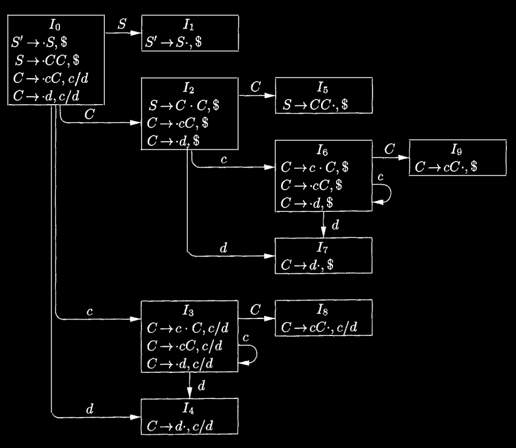

## 4.6 Introduction to LR Parsing: Simple LR

The most prevalent type of bottom-up parser today is based on a concept called LR(k) parsing; the "L" is for left-to-right scanning of the input, the "R" for constructing a rightmost derivation in reverse, and the "k" for the number of input symbols of lookahead that are used in making parsing decisions. The cases `k = 0` or `k = 1` are of practical interest, and we shall only consider LR parsers with `k  ≤ 1` here. When “(k)” is omitted, "k" is assumed to be 1.

This section introduces the basic concepts of LR parsing and the easiest method for constructing shift-reduce parsers, called "simple LR" (or SLR, for short). Some familiarity with the basic concepts is helpful even if the LR parser itself is constructed using an automatic parser generator. We begin with "items" and "parser states"; the diagnostic output from an LR parser generator typically includes parser states, which can be used to isolate the sources of parsing conflicts.

Section 4.7 introduces two, more complex methods canonical-LR and LALR that are used in the majority of LR parsers.

### 4.6.1 Why LR Parsers?

LR parsers are table-driven, much like the non-recursive LL parsers of Section 4.4.4. A grammar for which we can construct a parsing table using one of the methods in this section and the next is said to be an *LR grammar*. Intuitively, for a grammar to be LR it is sufficient that a left-to-right shift-reduce parser be able to recognize handles of right-sentential forms when they appear on top of the stack.

LR parsing is attractive for a variety of reasons:

- LR parsers can be constructed to recognize virtually all programming language constructs for which context-free grammars can be written. Non-LR context-free grammars exist, but these can generally be avoided for typical programming-language constructs.

- The LR-parsing method is the most general nonbacktracking shift-reduce parsing method known, yet it can be implemented as efficiently as other, more primitive shift-reduce methods (see the bibliographic notes).

- An LR parser can detect a syntactic error as soon as it is possible to do so on a left-to-right scan of the input.

- The class of grammars that can be parsed using LR methods is a proper superset of the class of grammars that can be parsed with predictive or LL methods. For a grammar to be LR(k), we must be able to recognize the occurrence of the right side of a production in a right-sentential form, with k input symbols of lookahead. This requirement is far less stringent than that for LL(k) grammars where we must be able to recognize the use of a production seeing only the first k symbols of what its right side derives. Thus, it should not be surprising that LR grammars can describe more languages than LL grammars.

The principal drawback of the LR method is that it is too much work to construct an LR parser by hand for a typical programming-language grammar. A specialized tool, an LR parser generator, is needed. Fortunately, many such generators are available, and we shall discuss one of the most commonly used ones, Yacc, in Section 4.9. Such a generator takes a context-free grammar and automatically produces a parser for that grammar. If the grammar contains ambiguities or other constructs that are difficult to parse in a left-to-right scan of the input, then the parser generator locates these constructs and provides detailed diagnostic messages.

### 4.6.2 Items and the LR(0) Automaton

How does a shift-reduce parser know when to shift and when to reduce? For example, with stack contents `$T` and next input symbol `*` in Fig. 4.28, how does the parser know that `T` on the top of the stack is not a handle, so the appropriate action is to shift and not to reduce `T` to `E`?

An LR parser makes shift-reduce decisions by maintaining states to keep track of where we are in a parse. States represent sets of "items". An *LR(0) item* (item for short) of a grammar *G* is a production of *G* with a dot at some position of the body. Thus, production `A -> XYZ` yields the four items

```F#
A -> @ XYZ
A -> X @ YZ
A -> XY @ Z
A -> XYZ @
```

The production $A \to \epsilon$ generates only one item, $A \to @$.

---

##### Representing Item Sets

A parser generator that produces a bottom-up parser may need to represent items and sets of items conveniently. Note that an item can be represented by a pair of integers, the first of which is the number of one of the productions of the underlying grammar, and the second of which is the position of the dot. Sets of items can be represented by a list of these pairs. However, as we shall see, the necessary sets of items often include "closure" items, where the dot is at the beginning of the body. These can always be reconstructed from the other items in the set, and we do not have to include them in the list.

---

Intuitively, an item indicates how much of a production we have seen at a given point in the parsing process. For example, the item `A -> @ XYZ` indicates that we hope to see a string derivable from `XYZ` next on the input. Item `A -> X @ YZ` indicates that we have just seen on the input a string derivable from `X` and that we hope next to see a string derivable from `YZ`. Item `A -> XYZ @` indicates that we have seen the body `XYZ` and that it may be time to reduce `XYZ` to `A`.

One collection of sets of LR(0) items, called the *canonical* LR(0) collection, provides the basis for constructing a deterministic finite automaton that is used to make parsing decisions. Such an automaton is called an *LR(0) automaton*.[^3] In particular, each state of the LR(0) automaton represents a set of items in the canonical LR(0) collection. The automaton for the expression grammar (4.1), shown in Fig. 4.31, will serve as the running example for discussing the canonical LR(0) collection for a grammar.

[^3]: Technically, the automaton misses being deterministic according to the definition of Section 3.6.4, because we do not have a dead state, corresponding to the empty set of items. As a result, there are some state input pairs for which no next state exists.

To construct the canonical LR(0) collection for a grammar, we define an *augmented grammar* and two functions, CLOSURE and GOTO. If *G* is a grammar with start symbol `S`, then *G'*, the *augmented grammar* for *G*, is *G* with a new start symbol $S'$ and production $S' \to S$. The purpose of this new starting production is to indicate to the parser when it should stop parsing and announce acceptance of the input. That is, acceptance occurs when and only when the parser is about to reduce by $S' \to S$.

#### Closure of Item Sets

If `I` is a set of items for a grammar *G*, then CLOSURE(I) is the set of items constructed from `I` by the two rules:

1. Initially, add every item in `I` to CLOSURE(I).
2. If $A \to a\cdot B\beta$  is in CLOSURE(I) and $B \to \gamma$  is a production, then add the item $B \to \cdot\gamma$  to CLOSURE(I), if it is not already there. Apply this rule until no more new items can be added to CLOSURE(I).

Intuitively, $A \to a\cdot B\beta$ in CLOSURE(I) indicates that, at some point in the parsing process, we think we might next see a substring derivable from $B\beta$ as input. The substring derivable from $B\beta$ will have a prefix derivable from `B` by applying one of the `B`-productions. We therefore add items for all the `B`-productions; that is, if $B \to \gamma$  is a production, we also include $B \to \cdot\gamma$ in CLOSURE(I).

**Example 4.40:** Consider the augmented expression grammar:

```F#
E' -> E
E  -> E + T | T
T  -> T * F | F
F  -> ( E ) | id
```

If I is the set of one item $\{[ E' \to \cdot E\ ]\}$, then CLOSURE(I) contains the set of items I~0~ in Fig. 4.31.


Figure 4.31: LR(0) automaton for the expression grammar (4.1)

To see how the closure is computed, $E' \to \cdot E$ is put in CLOSURE(I) by rule (1). Since there is an `E` immediately to the right of a dot, we add the `E`-productions with dots at the left ends: $E \to \cdot E + T$ and $E \to \cdot T$. Now there is a `T` immediately to the right of a dot in the latter item, so we add $T \to \cdot T * F$ and $T \to \cdot F$. Next, the `F` to the right of a dot forces us to add $F \to \cdot(E)$ and $F \to \cdot \textbf{id}$, but no other items need to be added. □

The closure can be computed as in Fig. 4.32. A convenient way to implement the function *closure* is to keep a boolean array *added*, indexed by the nonterminals of *G*, such that *added*[B] is set to **true** if and when we add the item $B \to \cdot\gamma$  for each `B`-production $B \to \gamma$ .

```C++
SetOfltems CLOSURE (I) {
J = I;
repeat
for (each item `A -> \alpha @ B \beta` in J )
for (each production `B -> \gamma` of G )
if ( `B -> \gamma` is not in J )
    add `B \to \gamma` to J;
until no more items are added to J on one round;
return J;
}
```

Figure 4.32: Computation of CLOSURE

Note that if one `B`-production is added to the closure of `I` with the dot at the left end, then all `B`-productions will be similarly added to the closure. Hence, it is not necessary in some circumstances actually to list the items $B \to \cdot\gamma$  added to `I` by CLOSURE. A list of the nonterminals `B` whose productions were so added will suffice. We divide all the sets of items of interest into two classes:

1. *Kernel items*: the initial item, $S' \to \cdot S$, and all items whose dots are not at the left end.

2. *Nonkernel items*: all items with their dots at the left end, except for $S' \to \cdot S$.

Moreover, each set of items of interest is formed by taking the closure of a set of kernel items; the items added in the closure can never be kernel items, of course. Thus, we can represent the sets of items we are really interested in with very little storage if we throw away all nonkernel items, knowing that they could be regenerated by the closure process. In Fig. 4.31, nonkernel items are in the shaded part of the box for a state.

#### The Function GOTO

The second useful function is GOTO(I, X) where `I` is a set of items and `X` is a grammar symbol. GOTO(I, X) is defined to be the closure of the set of all items $[A \to \alpha X \cdot \beta ]$ such that $[A \to \alpha\cdot X\beta ]$ is in `I`. Intuitively, the GOTO function is used to define the transitions in the LR(0) automaton for a grammar. The states of the automaton correspond to sets of items, and GOTO(I, X) specifies the transition from the state for `I` under input `X`.

**Example 4.41:** If `I` is the set of two items `{[E' -> E @ ], [ E -> E @ + T]}`, then GOTO(I, +) contains the items

```F#
E ->  E + @ T
T ->  @ T * F
T ->  @ F
F ->  @ ( E )
F ->  @ id
```

We computed GOTO(I, +) by examining `I` for items with `+` immediately to the right of the dot. `E' -> E @` is not such an item, but `$E \to E \cdot + T$` is. We moved the dot over the + to get `$E \to E + \cdot T$` and then took the closure of this singleton set. □

We are now ready for the algorithm to construct C, the canonical collection of sets of LR(0) items for an augmented grammar G' the algorithm is shown in Fig. 4.33.

```F#
void items(G') {
C = {CLOSURE({[ S' -> @ S ]})};
repeat
for(each set of items I in C)
for(each grammar symbol X)
if(GOTO(I, X) is not empty and not in C)
add GOTO(I, X) to C;
until no new sets of items are added to C on a round;
}
```

Figure 4.33: Computation of the canonical collection of sets of LR(0) items

**Example 4.42:** The canonical collection of sets of LR(0) items for grammar (4.1) and the GOTO function are shown in Fig. 4.31. GOTO is encoded by the transitions in the figure. □

#### Use of the LR(0) Automaton

The central idea behind "Simple LR", or SLR, parsing is the construction from the grammar of the LR(0) automaton. The states of this automaton are the sets of items from the canonical LR(0) collection, and the transitions are given by the GOTO function. The LR(0) automaton for the expression grammar (4.1) appeared earlier in Fig. 4.31.

The start state of the LR(0) automaton is CLOSURE($\{[S' \to \cdot S]\}$), where $S'$ is the start symbol of the augmented grammar. All states are accepting states. We say "state j" to refer to the state corresponding to the set of items $I_j$.

How can LR(0) automaton help with shift-reduce decisions? Shift-reduce decisions can be made as follows. Suppose that the string $\gamma$ of grammar symbols takes the LR(0) automaton from the start state `0` to some state `j`. Then, shift on next input symbol `a` if state `j` has a transition on `a`. Otherwise, we choose to reduce; the items in state `j` will tell us which production to use.

The LR-parsing algorithm to be introduced in Section 4.6.3 uses its stack to keep track of states as well as grammar symbols; in fact, the grammar symbol can be recovered from the state, so the stack holds states. The next example gives a preview of how an LR(0) automaton and a stack of states can be used to make shift-reduce parsing decisions.

**Example 4.43:** Figure 4.34 illustrates the actions of a shift-reduce parser on input `id * id`, using the LR(0) automaton in Fig. 4.31. We use a STACK to hold states; for clarity, the grammar symbols corresponding to the states on the stack appear in column SYMBOLS. At line (1), the stack holds the start state 0 of the automaton; the corresponding symbol is the bottom-of-stack marker `$`.
$$
\begin{array}{c|llrl}
\text{LINE} &\text{STACK}  &\text{SYMBOLS}   &\text{INPUT}     &\text{ACTION}    \\
\hline
(1)    &0        &\$          &\textbf{id}  *\textbf{id} \$   &\text{shift to 5}  \\
(2)    &0\ 5      &\$ \textbf{id}       &* \textbf{id} \$   &\text{reduce by }F \to \textbf{id} \\
(3)    &0\ 3      &\$ F        &  *\textbf{id} \$   &\text{reduce by }T \to F \\
(4)    &0\ 2      &\$ T        &* \textbf{id} \$   &\text{shift to 7 }\\
(5)    &0\ 2\ 7    &\$ T *&    \textbf{id} \$   &\text{shift to 5 }\\
(6)    &0\ 2\ 7\ 5  &\$ T* \textbf{id}   &       \$   &\text{reduce by }F \to \textbf{id} \\
(7)    &0\ 2\ 7\ 10 &\$ T *F    &       \$   &\text{reduce by }T \to T* F \\
(8)    &0\ 2      &\$ T        &       \$   &\text{reduce by }E \to T \\
(9)    &0\ 1      &\$ E        &       \$   &\text{accept}
\end{array}
$$

Figure 4.34: The parse of $\textbf{id}  * \textbf{id}$

The next input symbol is **id** and state 0 has a transition on **id** to state 5. We therefore shift. At line (2), state 5 (symbol **id**) has been pushed onto the stack. There is no transition from state 5 on input `*`, so we reduce. From item $[F \to \textbf{id} \cdot]$ in state 5, the reduction is by production $F \to \textbf{id}$.

With symbols, a reduction is implemented by popping the body of the production from the stack (on line (2), the body is **id**) and pushing the head of the production (in this case, `F`). With states, we pop state 5 for symbol **id**, which brings state 0 to the top and look for a transition on `F`, the head of the production. In Fig. 4.31, state 0 has a transition on `F` to state 3, so we push state 3, with corresponding symbol `F`; see line (3).

As another example, consider line (5), with state 7 (symbol `*` ) on top of the stack. This state has a transition to state 5 on input **id**, so we push state 5 (symbol **id**). State 5 has no transitions, so we reduce by $F \to \textbf{id}$. When we pop state 5 for the body **id**, state 7 comes to the top of the stack. Since state 7 has a transition on `F` to state 10, we push state 10 (symbol `F`). □

### 4.6.3 The LR-Parsing Algorithm

A schematic of an LR parser is shown in Fig. 4.35. It consists of an input, an output, a stack, a driver program, and a parsing table that has two parts (ACTION and GOTO). The driver program is the same for all LR parsers; only the parsing table changes from one parser to another. The parsing program reads characters from an input buffer one at a time. Where a shift-reduce parser would shift a symbol, an LR parser shifts a *state*. Each state summarizes the information contained in the stack below it.


Figure 4.35: Model of an LR parser

The stack holds a sequence of states, $s_0 s_1 \dots s_m$, where $s_m$ is on top. In the SLR method, the stack holds states from the LR(0) automaton; the canonical-LR and LALR methods are similar. By construction, each state has a corresponding grammar symbol. Recall that states correspond to sets of items, and that there is a transition from state i to state j if GOTO($I_i$, X) = $I_j$. All transitions to state j must be for the same grammar symbol `X`. Thus, each state, except the start state 0, has a unique grammar symbol associated with it. [^4]

[^4]: The converse need not hold; that is, more than one state may have the same grammar symbol. See for example states 1 and 8 in the LR(0) automaton in Fig. 4.31, which are both entered by transitions on `E`, or states 2 and 9, which are both entered by transitions on `T`.

#### Structure of the LR Parsing Table

The parsing table consists of two parts: a parsing-action function ACTION and a goto function GOTO.

1. The ACTION function takes as arguments a state i and a terminal `a` (or `$`, the input endmarker). The value of ACTION[i, `a`​] can have one of four forms:

   - Shift `j`, where `j` is a state. The action taken by the parser effectively shifts input `a` to the stack, but uses state `j` to represent `a`.

   - Reduce $A \to \beta$. The action of the parser effectively reduces $\beta$ on the top of the stack to head `A`.

   - Accept. The parser accepts the input and finishes parsing

   - Error. The parser discovers an error in its input and takes some corrective action. We shall have more to say about how such error-recovery routines work in Sections 4.8.3 and 4.9.4.

2. We extend the GOTO function, defined on sets of items, to states: if $\text{GOTO}[I_i, A] = I_j$, then GOTO also maps a state i and a nonterminal `A` to state j.

#### LR-Parser Configurations

To describe the behavior of an LR parser, it helps to have a notation representing the complete state of the parser: its stack and the remaining input. A *configuration* of an LR parser is a pair:

$$
(s_0 s_1 \dots s_m,\ a_i a_{i+1} \dots a_n\$)
$$

where the first component is the stack contents (top on the right), and the second component is the remaining input. This configuration represents the right-sentential form

$$
X_1 X_2 \dots X_m\ a_i a_{i+1} \dots a_n
$$

in essentially the same way as a shift-reduce parser would; the only difference is that instead of grammar symbols, the stack holds states from which grammar symbols can be recovered. That is, $X_i$ is the grammar symbol represented by state $s_i$. Note that $s_0$, the start state of the parser, does not represent a grammar symbol, and serves as a bottom-of-stack marker, as well as playing an important role in the parse.

#### Behavior of the LR Parser

The next move of the parser from the configuration above is determined by reading $a_i$, the current input symbol, and $s_m$, the state on top of the stack, and then consulting the entry ACTION[$s_m, a_i$] in the parsing action table. The configurations resulting after each of the four types of move are as follows

1. If ACTION[$s_m, a_i$] = shift s, the parser executes a shift move; it shifts the next state `s` onto the stack, entering the configuration

   $$
   (s_0 s_1 \dots s_m s,\ a_{i+1} \dots a_n\$)
   $$

   The symbol $a_i$ need not be held on the stack, since it can be recovered from `s`, if needed (which in practice it never is). The current input symbol is now $a_{i+1}$.

2. If ACTION[$s_m, a_i$] = reduce $A \to \beta$, then the parser executes a reduce move, entering the configuration

   $$
   (s_0 s_1 \dots s_{m-r} s,\ a_ia_{i+1}\dots a_n\$)
   $$

   where `r` is the length of $\beta$ , and s = GOTO[$s_{m-r}$, A]. Here the parser first popped `r` state symbols off the stack, exposing state $S_{m-r}$. The parser then pushed `s`, the entry for GOTO[$s_{m-r}, A$], onto the stack. The current input symbol is not changed in a reduce move. For the LR parsers we shall construct, $X_{m-r+1} \dots X_m$, the sequence of grammar symbols corresponding to the states popped off the stack, will always match $\beta$, the right side of the reducing production.

   The output of an LR parser is generated after a reduce move by executing the semantic action associated with the reducing production. For the time being, we shall assume the output consists of just printing the reducing production.

3. If $\text{ACTION}[s_m, a_i] = \text{accept}$, parsing is completed.

4. If $\text{ACTION}[s_m, a_i] = \text{error}$, the parser has discovered an error and calls an error recovery routine.

The LR-parsing algorithm is summarized below. All LR parsers behave in this fashion; the only difference between one LR parser and another is the information in the ACTION and GOTO fields of the parsing table.

**Algorithm 4.44:** LR-parsing algorithm.

**INPUT:** An input string `ω` and $a_n$ LR-parsing table with functions ACTION and GOTO for a grammar G.

**OUTPUT:** If `ω` is in L(G), the reduction steps of a bottom-up parse for `ω`; otherwise, an error indication.

**METHOD:** Initially, the parser has $s_0$ on its stack, where $s_0$ is the initial state, and $w \$$ in the input buffer. The parser then executes the program in Fig. 4.36.□

```js
let `a` be the first symbol of `ω$`;
while(true) { /* repeat forever */
    let `s` be the state on top of the stack;
    if ( ACTION[s, a] = shift t ) {
        push state `t` onto the stack;
        let `a` be the next input symbol;
    } else if(ACTION[s, a] = reduce `A -> β` ) {
        pop |β| symbols off the stack;
        let state `t` now be on top of the stack;
        push GOTO[t, A] onto the stack;
        output the production `A -> β`;
    } else if(ACTION[s, a] = accept)
        break; /* parsing is done */
    else
        call error-recovery routine;
}
```

Figure 4.36: LR-parsing program

**Example 4.45:** Figure 4.37 shows the ACTION and GOTO functions of an LR-parsing table for the expression grammar (4.1), repeated here with the productions numbered:

```FS
(1) E -> E + T
(2) E -> T
(3) T -> T * F
(4) T -> F
(5) F -> ( E )
(6) F -> id
```

```fsharp
| STATE |  A   |  C   |  T   |  I   |  O   |  N   |  G   |  O   |  TO  |
| :---: | :--: | :--: | :--: | :--: | :--: | :--: | :--: | :--: | :--: |
|       |  id  |  +   |  *   |  (   |  )   |  $   |  E   |  T   |  F   |
|   0   |  s5  |      |      |  s4  |      |      |  1   |  2   |  3   |
|   1   |      |  s6  |      |      |      | acc  |      |      |      |
|   2   |      |  r2  |  s7  |      |  r2  |  r2  |      |      |      |
|   3   |      |  r4  |  r4  |      |  r4  |  r4  |      |      |      |
|   4   |  s5  |      |      |  s4  |      |      |  8   |  2   |  3   |
|   5   |      |  r6  |  r6  |      |  r6  |  r6  |      |      |      |
|   6   |  s5  |      |      |  s4  |      |      |      |  9   |  3   |
|   7   |  s5  |      |      |  s4  |      |      |      |      |  10  |
|   8   |      |  s6  |      |      | s11  |      |      |      |      |
|   9   |      |  r1  |  s7  |      |  r1  |  r1  |      |      |      |
|  10   |      |  r3  |  r3  |      |  r3  |  r3  |      |      |      |
|  11   |      |  r5  |  r5  |      |  r5  |  r5  |      |      |      |
```

Figure 4.37: Parsing table for expression grammar

The codes for the actions are:

1. $s_i$ means shift and stack state i,

2. $r_j$ means reduce by the production numbered j,

3. acc means accept,

4. blank means error.

Note that the value of GOTO[$s, a$] for terminal `a` is found in the ACTION field connected with the shift action on input `a` for state `s`. The GOTO field gives GOTO[$s, A$] for nonterminals `A`. Although we have not yet explained how the entries for Fig. 4.37 were selected, we shall deal with this issue shortly.

On input `id * id + id`, the sequence of stack and input contents is shown in Fig. 4.38. Also shown for clarity, are the sequences of grammar symbols corresponding to the states held on the stack. For example, at line (1) the LR parser is in state 0, the initial state with no grammar symbol, and with `id` the first input symbol. The action in row 0 and column `id` of the action field of Fig. 4.37 is `s5`, meaning shift by pushing state 5. That is what has happened at line (2): the state symbol 5 has been pushed onto the stack, and `id` has been removed from the input.

Then, `*` becomes the current input symbol, and the action of state 5 on input `*` is to reduce by `F -> id`. One state symbol is popped off the stack. State 0 is then exposed. Since the GOTO of state 0 on `F` is 3, state 3 is pushed onto the stack. We now have the configuration in line (3). Each of the remaining moves is determined similarly. □

|      | STACK    | SYMBOLS |          INPUT | ACTION                 |
| :--: | :------- | :------ | -------------: | :--------------------- |
|  1   | 0        |         | id * id + id $ | shift                  |
|  2   | 0 5      | id      |    * id + id $ | reduce by `F -> id`    |
|  3   | 0 3      | F       |    * id + id $ | reduce by `T -> F`     |
|  4   | 0 2      | T       |    * id + id $ | shift                  |
|  5   | 0 2 7    | T *     |      id + id $ | shift                  |
|  6   | 0 2 7 5  | T * id  |         + id $ | reduce by `F -> id`    |
|  7   | 0 2 7 10 | T * F   |         + id $ | reduce by `T -> T * F` |
|  8   | 0 2      | T       |         + id $ | reduce by `E -> T`     |
|  9   | 0 1      | E       |         + id $ | shift                  |
|  10  | 0 1 6    | E +     |           id $ | shift                  |
|  11  | 0 1 6 5  | E + id  |              $ | reduce by `F -> id`    |
|  12  | 0 1 6 3  | E + F   |              $ | reduce by `T -> F`     |
|  13  | 0 1 6 9  | E + T   |              $ | reduce by `E -> E + T` |
|  14  | 0 1      | E       |              $ | accept                 |

Figure 4.38: Moves of an LR parser on $\textbf{id} * \textbf{id} + \textbf{id}$

### 4.6.4 Constructing SLR-Parsing Tables

The SLR method for constructing parsing tables is a good starting point for studying LR parsing. We shall refer to the parsing table constructed by this method as an SLR table, and to an LR parser using an SLR-parsing table as an SLR parser. The other two methods augment the SLR method with lookahead information.

The SLR method begins with LR(0) items and LR(0) automata, introduced in Section 4.5. That is, given a grammar, *G*, we augment *G* to produce *G'*, with a new start symbol `S'`. From *G'*, we construct `C`, the canonical collection of sets of items for *G'* together with the GOTO function.

The ACTION and GOTO entries in the parsing table are then constructed using the following algorithm. It requires us to know FOLLOW(`A`) for each nonterminal `A` of a grammar (see Section 4.4).

**Algorithm 4.46:** Constructing an SLR-parsing table.

**INPUT:** An augmented grammar *G'*.

**OUTPUT:** The SLR-parsing table functions ACTION and GOTO for *G'*.

**METHOD:**

1. Construct $C = \{I_0, I_1, \dots, I_n\}$, the collection of sets of LR(0) items for *G'*.

2. State `i` is constructed from $I_i$. The parsing actions for state `i` are determined as follows:

   a. If $[A \to \alpha \cdot a \beta]$ is in $I_i$ and GOTO($I_i$, a) = $I_j$, then set ACTION[i, a] to "shift j". Here `a` must be a terminal.

   b. If $[A \to \alpha \cdot]$ is in $I_i$, then set ACTION[i, a] to "reduce $A \to \alpha$" for all a in FOLLOW(A); here `A` may not be `S'`.

   c. If $[S' \to S \cdot ]$ is in $I_i$, then set ACTION[i, `$`] to "accept".

   If any conflicting actions result from the above rules, we say the grammar is not SLR(1). The algorithm fails to produce a parser in this case.

3. The GOTO transitions for state `i` are constructed for all nonterminals `A` using the rule: If GOTO($I_i$, A) = $I_j$, then GOTO[i, A] = j.

4. All entries not defined by rules (2) and (3) are made "error".

5. The initial state of the parser is the one constructed from the set of items containing $[S' \to \cdot S]$.

□

The parsing table consisting of the ACTION and GOTO functions determined by Algorithm 4.46 is called the *SLR(1) table* for *G*. An LR parser using the SLR(1) table for *G* is called the SLR(1) parser for *G*, and a grammar having an SLR(1) parsing table is said to be *SLR(1)*. We usually omit the "(1)" after the "SLR", since we shall not deal here with parsers having more than one symbol of lookahead.

**Example 4.47:** Let us construct the *SLR table* for the augmented expression grammar. The canonical collection of sets of LR(0) items for the grammar was shown in Fig. 4.31. First consider the set of items $I_0$:

```F#
E' -> @ E
E  -> @ E + T
E  -> @ T
T  -> @ T * F
T  -> @ F
F  -> @ ( E )
F  -> @ id
```

The item $F \to \cdot (E)$ gives rise to the entry ACTION[0, `(`] = shift 4, and the item $F \to \cdot \textbf{id}$ to the entry ACTION[0, id] = shift 5. Other items in $I_0$ yield no actions. Now consider $I_1$:

```fs
E' -> E @
E  -> E @ + T
```

The first item yields ACTION[1, `$`] = accept, and the second yields ACTION[1, `+`] = shift 6. Next consider $I_2$:

```fs
E -> T @
T -> T @ * F
```

Since FOLLOW(E) = {`$`, `+`, `)`}, the first item makes

```fs
ACTION[2, `$`] = ACTION[2, `+`] = ACTION[2, `)`] = reduce `E -> T`
```

The second item makes ACTION[2, `*`] = shift 7. Continuing in this fashion we obtain the ACTION and GOTO tables that were shown in Fig. 4.31. In that figure, the numbers of productions in reduce actions are the same as the order in which they appear in the original grammar (4.1). That is, $E \to E + T$ is number 1, $E \to T$ is 2, and so on. □

**Example 4.48:** Every SLR(1) grammar is unambiguous, but there are many unambiguous grammars that are not SLR(1). Consider the grammar with productions

```fs
S -> L = R | R
L -> * R | id
R -> L
```

Think of `L` and `R` as standing for l-value and r-value, respectively, and `*` as an operator indicating "contents of".[^5] The canonical collection of sets of LR(0) items for grammar (4.49) is shown in Fig. 4.39.

[^5]: As in Section 2.8.3, an l-value designates a location and an r-value is a value that can be stored in a location.

$$
\begin{array}{llll}
I_0:&S'&\to& \cdot S\\
   &S &\to& \cdot L=R\\
   &S &\to& \cdot R\\
   &S &\to& \cdot *R\\
   &L &\to& \cdot \textbf{id}\\
   &R &\to& \cdot L\\
I_1:&S'&\to& S\cdot\\
I_2:&S &\to& L\cdot =R\\
   &R &\to& L\cdot\\
I_3:&S &\to& R\cdot\\
I_4:&L &\to& *\cdot R\\
   &R &\to& \cdot L\\
   &L &\to& \cdot *R\\
   &L &\to& \cdot \textbf{id}\\
I_5:&L &\to& \textbf{id}\cdot\\
I_6:&S &\to& L=\cdot R\\
   &R &\to& \cdot L\\
   &L &\to& \cdot *R\\
   &L &\to& \cdot \textbf{id}\\
I_7:&L &\to& *R\cdot \\
I_8:&R &\to& L\cdot \\
I_9:&S &\to& L=R\cdot
\end{array}
$$

Figure 4.39: Canonical LR(0) collection for grammar (4.49)

Consider the set of items $I_2$, The first item in this set makes ACTION[2, `=`] be "shift 6." Since FOLLOW(`R`) contains `=` (to see why, consider the derivation $S \implies  L = R \implies  * R = R)$, the second item sets ACTION[2, `=`] to "reduce $R \to L$". Since there is both a shift and a reduce entry in ACTION[2, `=`], state 2 has a shift/reduce conflict on input symbol `=`.

Grammar (4.49) is not ambiguous. This shift/reduce conflict arises from the fact that the SLR parser construction method is not powerful enough to remember enough left context to decide what action the parser should take on input `=`, having seen a string reducible to `L`. The canonical and LALR methods, to be discussed next, will succeed on a larger collection of grammars, including grammar (4.49). Note, however, that there are unambiguous grammars for which every LR parser construction method will produce a parsing action table with parsing action conflicts. Fortunately, such grammars can generally be avoided in programming language applications. □

### 4.6.5 Viable Prefixes

Why can LR(0) automata be used to make shift-reduce decisions? The LR(0) automaton for a grammar characterizes the strings of grammar symbols that can appear on the stack of a shift-reduce parser for the grammar. The stack contents must be a prefix of a right-sentential form. If the stack holds $\alpha$ and the rest of the input is `x`, then a sequence of reductions will take $\alpha x$ to `S`. In terms of derivations, $S\underset{rm}{\overset*\implies} \alpha x$.

Not all prefixes of right-sentential forms can appear on the stack, however, since the parser must not shift past the handle. For example, suppose

$$
E\underset{rm}{\overset*\implies} F * \textbf{id} \underset{rm}\implies (E)*\textbf{id}
$$

Then, at various times during the parse, the stack will hold `(`, `(E`, and `(E)`, but it must not hold `(E)*`, since `(E)` is a handle, which the parser must reduce to `F` before shifting `*`.

The prefixes of right sentential forms that can appear on the stack of a shift-reduce parser are called *viable prefixes*. They are defined as follows: a viable prefix is a prefix of a right-sentential form that does not continue past the right end of the rightmost handle of that sentential form. By this definition, it is always possible to add terminal symbols to the end of a viable prefix to obtain a right-sentential form.

SLR parsing is based on the fact that LR(0) automata recognize viable prefixes. We say item $A \to \beta_1\cdot\beta_2$ is *valid* for a viable prefix $\alpha\beta_1$ if there is a derivation $S' \underset{rm}{\overset * \implies} \alpha A w \underset{rm}\implies \alpha\beta_1\beta_2w$. In general, an item will be valid for many viable prefixes.

The fact that $A \to \beta_1\cdot\beta_2$ is valid for $\alpha\beta_1$ tells us a lot about whether to shift or reduce when we find $\alpha\beta_1$ on the parsing stack. In particular, if $\beta_2\not=\epsilon$, then it suggests that we have not yet shifted the handle onto the stack, so shift is our move. If $\beta_2=\epsilon$, then it looks as if $A \to \beta_1$ is the handle, and we should reduce by this production. Of course, two valid items may tell us to do different things for the same viable prefix. Some of these conflicts can be resolved by looking at the next input symbol, and others can be resolved by the methods of Section 4.8, but we should not suppose that all parsing action conflicts can be resolved if the LR method is applied to an arbitrary grammar.

We can easily compute the set of valid items for each viable prefix that can appear on the stack of an LR parser. In fact, it is a central theorem of LR-parsing theory that the set of valid items for a viable prefix $\gamma$  is exactly the set of items reached from the initial state along the path labeled $\gamma$  in the LR(0) automaton for the grammar. In essence, the set of valid items embodies all the useful information that can be gleaned from the stack. While we shall not prove this theorem here, we shall give an example.

---

#### Items as States of an NFA

A nondeterministic finite automaton *N* for recognizing viable prefixes can be constructed by treating the items themselves as states. There is a transition from $A \to \alpha\cdot X\beta$  to $A \to \alpha X\cdot\beta$  labeled `X`, and there is a transition from $A \to \alpha \cdot B \beta$  to $B \to \cdot \gamma$  labeled $\epsilon$. Then CLOSURE(I) for set of items (states of *N*) `I` is exactly the $\epsilon$-closure of a set of NFA states defined in Section 3.7.1. Thus, GOTO(I, X) gives the transition from `I` on symbol `X` in the DFA constructed from *N* by the subset construction. Viewed in this way, the procedure `items(G')` in Fig. 4.33 is just the subset construction itself applied to the NFA *N* with items as states.

---

**Example 4.50:** Let us consider the augmented expression grammar again, whose sets of items and GOTO function are exhibited in Fig. 4.31. Clearly, the string $E + T *$ is a viable prefix of the grammar. The automaton of Fig. 4.31 will be in state 7 after having read $E + T* $. State 7 contains the items

$$
\begin{array}{lll}
T&\to& T*\cdot F\\
F&\to& \cdot(E)\\
F&\to& \cdot \textbf{id}
\end{array}
$$

which are precisely the items valid for $E+T * $. To see why, consider the following three rightmost derivations

$$
\begin{array}{lll}
E'&\underset{rm}\implies& E \\
&\underset{rm}\implies& E+T \\
&\underset{rm}\implies& E+T*F \\

E'&\underset{rm}\implies& E \\
&\underset{rm}\implies& E+T \\
&\underset{rm}\implies& E+T*F \\
&\underset{rm}\implies& E+T*(E) \\

E'&\underset{rm}\implies& E \\
&\underset{rm}\implies& E+T \\
&\underset{rm}\implies& E+T*F \\
&\underset{rm}\implies& E+T*\textbf{id}
\end{array}
$$

The first derivation shows the validity of $T \to T *\cdot F$, the second the validity of $F \to \cdot(E)$, and the third the validity of $F \to \cdot \textbf{id}$. It can be shown that there are no other valid items for $E + T* $, although we shall not prove that fact here. □

## 4.7 More Powerful LR Parsers

In this section, we shall extend the previous LR parsing techniques to use one symbol of lookahead on the input. There are two different methods:

1. The "canonical-LR" or just "LR" method, which makes full use of the lookahead symbol(s). This method uses a large set of items, called the LR(1) items.

2. The "lookahead-LR" or "LALR" method, which is based on the LR(0) sets of items, and has many fewer states than typical parsers based on the LR(1) items. By carefully introducing lookaheads into the LR(0) items, we can handle many more grammars with the LALR method than with the SLR method, and build parsing tables that are no bigger than the SLR tables. LALR is the method of choice in most situations.

After introducing both these methods, we conclude with a discussion of how to compact LR parsing tables for environments with limited memory.

### 4.7.1 Canonical LR(1) Items

We shall now present the most general technique for constructing an LR parsing table from a grammar. Recall that in the SLR method, state `i` calls for reduction by $A \to \alpha$ if the set of items $I_i$ contains item [$A \to \alpha\cdot$] and input symbol `a` is in FOLLOW(`A`). In some situations, however, when state `i` appears on top of the stack, the viable prefix $\beta\alpha$ on the stack is such that $\beta A$ cannot be followed by `a` in any right-sentential form. Thus, the reduction by $A \to \alpha$ should be invalid on input `a`.

**Example 4.51:** Let us reconsider Example 4.48, where in state 2 we had item $R \to L\cdot$, which could correspond to $A \to \alpha$ above, and `a` could be the `=` sign, which is in FOLLOW(`R`). Thus, the SLR parser calls for reduction by $R \to L$ in state 2 with `=` as the next input (the shift action is also called for, because of item $S \to L\cdot=R$ in state 2). However, there is no right-sentential form of the grammar in Example 4.48 that begins $R = \dots$ . Thus state 2, which is the state corresponding to viable prefix `L` only, should not really call for reduction of that `L` to `R`. □

It is possible to carry more information in the state that will allow us to rule out some of these invalid reductions by $A \to \alpha$. By splitting states when necessary, we can arrange to have each state of an LR parser indicate exactly which input symbols can follow a handle $\alpha$ for which there is a possible reduction to `A`.

The extra information is incorporated into the state by redefining items to include a terminal symbol as a second component. The general form of an item becomes $[A \to \alpha \cdot \beta, a]$, where $A \to \alpha\beta$ is a production and `a` is a terminal or the right endmarker \$. We call such an object an *LR(1) item*. The 1 refers to the length of the second component, called the *lookahead* of the item.[^6] The lookahead has no effect in an item of the form $[A \to \alpha\cdot\beta, a]$, where $\beta$  is not $\epsilon$, but an item of the form $[A \to \alpha\cdot, a]$ calls for a reduction by $A\to \alpha$ only if the next input symbol is `a`. Thus, we are compelled to reduce by $A \to \alpha$ only on those input symbols `a` for which $[A \to \alpha \cdot \beta, a]$ is an LR(1) item in the state on top of the stack. The set of such `a`'s will always be a subset of FOLLOW(`A`), but it could be a proper subset, as in Example 4.51.

[^6]: Lookaheads that are strings of length greater than one are possible, of course, but we shall not consider such lookaheads here.

Formally, we say LR(1) item $[A \to \alpha \cdot \beta, a]$ is *valid* for a viable prefix $\gamma$  if there is a derivation $S \underset{rm}{\overset * \implies} \delta Aw  \underset{rm}\implies \delta \alpha \beta w$, where

1. $\gamma  = \delta \alpha$, and

2. Either `a` is the first symbol of `ω`, or `ω`  is $\epsilon$ and `a` is \$.

**Example 4.52:** Let us consider the grammar

$$
\begin{array}{lll}
S &\to& B\ B \\
B &\to& a\ B\ |\ b
\end{array}
$$

There is a rightmost derivation $S \underset{rm}{\overset *\implies} aaBab \underset{rm}\implies aaaBab$. We see that item $[B \to a\cdot B, a]$ is valid for a viable prefix $\gamma = aaa$ by letting $\delta = aa$, $A = B$, $w = ab$, $\alpha = a$, and $\beta = B$ in the above definition. There is also a rightmost derivation $S \underset{rm}{\overset* \implies} BaB \underset{rm}\implies BaaB$. From this derivation we see that item $[B \to a\cdot B,\$]$ is valid for viable prefix $Baa$. □

上面的语法同下面的语法4.55只是符号表示不同，中文版书籍段落中的推导公式B->a误写为B->alpha。

### 4.7.2 Constructing LR(1) Sets of Items

The method for building the collection of sets of valid LR (1) items is essentially the same as the one for building the canonical collection of sets of LR (0) items. We need only to modify the two procedures CLOSURE and GOTO.

To appreciate the new definition of the CLOSURE operation, in particular, why `b` must be in FIRST($\beta a$), consider an item of the form $[A \to \alpha\cdot B\beta, a]$ in the set of items valid for some viable prefix $\gamma$. Then there is a rightmost derivation $S \underset{rm}{\overset *\implies} \delta A a x \underset{rm}\implies \delta\alpha B\beta ax$, where $\gamma =\delta\alpha$. Suppose $\beta a x$ derives terminal string `by`. Then for each production of the form $B \to \eta $ for some $\eta$, we have derivation $S \underset{rm}{\overset* \implies} \gamma Bby \underset{rm}\implies \gamma\eta by$. Thus, $[B \to \cdot\eta, b]$ is valid for $\gamma$. Note that `b` can be the first terminal derived from $\beta$, or it is possible that $\beta$ derives $\epsilon$ in the derivation $\beta a x \implies  b y$, and `b` can therefore be `a`. To summarize both possibilities we say that `b` can be any terminal in FIRST($\beta a x$), where FIRST is the function from Section 4.4. Note that `x` cannot contain the first terminal of `by`, so $\text{FIRST}(\beta a x) = \text{FIRST}(\beta a)$. We now give the LR(1) sets of items construction.

**Algorithm 4.53:** Construction of the sets of LR(1) items.

**INPUT:** An augmented grammar *G'*.

**OUTPUT:** The sets of LR(1) items that are the set of items valid for one or more viable prefixes of *G'*.

**METHOD:** The procedures CLOSURE and GOTO and the main routine *items* for constructing the sets of items were shown in Fig. 4.40. □

```fs
SetOfItems CLOSURE(I)  {
repeat
for ( each item [$A \to  \alpha\cdot B\beta$, `a`]  in I )
for ( each production $B \to  \gamma$  in G' )
for ( each terminal b in FIRST($\beta a$)  )
add [$B \to  \cdot \gamma$, `b`] to set I;
until no more items are added to I;
return I;
}
SetOfItems GOTO(I, X) {
initialize J to be the empty set;
for ( each item [$A \to  \alpha\cdot X\beta$, `a`]  in I  )
add item [$A \to  \alpha\cdot X\beta$, `a`] to set J;
return CLOSURE( J ) ;
}
void items(G') {
initialize C to CLOSURE( {[$S' \to \cdot S$, $]});
repeat
for ( each set of items I in C )
for ( each grammar symbol X )
if  (  GOTO(I, X)  is not empty and not in C )
add GOTO(I, X)  to C;
until no new sets of items are added to C;
}
```

Figure 4.40: Sets-of-LR(1)-items construction for grammar *G'*

**Example 4.54:** Consider the following augmented grammar.
$$
\begin{array}{lll}
S' \to S\\
S \to C C \\\tag{4.55}
C \to c C | d
\end{array}
$$

We begin by computing the closure of {[$S' \to \cdot S$, \$]}. To close, we match the item [$S' \to \cdot S$, \$] with the item [$A \to \alpha \cdot B\beta$, `a`] in the procedure CLOSURE.

That is, $A = S', \alpha = \eta, B = S, \beta = \eta$, and $a = \$$. Function CLOSURE tells us to add [$B \to \cdot \gamma$, `b`] for each production $B \to \gamma$ and terminal `b` in FIRST($\beta a$). In terms of the present grammar, $B \to \gamma$ must be $S \to C C$, and since $\beta$ is `E` and `a` is \$, `b` may only be \$. Thus we add [$S \to \cdot C C$, \$].

We continue to compute the closure by adding all items [$C \to \cdot \gamma$ , `b`] for `b` in FIRST($C\$$). That is, matching [$S \to \cdot C C$, \$] against [$A \to \alpha \cdot B \beta$, `a`], we have $A = S, \alpha = \gamma, B = C, \beta = C$, and $a = \$$. Since `C` does not derive the empty string, FIRST($C\$$) = FIRST(`C`). Since FIRST(`C`) contains terminals `c` and `d`, we add items [$C \to \cdot c C$, `c`], [$C \to \cdot c C$, `d`] , [$C \to \cdot d$, `c`] and [$C \to \cdot d$, `d`] . None of the new items has a nonterminal immediately to the right of the dot, so we have completed our first set of LR(1) items. The initial set of items is

$$
\begin{array}{llll}
I_0: &S \to \cdot S, \$\\
    &S \to \cdot C C, \$\\
    &C \to \cdot c C, c/d\\
    &C \to \cdot d, c/d
\end{array}
$$

The brackets have been omitted for notational convenience, and we use the notation [$C \to \cdot c C$, c/d] as a shorthand for the two items [$C \to \cdot c C$, c] and [$C \to \cdot c C$, d].

Now we compute GOTO(I_0, X) for the various values of X. For X = S we must close the item [$S' \to S\cdot$, \$]. No additional closure is possible, since the dot is at the right end. Thus we have the next set of items
$$
I_1: S' \to S\cdot, \$
$$
For X = C we close [$S \to C\cdot C$, \$]. We add the C-productions with second component \$ and then can add no more, yielding

$$
\begin{array}{ll}
I_2: &S \to C \cdot C, \$\\
     &C \to \cdot c C, \$\\
     &C \to \cdot d, \$
\end{array}
$$

Next, let $X = c$. We must close {[$C \to c \cdot C$, $c/d$]}. We add the `C`-productions with second component $c / d$, yielding

$$
\begin{array}{lll}
I_3: & C \to c\cdot C&, c/d\\
    & C \to \cdot c C&, c/d\\
    & C \to \cdot d&, c/d
\end{array}
$$

Finally, let $X = d$, and we wind up with the set of items

$$
I_4: C \to d\cdot, c/d
$$

We have finished considering GOTO on $I_0$. We get no new sets from $I_1$, but $I_2$ has GOTO's on `C`, `c`, and `d`. For GOTO($I_2$, `C`) we get

$$
I_5: S \to C C\cdot, \$
$$

no closure being needed. To compute GOTO ($I_2$, `c`) we take the closure of {[$C \to c\cdot C$, \$]}, to obtain

$$
\begin{array}{ll}
I_6: & C \to c\cdot C, \$\\
     & C \to \cdot c C, \$\\
     & C \to \cdot d, \$
\end{array}
$$

Note that $I_6$ differs from $I_3$ only in second components. We shall see that it is common for several sets of LR(1) items for a grammar to have the same first components and differ in their second components. When we construct the collection of sets of LR(0) items for the same grammar, each set of LR(0) items will coincide with the set of first components of one or more sets of LR(1) items. We shall have more to say about this phenomenon when we discuss LALR parsing.

Continuing with the GOTO function for $I_2$, GOTO($I_2$, `d`) is seen to be

$$
I_7: C \to d\cdot, \$
$$

Turning now to $l_3$, the GOTO'S of $I_3$ on `c` and `d` are $I_3$ and $I_4$, respectively, and GOTO($I_3$, `C`) is

$$
I_8: C \to c C\cdot, c/d
$$

$I_4$ and $I_5$ have no GOTO's, since all items have their dots at the right end. The GOTO's of $I_6$ on `c` and `d` are $I_6$ and $I_7$, respectively, and GOTO($I_6$, `C`) is

$$
I_9: C \to c C\cdot, \$
$$

The remaining sets of items yield no GOTO's, so we are done. Figure 4.41 shows the ten sets of items with their GOTO's. □



Figure 4.41: The GOTO graph for grammar (4.55)

### 4.7.3 Canonical LR(1) Parsing Tables

We now give the rules for constructing the LR(1) ACTION and GOTO functions from the sets of LR(1) items. These functions are represented by a table, as before. The only difference is in the values of the entries.

**Algorithm 4.56:** Construction of canonical-LR parsing tables.

**INPUT:** An augmented grammar *G'*.

**OUTPUT:** The canonical-LR parsing table functions ACTION and GOTO for *G'*.

**METHOD:**

1. Construct $C' = \{I_0, I_1, \dots, I_n\}$, the collection of sets of LR(1) items for *G'*.

2. State *i* of the parser is constructed from $I_i$. The parsing action for state *i* is determined as follows.

   a. If $[A\to \alpha\cdot a\beta, b]$ is in $I_i$ and $\text{GOTO}(I_i, a) = I_j$, then set ACTION[$I, a$] to “shift *j*.” Here a must be a terminal.

   b. If $[A \to \alpha\cdot, a]$ is in $I_i$, $A \not= S'$, then set ACTION[$I, a$] to “reduce $A \to \alpha \cdot$”

   c. If $[S' \to S \cdot, \$]$ is in $I_i$, then set ACTION[$I, \$$] to “accept.”

   If any conflicting actions result from the above rules, we say the grammar is not LR(1). The algorithm fails to produce a parser in this case.

3. The GOTO transitions for state *i* are constructed for all nonterminals *A* using the rule: If $\text{GOTO}(I_i, A) = I_j$, then $\text{GOTO}[I, A] = j$.

4. All entries not defined by rules (2) and (3) are made “error.”

5. The initial state of the parser is the one constructed from the set of items containing $[S' \to \cdot S, \$]$.

□

The table formed from the parsing action and GOTO functions produced by Algorithm 4.56 is called the canonical LR(1) parsing table. An LR parser using this table is called a canonical-LR(1) parser. If the parsing action function has no multiply defined entries, then the given grammar is called an LR(1) grammar. As before, we omit the “(1)” if it is understood.

**Example 4.57:** The canonical parsing table for grammar (4.55) is shown in Fig. 4.42. Productions 1, 2, and 3 are $S \to C C$, $C\to cC$, and $C\to d$, respectively. □

Every SLR(1) grammar is an LR(1) grammar, but for an SLR(1) grammar the canonical LR parser may have more states than the SLR parser for the same grammar. The grammar of the previous examples is SLR and has an SLR parser with seven states, compared with the ten of Fig. 4.42.

```fs
| STATE |  ACTION            |  GOTO       |
| ----: | :--: | :--: | :--: | :--: | :--: |
|       |  c   |  d   |  $   |  S   |  C   |
|     0 |  s3  |  s4  |      |  1   |  2   |
|     1 |      |      | acc  |      |      |
|     2 |  s6  |  s7  |      |      |  5   |
|     3 |  s3  |  s4  |      |      |  8   |
|     4 |  r3  |  r3  |      |      |      |
|     5 |      |      |  r1  |      |      |
|     6 |  s6  |  s7  |      |      |  9   |
|     7 |      |      |  r3  |      |      |
|     8 |  r2  |  r2  |      |      |      |
|     9 |      |      |  r2  |      |      |
```

Figure 4.42: Canonical parsing table for grammar (4.55)

### 4.7.4 Constructing LALR Parsing Tables

We now introduce our last parser construction method, the LALR(lookahead-LR) technique. This method is often used in practice, because the tables obtained by it are considerably smaller than the canonical LR tables, yet most common syntactic constructs of programming languages can be expressed conveniently by an LALR grammar. The same is almost true for SLR grammars, but there are a few constructs that cannot be conveniently handled by SLR techniques (see Example 4.48, for example).

For a comparison of parser size, the SLR and LALR tables for a grammar always have the same number of states, and this number is typically several hundred states for a language like C. The canonical LR table would typically have several thousand states for the same-size language. Thus, it is much easier and more economical to construct SLR and LALR tables than the canonical LR tables.

By way of introduction, let us again consider grammar (4.55), whose sets of LR(1) items were shown in Fig. 4.41. Take a pair of similar looking states, such as $I_4$ and $I_7$. Each of these states has only items with first component $C \to d \cdot$. In $I_4$, the lookaheads are `c` or `d`; in $I_7$, \$ is the only lookahead.

To see the difference between the roles of $I_4$ and $I_7$ in the parser, note that the grammar generates the regular language `c*dc*d`. When reading an input $cc \dots cdcc \dots cd$, the parser shifts the first group of `c`'s and their following `d` onto the stack, entering state 4 after reading the `d`. The parser then calls for `a` reduction by $C \to d$, provided the next input symbol is `c` or `d`. The requirement that `c` or `d` follow makes sense, since these are the symbols that could begin strings in `c*d`. If `\$` follows the first `d`, we have an input like `ccd`, which is not in the language, and state 4 correctly declares an error if \$ is the next input.

The parser enters state 7 after reading the second `d`. Then, the parser must see \$ on the input, or it started with a string not of the form `c\*dc\*d`. It thus makes sense that state 7 should reduce by $C \to d$ on input \$ and declare error on inputs `c` or `d`.

Let us now replace $I_4$ and $I_7$ by $I_{47}$, the union of $I_4$ and $I_7$, consisting of the set of three items represented by $[C \to d\cdot, c/d/]$. The GOTO's on `d` to $I_4$ or $I_7$ from $I_0$, $I_2$, $I_3$, and $I_6$ now enter $I_{47}$. The action of state 47 is to reduce on any input. The revised parser behaves essentially like the original, although it might reduce `d` to `C` in circumstances where the original would declare error, for example, on input like $ccd$ or $cdcdc$. The error will eventually be caught; in fact, it will be caught before any more input symbols are shifted.

More generally, we can look for sets of LR(1) items having the same *core*, that is, set of first components, and we may merge these sets with common cores into one set of items. For example, in Fig. 4.41, $I_4$ and $I_7$ form such a pair, with core $\{ C \to d \cdot \}$. Similarly, $I_3$ and $I_6$ form another pair, with core $\{C \to c \cdot C, C \to \cdot c C, C\to \cdot d \}$. There is one more pair, $I_8$ and $I_9$, with common core $\{ C \to c C \cdot\}$. Note that, in general, a core is a set of LR(0) items for the grammar at hand, and that an LR(1) grammar may produce more than two sets of items with the same core.

Since the core of GOTO(I, X) depends only on the core of I, the GOTO's of merged sets can themselves be merged. Thus, there is no problem revising the GOTO function as we merge sets of items. The action functions are modified to reflect the non-error actions of all sets of items in the merger.

Suppose we have an LR(1) grammar, that is, one whose sets of LR(1) items produce no parsing-action conflicts. If we replace all states having the same core with their union, it is possible that the resulting union will have a conflict, but it is unlikely for the following reason: Suppose in the union there is a conflict on lookahead a because there is an item $[A \to \alpha \cdot, a]$ calling for a reduction by $A \to \alpha$, and there is another item $[B\to \beta \cdot a \gamma, b]$ calling for a shift. Then some set of items from which the union was formed has item $[A\to \alpha\cdot, a]$, and since the cores of all these states are the same, it must have an item $[B\to \beta \cdot a\gamma, c]$ for some c. But then this state has the same shift/reduce conflict on a, and the grammar was not LR(1) as we assumed. Thus, the merging of states with common cores can never produce a shift/reduce conflict that was not present in one of the original states, because shift actions depend only on the core, not the lookahead.

It is possible, however, that a merger will produce a reduce/reduce conflict, as the following example shows.

**Example 4.58:** Consider the grammar
$$
\begin{array}{lll}
S'&\to& S\\
S &\to& a A d\ |\ b B d\ |\ a B e\ |\ b A e\\
A &\to& c\\
B &\to& c
\end{array}
$$

which generates the four strings *acd*, *ace*, *bcd*, and *bce*. The reader can check that the grammar is LR(1) by constructing the sets of items. Up on doing so, we find the set of items $\{[A\to c\cdot, d]; [B\to c\cdot, e]\}$ valid for viable prefix *ac* and $\{[A\to c\cdot, e]; [B\to c\cdot, d]\}$ valid for $bc$. Neither of these sets has a conflict, and their cores are the same. However, their union, which is

$$
\begin{array}{ll}
A\to c\cdot, &d/e\\
B\to c\cdot, &d/e
\end{array}
$$

generates a reduce/reduce conflict, since reductions by both $A \to c$ and $B \to c$ are called for on inputs d and e. □

We are now prepared to give the first of two LALR table-construction algorithms. The general idea is to construct the sets of LR(1) items, and if no conflicts arise, merge sets with common cores. We then construct the parsing table from the collection of merged sets of items. The method we are about to describe serves primarily as a definition of LALR(1) grammars. Constructing the entire collection of LR(1) sets of items requires too much space and time to be useful in practice.

**Algorithm 4.59:** An easy, but space-consuming LALR table construction.

**INPUT:** An augmented grammar *G'*.

**OUTPUT:** The LALR parsing-table functions ACTION and GOTO for *G'*.

**METHOD:**

1. Construct $C = \{I_0, I_1, \dots , I_n\}$, the collection of sets of LR(1) items.

2. For each core present among the set of LR(1) items, find all sets having that core, and replace these sets by their union.

3. Let $C' = \{J_0, J_1, \dots , J_m\}$ be the resulting sets of LR(1) items. The parsing actions for state *i* are constructed from $J_i$ in the same manner as in Algorithm 4.56. If there is a parsing action conflict, the algorithm fails to produce a parser, and the grammar is said not to be LALR(1).

4. The GOTO table is constructed as follows. If J is the union of one or more sets of LR(1) items, that is, $J = I_1\cup I_2 \cup \dots \cup I_k$, then the cores of $\text{GOTO}(I_1, X), \text{GOTO}(I_2, X), \dots , \text{GOTO}(I_k, X)$ are the same, since $I_1, I_2, \dots , I_k$ all have the same core. Let K be the union of all sets of items having the same core as $GOTO(I_1, X)$. Then $GOTO(J, X) = K$.

□

The table produced by Algorithm 4.59 is called the *LALR parsing table* for *G*. If there are no parsing action conflicts, then the given grammar is said to be an *LALR(1) grammar*. The collection of sets of items constructed in step(3) is called the *LALR(1) collection*.

**Example 4.60:** Again consider grammar (4.55) whose GOTO graph was shown in Fig. 4.41. As we mentioned, there are three pairs of sets of items that can be merged. $I_3$ and $I_6$ are replaced by their union:
$$
\begin{array}{lll}
I_{36} : &C\to c\cdot C&, c/d/\$\\
      &C\to \cdot c C&, c/d/\$\\
      &C\to \cdot d &, c/d/\$
\end{array}
$$

$I_4$ and $I_7$ are replaced by their union:

$$
\begin{array}{lll}
I_{47}: &C\to d\cdot&, c/d/\$
\end{array}
$$

and $I_8$ and $I_9$ are replaced by their union:

$$
\begin{array}{lll}
I_{89}: &C\to cC\cdot&, c/d/\$
\end{array}
$$

The LALR action and GOTO functions for the condensed sets of items are shown in Fig. 4.43.

```FS
| STATE |  ACTION            |   GOTO      |
| ----: | :--: | :--: | :--: | ---: | ---: |
|       |  c   |  d   |  $   |   S  |   C  |
|     0 | s36  | s47  |      |    1 |    2 |
|     1 |      |      | acc  |      |      |
|     2 | s36  | s47  |      |      |    5 |
|    36 | s36  | s47  |      |      |   89 |
|    47 |  r3  |  r3  |  r3  |      |      |
|     5 |      |      |  r1  |      |      |
|    89 |  r2  |  r2  |  r2  |      |      |
```

Figure 4.43: LALR parsing table for the grammar of Example 4.54

To see how the GOTO's are computed, consider GOTO (I_36, `C`). In the original set of LR(1) items, GOTO(I_3, `C`) = I_8, and I_8 is now part of $I_{89}$, so we make GOTO($I_{36}$, `C`) be $I_{89}$. We could have arrived at the same conclusion if we considered $I_6$, the other part of $I_{36}$. That is, GOTO($I_6$, `C`) = $I_9$, and $I_9$ is now part of $I_{89}$ . For another example, consider GOTO($I_2$, `c`), an entry that is exercised after the shift action of $I_2$ on input `c`. In the original sets of LR(1) items, GOTO($I_2$, `c`) = I6. Since $I_6$ is now part of $I_{36}$, GOTO ($I_2$, `c`) becomes $I_{36}$. Thus, the entry in Fig. 4.43 for state 2 and input `c` is made s36, meaning shift and push state 36 onto the stack. □

When presented with a string from the language $c*dc*d$, both the LR parser of Fig. 4.42 and the LALR parser of Fig. 4.43 make exactly the same sequence of shifts and reductions, although the names of the states on the stack may differ. For instance, if the LR parser puts $I_3$ or $I_6$ on the stack, the LALR parser will put $I_{36}$ on the stack. This relationship holds in general for an LALR grammar. The LR and LALR parsers will mimic one another on correct inputs.

When presented with erroneous input, the LALR parser may proceed to do some reductions after the LR parser has declared an error. However, the LALR parser will never shift another symbol after the LR parser declares an error. For example, on input $ccd$ followed by \$, the LR parser of Fig. 4.42 will put

0 3 3 4

on the stack, and in state 4 will discover an error, because \$ is the next input symbol and state 4 has action error on \$. In contrast, the LALR parser of Fig.4.43 will make the corresponding moves, putting

0 36 36 47

on the stack. But state 47 on input \$ has action reduce $C \to d$. The LALR parser will thus change its stack to

0 36 36 89

Now the action of state 89 on input \$ is reduce $C \to cC$. The stack becomes

0 36 89

whereupon a similar reduction is called for, obtaining stack

0 2

Finally, state 2 has action error on input \$, so the error is now discovered.

### 4.7.5 Efficient Construction of LALR Parsing Tables

There are several modifications we can make to Algorithm 4.59 to avoid constructing the full collection of sets of LR(1) items in the process of creating an LALR(1) parsing table.

- First, we can represent any set of LR(0) or LR(1) items `I` by its kernel, that is, by those items that are either the initial item—$[S' \to \cdot S]$ or $[S'\to \cdot S,\$]$—or that have the dot somewhere other than at the beginning of the production body.

- We can construct the LALR(1)-item kernels from the LR(0)-item kernels by a process of propagation and spontaneous generation of lookaheads, that we shall describe shortly.

- If we have the LALR(1) kernels, we can generate the LALR(1) parsing table by closing each kernel, using the function CLOSURE of Fig. 4.40, and then computing table entries by Algorithm 4.56, as if the LALR(1) sets of items were canonical LR(1) sets of items.

**Example 4.61:** We shall use as an example of the efficient LALR(1) table-construction method the non-SLR grammar from Example 4.48, which we reproduce below in its augmented form:

$$
\begin{array}{lll}
S'&\to& S\\
S &\to& L = R\ |\ R\\
L &\to& * R\ |\ \textbf{id}\\
R &\to& L
\end{array}
$$

The complete sets of LR(0) items for this grammar were shown in Fig. 4.39. The kernels of these items are shown in Fig. 4.44. □

$$
\begin{array}{llll}
I_0:&S'&\to& \cdot S \\
I_1:&S'&\to& S\cdot \\
I_2:&S &\to& L\cdot = R \\
   &R &\to& L\cdot \\
I_3:&S &\to& R\cdot  \\
I_4:&L &\to& *\cdot R \\
I_5:&L &\to& id\cdot \\
I_6:&S &\to& L = \cdot R \\
I_7:&L &\to& *R\cdot \\
I_8:&R &\to& L\cdot \\
I_9:&S &\to& L = R\cdot
\end{array}
$$

Figure 4.44: Kernels of the sets of LR(0) items for grammar (4.49)

Now we must attach the proper lookaheads to the LR(0) items in the kernels, to create the kernels of the sets of LALR(1) items. There are two ways a lookahead `b` can get attached to an LR(0) item $B \to \gamma \cdot \delta$ in some set of LALR(1) items `J`:

1. There is a set of items `I`, with a kernel item $A \to \alpha \cdot \beta, a$, and $J = \text{GOTO}(I, X)$, and the construction of
   $$
   \text{GOTO}(\text{CLOSURE}(\{[A \to \alpha \cdot \beta, a]\}), X)
   $$
   as given in Fig. 4.40, contains $[B \to \gamma \cdot \delta, b]$, regardless of `a`. Such a lookahead `b` is said to be generated *spontaneously* for $B \to \gamma \cdot \delta$. As a special case, lookahead \$ is generated spontaneously for the item $S' \to \cdot S$ in the initial set of items.

2. All is as in (1), but $a = b$, and $\text{GOTO}(\text{CLOSURE}(\{[A \to \alpha \cdot \beta, b]\}), X)$, as given in Fig. 4.40, contains $[B\to \gamma \cdot\delta, b]$ only because $A \to \alpha \cdot \beta$ has `b` as one of its associated lookaheads. In such a case, we say that lookaheads *propagate* from $A \to \alpha \cdot \beta$ in the kernel of `I` to $B \to \gamma \cdot \delta$ in the kernel of `J`. Note that propagation does not depend on the particular lookahead symbol; either all lookaheads propagate from one item to another, or none do.

We need to determine the spontaneously generated lookaheads for each set of LR(0) items, and also to determine which items propagate lookaheads from which. The test is actually quite simple. Let $\#$ be a symbol not in the grammar at hand. Let $A\to \alpha \cdot \beta$ be a kernel LR(0) item in set `I`. Compute, for each `X`, J = GOTO(CLOSURE(\{[A\to \alpha\cdot\beta, \#]\}), X). For each kernel item in `J`, we examine its set of lookaheads. If $\#$ is a lookahead, then lookaheads propagate to that item from $A \to \alpha\cdot\beta$. Any other lookahead is spontaneously generated. These ideas are made precise in the following algorithm, which also makes use of the fact that the only kernel items in `J` must have `X` immediately to the left of the dot; that is, they must be of the form $B \to \gamma X \cdot \delta$.

**Algorithm 4.62:** Determining lookaheads.

**INPUT:** The kernel `K` of a set of LR(0) items `I` and a grammar symbol `X`.

**OUTPUT:** The lookaheads spontaneously generated by items in `I` for kernel items in GOTO(I, X) and the items in `I` from which lookaheads are propagated to kernel items in GOTO(I, X).

**METHOD:** The algorithm is given in Fig. 4.45. □

```fs
for ( each item $A \to \alpha\cdot\beta$ in K ) {
J := CLOSURE({[$A\to \alpha\cdot\beta$, #]});
if ( [$B\to \gamma X\cdot\delta$, a] is in J, and a is not # )
conclude that lookahead a is generated spontaneously for item
$\gamma X\cdot\delta$ in GOTO(I, X);
if ( [$B\to \gamma X\cdot\delta$, #] is in J)
conclude that lookaheads propagate from $A\to \alpha\cdot\beta$  in `I` to
$B \to \gamma \cdot \delta$ in GOTO(I, X);
}
```

Figure 4.45: Discovering propagated and spontaneous lookaheads

We are now ready to attach lookaheads to the kernels of the sets of LR(0) items to form the sets of LALR(1) items. First, we know that \$ is a lookahead for $S' \to S$ in the initial set of LR(0) items. Algorithm 4.62 gives us all the lookaheads generated spontaneously. After listing all those lookaheads, we must allow them to propagate until no further propagation is possible. There are many different approaches, all of which in some sense keep track of “new” lookaheads that have propagated into an item but which have not yet propagated out. The next algorithm describes one technique to propagate lookaheads to all items.

**Algorithm 4.63:** Efficient computation of the kernels of the LALR(1) collection of sets of items.

**INPUT:** An augmented grammar *G'*.

**OUTPUT:** The kernels of the LALR(1) collection of sets of items for *G'*.

**METHOD:**

1. Construct the kernels of the sets of LR(0) items for *G*. If space is not at a premium, the simplest way is to construct the LR(0) sets of items, as in Section 4.6.2, and then remove the nonkernel items. If space is severely constrained, we may wish instead to store only the kernel items for each set, and compute GOTO for a set of items `I` by first computing the closure of `I`.

2. Apply Algorithm 4.62 to the kernel of each set of LR(0) items and grammar symbol `X` to determine which lookaheads are spontaneously generated for kernel items in GOTO$(I, X)$, and from which items in `I` lookaheads are propagated to kernel items in GOTO$(I, X)$.

3. Initialize a table that gives, for each kernel item in each set of items, the associated lookaheads. Initially, each item has associated with it only those lookaheads that we determined in step (2) were generated spontaneously.

4. Make repeated passes over the kernel items in all sets. When we visit an item `i`, we look up the kernel items to which `i` propagates its lookaheads, using information tabulated in step (2). The current set of lookaheads for `i` is added to those already associated with each of the items to which `i` propagates its lookaheads. We continue making passes over the kernel items until no more new lookaheads are propagated.

□

**Example 4.64:** Let us construct the kernels of the LALR(1) items for the grammar of Example 4.61. The kernels of the LR(0) items were shown in Fig. 4.44. When we apply Algorithm 4.62 to the kernel of set of items $I_0$, we first compute $\text{CLOSURE}(\{[S' \to \cdot S, \#]\})$, which is

$$
\begin{array}{llll}
S'&\to \cdot S, \#      &L&\to \cdot * R, \#/= \\
S &\to \cdot L = R, \#  &L&\to \cdot \textbf{id}, \#/= \\
S &\to \cdot R, \#      &R&\to \cdot L, \#
\end{array}
$$

Among the items in the closure, we see two where the lookahead `=` has been generated spontaneously. The first of these is $L \to \cdot\ *R$. This item, with `*` to the right of the dot, gives rise to $[L \to \cdot * R, =]$. That is, `=` is a spontaneously generated lookahead for $L \to \cdot* R$, which is in set of items $I_4$. Similarly, $[L \to \cdot \textbf{id}, =]$ tells us that `=` is a spontaneously generated lookahead for $L\to \textbf{id}\cdot$ in $I_5$.

As # is a lookahead for all six items in the closure, we determine that the item $S'\to \cdot S$ in $I_0$ propagates lookaheads to the following six items:

$$
\begin{array}{llll}
S'&\to& S\cdot     &\text{in }I_1     \\
S &\to& L\cdot = R &\text{in }I_2 \\
S &\to& R\cdot     &\text{in }I_3     \\
L &\to& *\cdot R   &\text{in }I_4\\
L &\to& id\cdot    &\text{in }I_5\\
R &\to& L\cdot     &\text{in }I_2\\
\end{array}
$$

| FROM                    | TO                      |
| :---------------------- | :---------------------- |
| $I_0: S'\to \cdot S$    | $I_1: S'\to S\cdot$     |
|                         | $I_2: S\to L\cdot = R$  |
|                         | $I_2: R\to L\cdot$      |
|                         | $I_3: S\to R\cdot$      |
|                         | $I_4: L\to *\cdot R$    |
|                         | $I_5: L\to id\cdot$     |
| $I_2: S\to L\cdot = R$  | $I_6: S\to L = \cdot R$ |
| $I_4: L\to *\cdot R$    | $I_4: L\to *\cdot R$    |
|                         | $I_5: L\to id\cdot$     |
|                         | $I_7: L\to *R\cdot$     |
|                         | $I_8: R\to L\cdot$      |
| $I_6: S\to L = \cdot R$ | $I_4: L\to *\cdot R$    |
|                         | $I_5: L\to id\cdot$     |
|                         | $I_8: R\to L\cdot$      |
|                         | $I_9: S\to L = R\cdot$  |

Figure 4.46: Propagation of lookaheads

In Fig. 4.47, we show steps (3) and (4) of Algorithm 4.63. The column labeled INIT shows the spontaneously generated lookaheads for each kernel item. These are only the two occurrences of = discussed earlier, and the spontaneous lookahead \$ for the initial item $S' \to \cdot S$.

On the first pass, the lookahead \$ propagates from $S' \to \cdot S$ in $I_0$ to the six items listed in Fig. 4.46. The lookahead = propagates from $L\to *\cdot R$ in $I_4$ to items $L\to *R\cdot$ in $I_7$ and $R\to L\cdot$ in $I_8$. It also propagates to itself and to $L\to \textbf{id}\cdot$ in $I_5$, but these lookaheads are already present. In the second and third passes, the only new lookahead propagated is \$, discovered for the successors of $I_2$ and $I_4$ on pass 2 and for the successor of $I_6$ on pass 3. No new lookaheads are propagated on pass 4, so the final set of lookaheads is shown in the rightmost column of Fig. 4.47.

| SET    | ITEM               | INIT | PASS 1 | PASS 2 | PASS 3 |
| :----- | :----------------- | :--: | :----: | :----: | :----: |
| $I_0:$ | $S'\to \cdot S$    |  \$  |   \$   |   \$   |   \$   |
| $I_1:$ | $S'\to S\cdot$     |      |   \$   |   \$   |   \$   |
| $I_2:$ | $S\to L\cdot = R$  |      |   \$   |   \$   |   \$   |
|        | $R\to L\cdot$      |      |   \$   |   \$   |   \$   |
| $I_3:$ | $S\to R\cdot$      |      |   \$   |   \$   |   \$   |
| $I_4:$ | $L\to *\cdot R$    |  =   |  =/\$  |  =/\$  |  =/\$  |
| $I_5:$ | $L\to id\cdot$     |  =   |  =/\$  |  =/\$  |  =/\$  |
| $I_6:$ | $S\to L = \cdot R$ |      |        |   \$   |   \$   |
| $I_7:$ | $L\to *R\cdot$     |      |   =    |  =/\$  |  =/\$  |
| $I_8:$ | $R\to L\cdot$      |      |   =    |  =/\$  |  =/\$  |
| $I_9:$ | $S\to L = R\cdot$  |      |        |        |   \$   |

Figure 4.47: Computation of lookaheads

Note that the shift/reduce conflict found in Example 4.48 using the SLR method has disappeared with the LALR technique. The reason is that only lookahead \$ is associated with $R\to L\cdot$ in $I_2$, so there is no conflict with the parsing action of shift on = generated by item $S\to L\cdot = R$ in $I_2$.

□

### 4.7.6 Compaction of LR Parsing Tables

A typical programming language grammar with 50 to 100 terminals and 100 productions may have an LALR parsing table with several hundred states. The action function may easily have 20,000 entries, each requiring at least 8 bits to encode. On small devices, a more efficient encoding than a two-dimensional array may be important. We shall mention briefly a few techniques that have been used to compress the ACTION and GOTO fields of an LR parsing table.

One useful technique for compacting the action field is to recognize that usually many rows of the action table are identical. For example, in Fig. 4.42, states 0 and 3 have identical action entries, and so do 2 and 6. We can therefore save considerable space, at little cost in time, if we create a pointer for each state into a one-dimensional array. Pointers for states with the same actions point to the same location. To access information from this array, we assign each terminal a number from zero to one less than the number of terminals, and we use this integer as an offset from the pointer value for each state. In a given state, the parsing action for the *i*th terminal will be found *i* locations past the pointer value for that state.

Further space efficiency can be achieved at the expense of a somewhat slower parser by creating a list for the actions of each state. The list consists of (terminal-symbol, action) pairs. The most frequent action for a state can be placed at the end of the list, and in place of a terminal we may use the notation “any,” meaning that if the current input symbol has not been found so far on the list, we should do that action no matter what the input is. Moreover, error entries can safely be replaced by reduce actions, for further uniformity along a row. The errors will be detected later, before a shift move.

**Example 4.65:** Consider the parsing table of Fig. 4.37. First, note that the actions for states 0, 4, 6, and 7 agree. We can represent them all by the list

$$
\begin{array}{ll}
\text{SYMBOL}   &\text{ACTION}\\
\textbf{id}       &s5\\
(        &s4\\
\textbf{any}      &error\\
\end{array}
$$

State 1 has a similar list:

$$
\begin{array}{ll}

- &s6 \\

\$       &acc \\
\textbf{any}      &error
\end{array}
$$

In state 2, we can replace the error entries by r2, so reduction by production 2 will occur on any input but \*. Thus the list for state 2 is

$$
\begin{array}{ll}
*       &s7 \\
\textbf{any}     &r2
\end{array}
$$

State 3 has only error and r4 entries. We can replace the former by the latter, so the list for state 3 consists of only the pair (any, r4). States 5, 10, and 11 can be treated similarly. The list for state 8 is

$$
\begin{array}{ll}
+   &s6 \\
)   &s11 \\
\textbf{any} &error
\end{array}
$$

and for state 9

$$
\begin{array}{ll}
*   &S7 \\
\textbf{any} &R1
\end{array}
$$

□

We can also encode the GOTO table by a list, but here it appears more efficient to make a list of pairs for each nonterminal `A`. Each pair on the list for `A` is of the form $(currentState, nextState)$, indicating

```fs
GOTO[currentState, A] = nextState
```

This technique is useful because there tend to be rather few states in any one column of the GOTO table. The reason is that the GOTO on nonterminal `A` can only be a state derivable from a set of items in which some items have `A` immediately to the left of a dot. No set has items with `X` and `Y` immediately to the left of a dot if $X \not= Y$. Thus, each state appears in at most one GOTO column.

For more space reduction, we note that the error entries in the GOTO table are never consulted. We can therefore replace each error entry by the most common non-error entry in its column. This entry becomes the default; it is represented in the list for each column by one pair with any in place of *currentState*.

**Example 4.66:** Consider Fig. 4.37 again. The column for `F` has entry 10 for state 7, and all other entries are either 3 or error. We may replace error by 3 and create for column `F` the list

| CURRENTSTATE | NEXTSTATE |
| :----------- | :-------: |
| 7            |    10     |
| any          |     3     |

Similarly, a suitable list for column `T` is

| CURRENTSTATE | NEXTSTATE |
| :----------- | :-------: |
| 6            |     9     |
| any          |     2     |

For column `E` we may choose either 1 or 8 to be the default; two entries are necessary in either case. For example, we might create for column `E` the list

| CURRENTSTATE | NEXTSTATE |
| :----------- | :-------: |
| 4            |     8     |
| any          |     1     |

□

This space savings in these small examples may be misleading, because the total number of entries in the lists created in this example and the previous one together with the pointers from states to action lists and from nonterminals to next-state lists, result in unimpressive space savings over the matrix implementation of Fig. 4.37. For practical grammars, the space needed for the list representation is typically less than ten percent of that needed for the matrix representation. The table-compression methods for finite automata that were discussed in Section 3.9.8 can also be used to represent LR parsing tables.

## 4.8 Using Ambiguous Grammars

It is a fact that every ambiguous grammar fails to be LR and thus is not in any of the classes of grammars discussed in the previous two sections. However, certain types of ambiguous grammars are quite useful in the specification and implementation of languages. For language constructs like expressions, an ambiguous grammar provides a shorter, more natural specification than any equivalent unambiguous grammar. Another use of ambiguous grammars is in isolating commonly occurring syntactic constructs for special-case optimization. With an ambiguous grammar, we can specify the special-case constructs by carefully adding new productions to the grammar.

Although the grammars we use are ambiguous, in all cases we specify disambiguating rules that allow only one parse tree for each sentence. In this way, the overall language specification becomes unambiguous, and sometimes it becomes possible to design an LR parser that follows the same ambiguity-resolving choices. We stress that ambiguous constructs should be used sparingly and in a strictly controlled fashion, otherwise, there can be no guarantee as to what language is recognized by a parser.

### 4.8.1 Precedence and Associativity to Resolve Conflicts

Consider the ambiguous grammar (4.3) for expressions with operators `+` and `*`, repeated here for convenience:

```fs
E -> E + E | E * E | ( E ) | id                (4.3)
```

This grammar is ambiguous because it does not specify the associativity or precedence of the operators `+` and `*`. The unambiguous grammar (4.1), which includes productions `E -> E + T` and `T -> T * F`, generates the same language, but gives `+` lower precedence than `*`, and makes both operators left associative. There are two reasons why we might prefer to use the ambiguous grammar. First, as we shall see, we can easily change the associativity and precedence of the operators `+` and `*` without disturbing the productions of (4.3) or the number of states in the resulting parser. Second, the parser for the unambiguous grammar will spend a substantial fraction of its time reducing by the productions `E -> T` and `T -> F`, whose sole function is to enforce associativity and precedence. The parser for the ambiguous grammar (4.3) will not waste time reducing by these *single* productions (productions whose body consists of a single nonterminal).

The sets of LR(0) items for the ambiguous expression grammar (4.3) augmented by `E' -> E` are shown in Fig. 4.48. Since grammar (4.3) is ambiguous, there will be parsing-action conflicts when we try to produce an LR parsing table from the sets of items. The states corresponding to sets of items I~7~ and I~8~ generate these conflicts. Suppose we use the SLR approach to constructing the parsing action table. The conflict generated by I~7~ between reduction by `E -> E + E` and shift on `+` or `*` cannot be resolved, because `+` and `*` are each in FOLLOW(E). Thus both actions would be called for on inputs `+` and `*`. A similar conflict is generated by I~8~, between reduction by `E -> E * E` and shift on inputs `+` and `*`. In fact, each of our LR parsing table-construction methods will generate these conflicts.

```fs
I0: E' -> @ E
    E  -> @ E + E
    E  -> @ E * E
    E  -> @ ( E )
    E  -> @ id

I1: E' -> E @
    E  -> E @ + E
    E  -> E @ * E

I2: E -> ( @ E)
    E -> @ E + E
    E -> @ E * E
    E -> @ ( E )
    E -> @ id

I3: E -> id @

I4: E -> E + @ E
    E -> @ E + E
    E -> @ E * E
    E -> @ ( E )
    E -> @ id

I5: E -> E * @ E
    E -> @ E + E
    E -> @ E * E
    E -> @ ( E )
    E -> @ id

I6: E -> (E @ )
    E -> E @ + E
    E -> E @ * E

I7: E -> E + E @
    E -> E @ + E
    E -> E @ * E

I8: E -> E * E @
    E -> E @ + E
    E -> E @ * E

I9: E -> ( E ) @
```

Figure 4.48: Sets of LR(0) items for an augmented expression grammar

However, these problems can be resolved using the precedence and associativity information for `+` and `*`. Consider the input `id + id * id`, which causes a parser based on Fig. 4.48 to enter state 7 after processing `id + id`, in particular the parser reaches a configuration

```fs
PREFIX  | STACK     |    INPUT
E + E   | 0 1 4 7   |   * id $
```

For convenience, the symbols corresponding to the states 1, 4, and 7 are also shown under PREFIX.

If `*` takes precedence over `+`, we know the parser should shift `*` onto the stack, preparing to reduce the `*` and its surrounding `id` symbols to an expression. This choice was made by the SLR parser of Fig. 4.37, based on an unambiguous grammar for the same language. On the other hand, if `+` takes precedence over `*`, we know the parser should reduce `E + E` to `E`. Thus the relative precedence of `+` followed by `*` uniquely determines how the parsing action conflict between reducing `E -> E + E` and shifting on `*` in state 7 should be resolved.

If the input had been `id + id + id` instead, the parser would still reach a configuration in which it had stack 0 1 4 7 after processing input `id + id`. On input `+` there is again a shift/reduce conflict in state 7. Now, however, the associativity of the `+` operator determines how this conflict should be resolved. If `+` is left associative, the correct action is to reduce by `E  -> E + E`. That is, the `id` symbols surrounding the first `+` must be grouped first. Again this choice coincides with what the SLR parser for the unambiguous grammar would do.

In summary, assuming `+` is left associative, the action of state 7 on input `+` should be to reduce by `E -> E + E`, and assuming that `*` takes precedence over `+`, the action of state 7 on input `*` should be to shift. Similarly, assuming that `*` is left associative and takes precedence over `+`, we can argue that state 8, which can appear on top of the stack only when `E * E` are the top three grammar symbols, should have the action reduce `E -> E * E` on both `+` and `*` inputs. In the case of input `+`, the reason is that `*` takes precedence over `+`, while in the case of input `*`, the rationale is that `*` is left associative.

Proceeding in this way, we obtain the LR parsing table shown in Fig. 4.49. Productions 1 through 4 are `E -> E + E`, `E -> E * E`, `E -> ( E )`, and `E -> id`, respectively. It is interesting that a similar parsing action table would be produced by eliminating the reductions by the single productions `E -> T` and `T -> F` from the SLR table for the unambiguous expression grammar (4.1) shown in Fig. 4.37. Ambiguous grammars like the one for expressions can be handled in a similar way in the context of LALR and canonical LR parsing.

```fs
| STATE |               ACTION                    | GOTO |
|       |  id  |  +   |   *  |  (   |  )   |   $  |  E   |
| :---: | :--: | :--: | :--: | :--: | :--: | :--: | :--: |
|   0   |  s3  |      |      |  s2  |      |      |  1   |
|   1   |      |  s4  |  s5  |      |      | acc  |      |
|   2   |  s3  |      |      |  s2  |      |      |  6   |
|   3   |      |  r4  |  r4  |      |  r4  |  r4  |      |
|   4   |  s3  |      |      |  s2  |      |      |  7   |
|   5   |  s3  |      |      |  s2  |      |      |  8   |
|   6   |      |  s4  |  s5  |      |  s9  |      |      |
|   7   |      |  r1  |  s5  |      |  r1  |  r1  |      |
|   8   |      |  r2  |  r2  |      |  r2  |  r2  |      |
|   9   |      |  r3  |  r3  |      |  r3  |  r3  |      |
```

Figure 4.49: Parsing table for grammar (4.3)

### 4.8.2 The “Dangling-Else” Ambiguity

Consider again the following grammar for conditional statements:

```fs
stmt -> if expr then stmt else stmt
      | if expr then stmt
      | other
```

As we noted in Section 4.3.2, this grammar is ambiguous because it does not resolve the dangling-else ambiguity. To simplify the discussion, let us consider an abstraction of this grammar, where `i` stands for `if expr then`, `e` stands for `else`, and `a` stands for “all other productions.” We can then write the grammar, with augmenting production `S' -> S`, as

```fs
S' -> S                             (4.67)
S  -> i S e S | i S | a
```

The sets of LR(0) items for grammar (4.67) are shown in Fig. 4.50. The ambiguity in (4.67) gives rise to a shift/reduce conflict in `I_4`. There, `S -> i S @ e S` calls for a shift of `e` and, since `FOLLOW(S) = {e, $}`, item `S  -> i S @` calls for reduction by `S -> i S` on input `e`.

```fs
I_0: S' -> @ S
     S  -> @ i S e S
     S  -> @ i S
     S  -> @ a

I_1: S' -> S @

I_2: S  -> i @ S e S
     S  -> i @ S
     S  -> @ i S e S
     S  -> @ i S
     S  -> @ a

I_3: S  -> a @

I_4: S  -> i S @ e S

I_5: S  -> i S e @ S
     S  -> @ i S e S
     S  -> @ i S
     S  -> @ a

I_6: S  -> i S e S @
```

Figure 4.50: LR(0) states for augmented grammar (4.67)

Translating back to the **if-then-else** terminology, given

```fs
if expr then stmt
```

on the stack and `else` as the first input symbol, should we shift `else` onto the stack (i.e., shift `e`) or reduce `if expr then stmt`(i.e., reduce by `S -> i S`)? The answer is that we should shift `else`, because it is “associated” with the previous `then`. In the terminology of grammar (4.67), the `e` on the input, standing for `else`, can only form part of the body beginning with the `i S` now on the top of the stack. If what follows `e` on the input cannot be parsed as an `S`, completing body `i S e S`, then it can be shown that there is no other parse possible.

We conclude that the shift/reduce conflict in `I_4` should be resolved in favor of shift on input `e`. The SLR parsing table constructed from the sets of items of Fig. 4.50, using this resolution of the parsing-action conflict in `I_4` on input `e`, is shown in Fig. 4.51. Productions 1 through 3 are `S  -> i S e S`, `S  -> i S`, and `S  -> a`, respectively.

```fs
| STATE |           ACTION          | GOTO |
|       |   i  |   e  |   a  |   $  |   S  |
| :---: | :--: | :--: | :--: | :--: | :--: |
|   0   |  s2  |      |  s3  |      |  1   |
|   1   |      |      |      | acc  |      |
|   2   |  s2  |      |  s3  |      |  4   |
|   3   |      |  r3  |      |  r3  |      |
|   4   |      |  s5  |      |  r2  |      |
|   5   |  s2  |      |  s3  |      |  6   |
|   6   |      |  r1  |      |  r1  |      |
```

Figure 4.51: LR parsing table for the "dangling-else" grammar

For example, on input `iiaea`, the parser makes the moves shown in Fig. 4.52, corresponding to the correct resolution of the “dangling-else.” At line (5), state 4 selects the shift action on input `e`, whereas at line (9), state 4 calls for reduction by `S  -> i S` on input `$`.

```fs
|      | STACK       | SYMBOLS   |       INPUT | ACTION                |
| ---: | :---------- | :-------- | ----------: | --------------------- |
|  (1) | 0           |           | i i a e a $ | shift                 |
|  (2) | 0 2         | i         |   i a e a $ | shift                 |
|  (3) | 0 2 2       | i i       |     a e a $ | shift                 |
|  (4) | 0 2 2 3     | i i a     |       e a $ | shift                 |
|  (5) | 0 2 2 4     | i i S     |       e a $ | reduce by `S -> a`    |
|  (6) | 0 2 2 4 5   | i i S e   |         a $ | shift                 |
|  (7) | 0 2 2 4 5 3 | i i S e a |           $ | reduce by `S -> a`    |
|  (8) | 0 2 2 4 5 6 | i i S e S |           $ | reduce by `S -> iSeS` |
|  (9) | 0 2 4       | i S       |           $ | reduce by `S -> iS`   |
| (10) | 0 1         | S         |           $ | accept                |
```

Figure 4.52: Parsing actions on input `iiaea`

By way of comparison, if we are unable to use an ambiguous grammar to specify conditional statements, then we would have to use a bulkier grammar along the lines of Example 4.16.

### 4.8.3 Error Recovery in LR Parsing

An LR parser will detect an error when it consults the parsing action table and finds an error entry. Errors are never detected by consulting the GOTO table. An LR parser will announce an error as soon as there is no valid continuation for the portion of the input thus far scanned. A canonical LR parser will not make even a single reduction before announcing an error. SLR and LALR parsers may make several reductions before announcing an error, but they will never shift an erroneous input symbol onto the stack.

In LR parsing, we can implement panic-mode error recovery as follows. We scan down the stack until a state `s` with a GOTO on a particular nonterminal `A` is found. Zero or more input symbols are then discarded until a symbol `a` is found that can legitimately follow `A`. The parser then stacks the state GOTO(`s`, `A`) and resumes normal parsing. There might be more than one choice for the nonterminal `A`. Normally these would be nonterminals representing major program pieces, such as an expression, statement, or block. For example, if `A` is the nonterminal `stmt`, `a` might be semicolon or `}`, which marks the end of a statement sequence.

This method of recovery attempts to eliminate the phrase containing the syntactic error. The parser determines that a string derivable from `A` contains an error. Part of that string has already been processed, and the result of this processing is a sequence of states on top of the stack. The remainder of the string is still in the input, and the parser attempts to skip over the remainder of this string by looking for a symbol on the input that can legitimately follow `A`. By removing states from the stack, skipping over the input, and pushing GOTO(`s`, `A`) on the stack, the parser pretends that it has found an instance of `A` and resumes normal parsing.

Phrase-level recovery is implemented by examining each error entry in the LR parsing table and deciding on the basis of language usage the most likely programmer error that would give rise to that error. An appropriate recovery procedure can then be constructed, presumably the top of the stack and/or first input symbols would be modified in a way deemed appropriate for each error entry.

In designing specific error-handling routines for an LR parser, we can fill in each blank entry in the action field with a pointer to an error routine that will take the appropriate action selected by the compiler designer. The actions may include insertion or deletion of symbols from the stack or the input or both, or alteration and transposition of input symbols. We must make our choices so that the LR parser will not get into an infinite loop. A safe strategy will assure that at least one input symbol will be removed or shifted eventually, or that the stack will eventually shrink if the end of the input has been reached. Popping a stack state that covers a nonterminal should be avoided, because this modification eliminates from the stack a construct that has already been successfully parsed.

**Example 4.68:** Consider again the expression grammar

```fs
E -> E + E | E * E | ( E ) | id
```

Figure 4.53 shows the LR parsing table from Fig. 4.49 for this grammar, modified for error detection and recovery. We have changed each state that calls for a particular reduction on some input symbols by replacing error entries in that state by the reduction. This change has the erect of postponing the error detection until one or more reductions are made, but the error will still be caught before any shift move takes place. The remaining blank entries from Fig. 4.49 have been replaced by calls to error routines.

```fs
| STATE |              ACTION                       | GOTO |
|       |   id   |  +   |   *  |  (   |  )   |   $  |  E   |
| :---: | :----: | :--: | :--: | :--: | :--: | :--: | :--: |
|   0   |   s3   |  e1  |  e1  |  s2  |  e2  |  e1  |  1   |
|   1   |   e3   |  s4  |  s5  |  e3  |  e2  | acc  |      |
|   2   |   s3   |  e1  |  e1  |  s2  |  e2  |  e1  |  6   |
|   3   |   r4   |  r4  |  r4  |  r4  |  r4  |  r4  |      |
|   4   |   s3   |  e1  |  e1  |  s2  |  e2  |  e1  |  7   |
|   5   |   s3   |  e1  |  e1  |  s2  |  e2  |  e1  |  8   |
|   6   |   e3   |  s4  |  s5  |  e3  |  s9  |  e4  |      |
|   7   |   r1   |  r1  |  s5  |  r1  |  r1  |  r1  |      |
|   8   |   r2   |  r2  |  r2  |  r2  |  r2  |  r2  |      |
|   9   |   r3   |  r3  |  r3  |  r3  |  r3  |  r3  |      |
```

Figure 4.53: LR parsing table with error routines

The error routines are as follows.

**e1:** This routine is called from states 0, 2, 4 and 5, all of which expect the beginning of an operand, either an **id** or a left parenthesis. Instead, `+`, `*` or the end of the input was found.

  push state 3 (the GOTO of states 0, 2, 4 and 5 on **id**);
  issue diagnostic “missing operand.”

**e2:** Called from states 0, 1, 2, 4 and 5 on finding a right parenthesis.

  remove the right parenthesis from the input,
  issue diagnostic “unbalanced right parenthesis.”

**e3:** Called from states 1 or 6 when expecting an operator, and an **id** or right parenthesis is found.

  push state 4 (corresponding to symbol `+`) onto the stack;
  issue diagnostic “missing operator.”

**e4:** Called from state 6 when the end of the input is found.

  push state 9 (for a right parenthesis) onto the stack;
  issue diagnostic “missing right parenthesis.”

On the erroneous input `id + )`, the sequence of configurations entered by the parser is shown in Fig. 4.54. □

```fs
| STACK   | SYMBOLS |    INPUT | ACTION                         |
| :------ | :------ | -------: | ------------------------------ |
| 0       |         | id + ) $ |                                |
| 0 3     | id      |    + ) $ |                                |
| 0 1     | E       |    + ) $ |                                |
| 0 1 4   | E +     |      ) $ | “unbalanced right parenthesis” |
|         |         |          | e2 removes right parenthesis   |
| 0 1 4   | E +     |        $ | “missing operand”              |
|         |         |          | e1 pushes state 3 onto stack   |
| 0 1 4 3 | E + id  |        $ |                                |
| 0 1 4 7 | E +     |        $ |                                |
| 0 1     | E +     |        $ |                                |
```

Figure 4.54: Parsing and error recovery moves made by an LR parser

## 4.9 Parser Generators

This section shows how a parser generator can be used to facilitate the construction of the front end of a compiler. We shall use the LALR parser generator Yacc as the basis of our discussion, since it implements many of the concepts discussed in the previous two sections and it is widely available. Yacc stands for “yet another compiler-compiler,” reflecting the popularity of parser generators in the early 1970s when the first version of Yacc was created by S. C. Johnson. Yacc is available as a command on the UNIX system, and has been used to help implement many production compilers.

### 4.9.1 The Parser Generator Yacc

A translator can be constructed using Yacc in the manner illustrated in Fig. 4.57. First, a file, say `translate.y`, containing a Yacc specification of the translator is prepared. The UNIX system command

```bash
yacc translate.y
```

transforms the file `translate.y` into a C program called `y.tab.c` using the LALR method outlined in Algorithm 4.63. The program `y.tab.c` is a representation of an LALR parser written in C, along with other C routines that the user may have prepared. The LALR parsing table is compacted as described in Section 4.7. By compiling `y.tab.c` along with the `ly` library that contains the LR parsing program using the command

```bash
cc y.tab.c –ly
```

we obtain the desired object program `a.out` that performs the translation specified by the original Yacc program. If other procedures are needed, they can be compiled or loaded with `y.tab.c`, just as with any C program.

```fs
yacc specification -> yacc compiler -> 
translate.y                             y.tab.c

y.tab.c -> C compiler -> a.out

input -> a.out -> output
```

Figure 4.57: Creating an input/output translator with Yacc

A Yacc source program has three parts:

```yacc
declarations
%%
translation rules
%%
supporting C routines
```

**Example 4.69:** To illustrate how to prepare a Yacc source program, let us construct a simple desk calculator that reads an arithmetic expression, evaluates it, and then prints its numeric value. We shall build the desk calculator starting with the following grammar for arithmetic expressions:

```fs
E -> E + T | T
T -> T * F | F
F -> ( E ) | digit
```

The token `digit` is a single digit between 0 and 9. A Yacc desk calculator program derived from this grammar is shown in Fig. 4.58. □

```fs
%{
#include <ctype.h>
%}
%token DIGIT
%%
line   : expr '\n' { printf("%d\n", $1); }
       ;
expr   : expr '+' term { $$ = $1 + $3; }
       | term
       ;
term   : term '*' factor { $$ = $1 * $3; }
       | factor
       ;
factor : '(' expr ')' { $$ = $2; }
       | DIGIT
       ;
%%
yylex() {
    int c;
    c = getchar();
    if(isdigit(c)) {
        yylval = c - 'O';
        return DIGIT;
    }
    return c;
}
```

Figure 4.58: Yacc specification of a simple desk calculator

#### The Declarations Part

There are two sections in the declarations part of a Yacc program; both are optional. In the first section, we put ordinary C declarations, delimited by `%{` and `%}`. Here we place declarations of any temporaries used by the translation rules or procedures of the second and third sections. In Fig. 4.58, this section contains only the include-statement

```c++
#include<ctype.h>
```

that causes the C preprocessor to include the standard header file `<ctype.h>` that contains the predicate `isdigit`.

Also in the declarations part are declarations of grammar tokens. In Fig. 4.58, the statement

```fs
%token DIGIT
```

declares `DIGIT` to be a token. Tokens declared in this section can then be used in the second and third parts of the Yacc specification. If **Lex** is used to create the lexical analyzer that passes token to the Yacc parser, then these token declarations are also made available to the analyzer generated by Lex, as discussed in Section 3.5.2.

#### The Translation Rules Part

In the part of the Yacc specification after the first `%%` pair, we put the translation rules. Each rule consists of a grammar production and the associated semantic action. A set of productions that we have been writing:

```fs
<head> -> <body>_1 | <body>_2 | ......  | <body>_n
```

would be written in Yacc as

```fs
<head> : <body>_1 {<semantic action>_1}
       | <body>_2 {<semantic action>_2}
         ...
       | <body>_n {<semantic action>_n}
       ;
```

In a Yacc production, unquoted strings of letters and digits not declared to be tokens are taken to be nonterminals. A quoted single character, e.g. `'c'`, is taken to be the terminal symbol `c`, as well as the integer code for the token represented by that character (i.e., Lex would return the character code for `'c'` to the parser, as an integer). Alternative bodies can be separated by a vertical bar, and a semicolon follows each head with its alternatives and their semantic actions. The first head is taken to be the start symbol.

A Yacc semantic action is a sequence of C statements. In a semantic action, the symbol `$$` refers to the attribute value associated with the nonterminal of the head, while `$i` refers to the value associated with the ith grammar symbol (terminal or nonterminal) of the body. The semantic action is performed whenever we reduce by the associated production, so normally the semantic action computes a value for `$$` in terms of the `$i`'s. In the Yacc specification, we have written the two `E`-productions

```fs
E -> E + T | T
```

and their associated semantic actions as:

```js
expr : expr '+' term { $$ = $1 + $3; }
     | term
     ;
```

Note that the nonterminal `term` in the first production is the third grammar symbol of the body, while `'+'` is the second. The semantic action associated with the first production adds the value of the `expr` and the `term` of the body and assigns the result as the value for the nonterminal `expr` of the head. We have omitted the semantic action for the second production altogether, since copying the value is the default action for productions with a single grammar symbol in the body. In general, `{ $$ = $1; }` is the default semantic action.

Notice that we have added a new starting production

```fs
line : expr '\n' { printf("%d\n", $1); }
```

to the Yacc specification. This production says that an input to the desk calculator is to be an expression followed by a newline character. The semantic action associated with this production prints the decimal value of the expression followed by a newline character.

#### The Supporting C-Routines Part

The third part of a Yacc specification consists of supporting C-routines. A lexical analyzer by the name `yylex()` must be provided. Using Lex to produce `yylex()` is a common choice; see Section 4.9.3. Other procedures such as error recovery routines may be added as necessary.

The lexical analyzer `yylex()` produces tokens consisting of a token name and its associated attribute value. If a token name such as `DIGIT` is returned, the token name must be declared in the first section of the Yacc specification. The attribute value associated with a token is communicated to the parser through a Yacc-defined variable `yylval`.

The lexical analyzer in Fig. 4.58 is very crude. It reads input characters one at a time using the C-function `getchar()`. If the character is a digit, the value of the digit is stored in the variable `yylval`, and the token name `DIGIT` is returned. Otherwise, the character itself is returned as the token name.

### 4.9.2 Using Yacc with Ambiguous Grammars

Let us now modify the Yacc specification so that the resulting desk calculator becomes more useful. First, we shall allow the desk calculator to evaluate a sequence of expressions, one to a line. We shall also allow blank lines between expressions. We do so by changing the first rule to

```cpp
lines : lines expr '\n' { printf("%g\n", $2); }
      | lines '\n'
      | /* empty */
      ;
```

In Yacc, an empty alternative, as the third line is, denotes $\epsilon$.

Second, we shall enlarge the class of expressions to include numbers instead of single digits and to include the arithmetic operators `+`, `-`, (both binary and unary), `*`, and `/`. The easiest way to specify this class of expressions is to use the ambiguous grammar

```F#
E -> E + E | E - E | E * E | E / E | - E | number
```

The resulting Yacc specification is shown in Fig. 4.59.

```js
%{
#include <ctype.h>
#include <stdio.h>
#define YYSTYPE double /* double type for Yacc stack */
%}
%token NUMBER

%left '+' '-'
%left '*' '/'
%right UMINUS
%%

lines : lines expr '\n' { printf("%g\n", $2); }
      | lines '\n'
      | /* empty */
      ;
expr : expr '+' expr { $$ = $1 + $3; }
     | expr '-' expr { $$ = $1 - $3; }
     | expr '*' expr { $$ = $1 * $3; }
     | expr '/' expr { $$ = $1 / $3; }
     | '(' expr ')' { $$ = $2; }
     | '-' expr %prec UMINUS { $$ = - $2; }
     | NUMBER
     ;
%%
yylex() {
    int c;
    while((c = getchar()) == ' ');
    if((c=='.') || (isdigit(c))) {
        ungetc(c,stdin);
        scanf("%lf",&yylval);
        return NUMBER;
    }
    return c;
}
```

Figure 4.59: Yacc specification for a more advanced desk calculator.

Since the grammar in the Yacc specification in Fig. 4.59 is ambiguous, the LALR algorithm will generate parsing-action conflicts. Yacc reports the number of parsing-action conflicts that are generated. A description of the sets of items and the parsing-action conflicts ~~can be obtained by invoking Yacc with a `-v` option. This option generates an additional file `y.output` that~~ contains the kernels of the sets of items found for the grammar, a description of the parsing action conflicts generated by the LALR algorithm, and a readable representation of the LR parsing table showing how the parsing action conflicts were resolved. Whenever Yacc reports that it has found parsing-action conflicts, it is wise to ~~create and consult the file `y.output` to~~ see why the parsing-action conflicts were generated and to see whether they were resolved correctly.

Unless otherwise instructed Yacc will resolve all parsing action conflicts using the following two rules:

1. A reduce/reduce conflict is resolved by choosing the conflicting production listed first in the Yacc specification.

2. A shift/reduce conflict is resolved in favor of shift. This rule resolves the shift/reduce conflict arising from the dangling-else ambiguity correctly.

Since these default rules may not always be what the compiler writer wants, Yacc provides a general mechanism for resolving shift/reduce conflicts. In the declarations portion, we can assign precedences and associativities to terminals. The declaration

```js
%left '+' '-'
```

makes `'+'` and `'-'` be of the same precedence and be left associative. We can declare an operator to be right associative by writing

```js
%right '^'
```

and we can force an operator to be a nonassociative binary operator(i.e., two occurrences of the operator cannot be combined at all) by writing

```fs
%nonassoc '<'
```

The tokens are given precedences in the order in which they appear in the declarations part, lowest first. Tokens in the same declaration have the same precedence. Thus, the declaration

```fs
%right UMINUS
```

in Fig. 4.59 gives the token UMINUS a precedence level higher than that of the five preceding terminals.

Yacc resolves shift/reduce conflicts by attaching a precedence and associativity to each production involved in a conflict, as well as to each terminal involved in a conflict. If it must choose between shifting input symbol `a` and reducing by production $A \to \alpha$, Yacc reduces if the precedence of the production is greater than that of `a`, or if the precedences are the same and the associativity of the production is `left`. Otherwise, shift is the chosen action.

Normally, the precedence of a production is taken to be the same as that of its rightmost terminal. This is the sensible decision in most cases. For example, given productions

```F#
E -> E + E | E * E
```

we would prefer to reduce by `E -> E + E` with lookahead `+`, because the `+` in the body has the same precedence as the lookahead, but is left associative. With lookahead `*`, we would prefer to shift, because the lookahead has higher precedence than the `+` in the production.

In those situations where the rightmost terminal does not supply the proper precedence to a production, we can force a precedence by appending to a production the tag

```livescript
%prec <terminal>
```

The precedence and associativity of the production will then be the same as that of the terminal, which presumably is defined in the declaration section. Yacc does not report shift/reduce conflicts that are resolved using this precedence and associativity mechanism.

This "terminal" can be a placeholder, like `UMINUS` in Fig. 4.59; this terminal is not returned by the lexical analyzer, but is declared solely to define a precedence for a production. In Fig. 4.59, the declaration

```livescript
%right UMINUS
```

assigns to the token `UMINUS` a precedence that is higher than that of `*` and `/`. In the translation rules part, the tag:

```livescript
%prec UMINUS
```

at the end of the production

```c
expr : '-' expr
```

makes the unary-minus operator in this production have a higher precedence than any other operator.

### 4.9.3 Creating Yacc Lexical Analyzers with Lex

Lex was designed to produce lexical analyzers that could be used with Yacc. The Lex library `ll` will provide a driver program named `yylex()`, the name required by Yacc for its lexical analyzer. If Lex is used to produce the lexical analyzer, we replace the routine `yylex()` in the third part of the Yacc specification by the statement

```c
#include "lex.yy.c"
```

and we have each Lex action return a terminal known to Yacc. By using the `#include "lex.yy.c"` statement, the program `yylex` has access to Yacc's names for tokens, since the Lex output file is compiled as part of the Yacc output file `y.tab.c`.

Under the UNIX system, if the Lex specification is in the file `first.l` and the Yacc specification in `second.y`, we can say

```bash
lex first.l
yacc second.y
cc y.tab.c -ly -ll
```

to obtain the desired translator.

The Lex specification in Fig. 4.60 can be used in place of the lexical analyzer in Fig. 4.59. The last pattern, meaning "any character," must be written `\n|.` since the dot in Lex matches any character except newline.

```C++
number     [0-9]+\.?|[0-9]*\.[0-9]+
%%
[ ]       { /* skip blanks */ }
{number}  { sscanf(yytext, "%lf", &yylval);
            return NUMBER; }
\n|.      { return yytext[0]; }
```

Figure 4.60: Lex specification for `yylex()` in Fig. 4.59

### 4.9.4 Error Recovery in Yacc

In Yacc, error recovery uses a form of error productions. First, the user decides what "major" nonterminals will have error recovery associated with them. Typical choices are some subset of the nonterminals generating expressions, statements; blocks, and functions. The user then adds to the grammar error productions of the form $A \to error\ \alpha$, where `A` is a major nonterminal and $\alpha$ is a string of grammar symbols, perhaps the empty string; **error** is a Yacc reserved word. Yacc will generate a parser from such a specification, treating the error productions as ordinary productions.

However, when the parser generated by Yacc encounters an error, it treats the states whose sets of items contain error productions in a special way. On encountering an error, Yacc pops symbols from its stack until it finds the topmost state on its stack whose underlying set of items includes an item of the form $A \to @\ error\ \alpha$. The parser then "shifts" a fictitious token **error** onto the stack, as though it saw the token **error** on its input.

When $\alpha$ is $\epsilon$, a reduction to `A` occurs immediately and the semantic action associated with the production $A \to @\ error$ (which might be a user-specified error-recovery routine) is invoked. The parser then discards input symbols until it finds an input symbol on which normal parsing can proceed.

If $\alpha$ is not empty, Yacc skips ahead on the input looking for a substring that can be reduced to $\alpha$. If $\alpha$ consists entirely of terminals, then it looks for this string of terminals on the input, and "reduces" them by shifting them onto the stack. At this point, the parser will have $error\ \alpha$ on top of its stack. The parser will then reduce $error\ \alpha$ to `A`; and resume normal parsing.

For example, an error production of the form

```F#
stmt -> error ;
```

would specify to the parser that it should skip just beyond the next semicolon on seeing an error, and assume that a statement had been found. The semantic routine for this error production would not need to manipulate the input, but could generate a diagnostic message and set a flag to inhibit generation of object code, for example.

```c++
%{
#include <ctype.h>
#include <stdio.h>
#define YYSTYPE double /* double type for Yacc stack */
%}
%token NUMBER

%left '+' '-'
%left '*' '/'
%right UMINUS
%%

lines : lines expr '\n' { printf("%g\n", $2); }
      | lines '\n'
      | /* empty */
      | error '\n' { yyerror("reenter previous line:");
                     yyerrok; }
      ;
expr  : expr '+' expr { $$ = $1 + $3; }
      | expr '-' expr { $$ = $1 - $3; }
      | expr '*' expr { $$ = $1 * $3; }
      | expr '/' expr { $$ = $1 / $3; }
      | '(' expr ')' { $$ = $2; }
      | '-' expr %prec UMINUS { $$ = - $2; }
      | NUMBER
      ;
%%
#include "lex.yy.c"
```

Figure 4.61: Desk calculator with error recovery

**Example 4.70:** Figure 4.61 shows the Yacc desk calculator of Fig. 4.59 with the error production

```c
lines: error '\n'
```

This error production causes the desk calculator to suspend normal parsing when a syntax error is found on an input line. On encountering the error, the parser in the desk calculator starts popping symbols from its stack until it encounters a state that has a shift action on the token `error`. State 0 is such a state (in this example, it's the only such state), since its items include

```fs
lines -> @ error '\n'
```

Also, state 0 is always on the bottom of the stack. The parser shifts the token `error` onto the stack, and then proceeds to skip ahead in the input until it has found a newline character. At this point the parser shifts the newline onto the stack, reduces `error '\n'` to `lines`, and emits the diagnostic message “reenter previous line:” The special Yacc routine `yyerrok` resets the parser to its normal mode of operation. □
